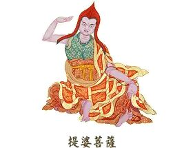

百字论释

吕澂

　　《百字论》为中观入门之书。中观根据《中论》，《中论》益以《百论》意义始备。此《百字论》又属《百论》之心，《百论》精华皆具於此，如《心经》然。故中观以《中论》为主，《百论》为辅，而此《百字论》则人中观之初门也。其要若此，治中观者可不深心一究欤？！

今释分二段：一、解题；二、释义。论之名义、作者、翻译，摄於解题之内;要义、文句结构，归诸释义之中。

先解论题，分为三节。

一、名义论

名尅实应作《百字论释》，盖此论非但为《百字》本论，亦有论释在其中也。本论即末後所附颂文，凡二十句，其前长行皆《论》之释。故此论名，按实应作《百字论释》。其义如何，可依唐人文轨之说见之。

轨居奘师门下，又参译场。所著《广百论疏》，现无全帙，惟敦煌石室存残本一卷。轨《疏》谓提婆著述百部，悉名《百论》，但各加别名以示区别，如旧《百论》，原名《经百论》。经谓修妬路，其书即修妬路体(要略体)，语简义广，乃印人述作之一体，旧《百论》即从之题名《修妬路百论》。至於此一《百论》应名《字百论》——论仅百字,以字题名，乃提婆被刺临终血书。轨《疏》又谓国王居丧过哀，提婆乃作论喻之，因名《教化百论》。此皆旧说。

如此《字百论》或《教化百论》之解释，其意在讲百论之数。但百论之百,非但数字，另有百圣随行不越此路之义（此护法《广百论释》所说）。如此百言表示具备，正如百王百味，以见其无所不具耳。《百论》所说既为百圣同宗，当知《百字论》亦复如是。至谓是论实际仅有百字，故名《百字论》。此非汉译百字，实梵文拼音百字也。译本二十句颂适成百字，乃译人所作，不足为据。梵汉文殊，汉惟单音，梵兼单复，此论之云百字，明明非汉译之百字也。

以上各说，证诸西藏译本，皆有来历。藏传虽无“提婆著书皆名《百论》”之说，但谓龙树所作悉名《中论》，如旧《中论》即以《根本中论》别之，以此例知，提婆诸书皆同一名亦无不可。又，藏传谓《百论》之“百”不限於数，尚有“除遣诸执无不净尽”之义。此义从梵文“百”字——舍多迦——而来，因其字根“舍塔”，即说“除遣”、“破灭”等，由此构成“舍多迦”，於数目之外得有破执之义也。

辨论名义竟。

