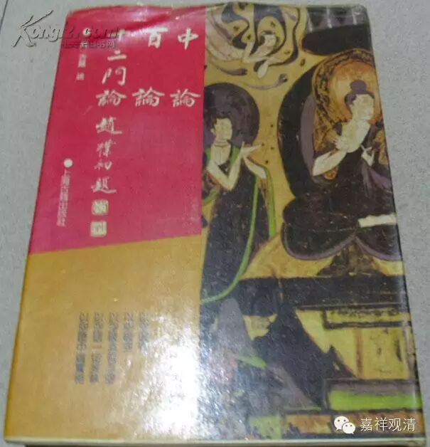

何宗安立“不失法”？

宗喀巴大师《入中论善显密意疏》卷七述应成宗不共之安立——“业灭无自性”时，数及他宗的业果安立：

“……于已造业第二刹那谢灭之前，业将灭时，为欲保持业功能故，1、有计阿赖耶识者；2、有计离二业外有馀不相应行名“不失法”如债券者；3、有计离二业外有馀不相应行名二业之“得”者；4、有计二业习气所薰识相续者。故说业虽已灭，经极久时仍能生果，亦不相违。……

初说是一分唯识宗。第二说：观音禁说是毗婆沙师。然非迦湿弥罗毗婆沙师，应是其馀一分。第三说是毗婆沙师中一分。第四说虽无明文，若按《俱舍论》第九品义，似是经部与迦湿弥罗毗婆沙师所许……”

《疏》中所述，与自罗什以来的汉传所述，略见参差，见下表。

业果安立所依者

《入中论善显密意疏》

汉传传说

1

“阿赖耶识”

一分唯识宗

唯识师

2

“不失法”

有部一分（非迦湿弥罗系）

正量部师

3

“得”

一分有部师

有部师

4

“内心相续”

经部与迦湿弥罗有部师

经部、譬喻师

