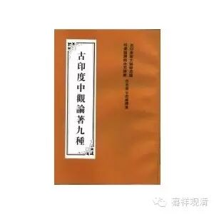

百字论颂

圣龙树菩萨  造

迦湿弥罗无比城童慧  译藏

后由论师阿难陀共西藏译师名称慧修改校正

任杰由藏译汉

顶礼妙吉祥金刚！

　　诸法非一体。异体亦如是【一】。

　　所立有自性。无性应成立。

　　诸法非有因【二】。非者相待故【三】。

　　汝许则非有【四】。声表不能立【五】。

　　立因无意义【六】。所言有自性【七】。

　　则有一体过【八】。异体是无法【九】。

　　无能取功能【十】。瓶法非可见。

　　有者不须作。有无等非生【十一】。

　　无有有为法【十二】。无为唯一方【十三】。

　　世谛与梦同【十四】。名者非实法【十五】。

与所立相同【十六】。百字论圆满。

注释：

　　【一】“如是”者，指非有。

　　【二】若先有果，即非有因。

　　【三】待因立果，待果守囚；此破自性、自在、极微、时、方等无因，因果相待故，故不能成立。

　　【四】汝许有，我许无，汝许有我，我许无我，无共许因。

　　【五】破声常、补特伽罗常，文字声语等非是一因，要诸文字合。

　　【六】所立宗法既不能立，能立立因法则无意义。

　　【七】若立有我，必说有自性。

　　【八】有我则有一体过。

　　【九】破实、德、业、总、别、和合为异体。

　　【十】破瓶是实有。

　　【十一】已有非生，已有故，已无作能生，是无故，所以有与无即非生。自生、他生、同时生，俱有过。

　　【十二】有为法生住灭相，次第牛或同时生，俱有过。

　　【十三】破无为无方所遍一切处。

　　【十四】立诸世谛如梦非实有。

　　【十五】名字假立，当知无实，破名实有。如佛云：世间唯有名，名如热时灾，词句言说空，如贪鼓回声。

　　【十六】问：我所立有既破，我所立无，汝则无所破

　　答：既有所立，则有所破，若本无自性，则无所破。

　　译后记：藏文《百字论颂》、《释》别列，为龙树菩萨造。每一句均有句号，表圆满词。是作者破对方所立宗，立自宗之要点。与汉文《百字论》文义基本相符，不同的是：藏文为龙树造，颂释别列，每句别分解释，汉文为提婆造，为元魏菩提流支译，有释无颂，前皈敬颂与末结颂均说为提婆造，此乃译者所加。据察对后十颂其中有五颂半即是本论颂文，即“一切法无一”至“此是百字论”。藏文《释》仅有汉文后十颂的前一颂“大人平等相……都无有止住”。由是可见，汉藏两本翻译先后不同，译文也有繁简之别，但按义理大致相同，汉文也可以释此颂译文，故不另译颂释。就文体论式，圣提婆造较为确切，藏本圣龙树菩萨造，似乎为误。

一九七六年七月译于北京中国佛协

