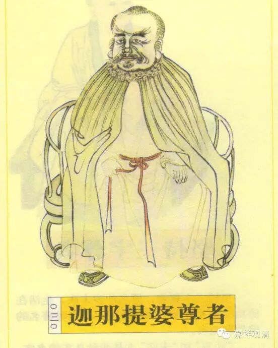

论曰：如是法无异。

若法是异，犯过与一相同，破言非异，故说如是法无异也。

胜论师(即毘舍师)言诸法有同异性(同即类同,异谓种异),同极至上同(即大有),异极至边异,其间亦同亦异(如种类)。如一生物,上同大有,边异个体,中间有同有异,即种类差别。如此说法,实非单纯谓一切法异,只云法之所以同者,以有同性与之和合故同,其所以异者,亦有异性与之和合故异。如《入正理论》云,有性非实非德非业(实等三法摄尽一切事物),而在实德业外别有有性是同,故知胜论虽说法异,实亦有同,不过此同,非法自身,乃别有一同性与法和合耳。因此彼宗论议,并不明主一切法异,但其说趋势归结於异而已。

此章即破此种异执。如彼说,汝立一相,成为过失,我今立异即无前过。释论“内曰”下,应牒论本“如是法无异”句(译本脱落)。

中观家亦迳破其因。如问,汝所立异其因是何？汝若无因立异,我亦无因立一,徒执虚言,何有胜负。答曰,有因。即立一量,我要(宗)立异,诸法差别各异相故(因),喻如象驼等物其相各异。以此推论一切法皆各有其相,因而不同。内曰以下,破其非异。破法同前,不问因义若何,但徵因法本身是异非异。异则所立相似(缺因),因即成宗。非异则坏一切法异之宗,因非异故。此在因明论议中,皆为堕负。

