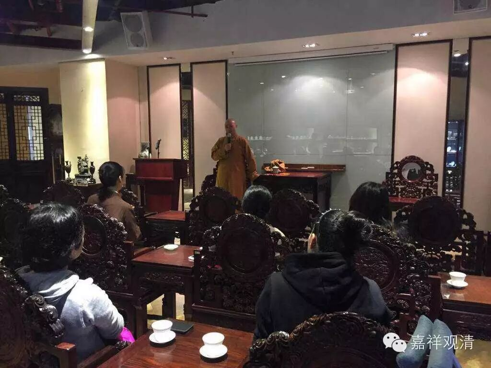
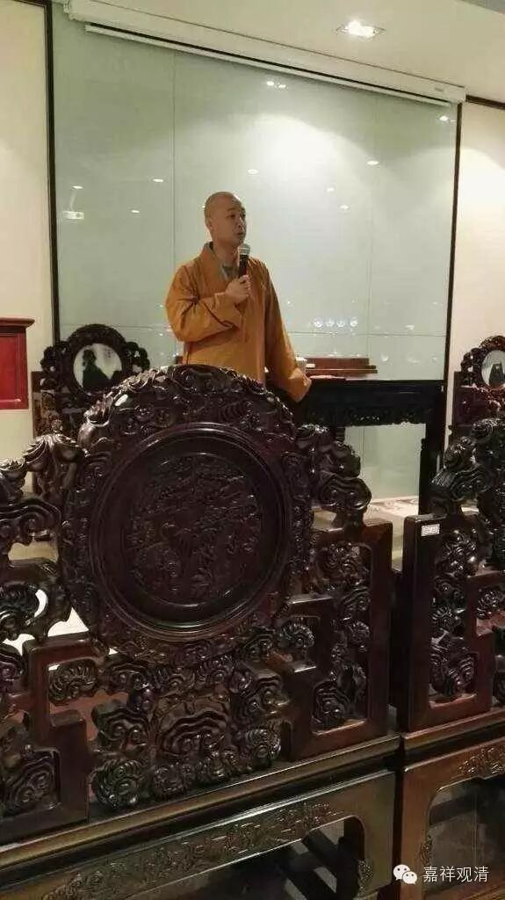
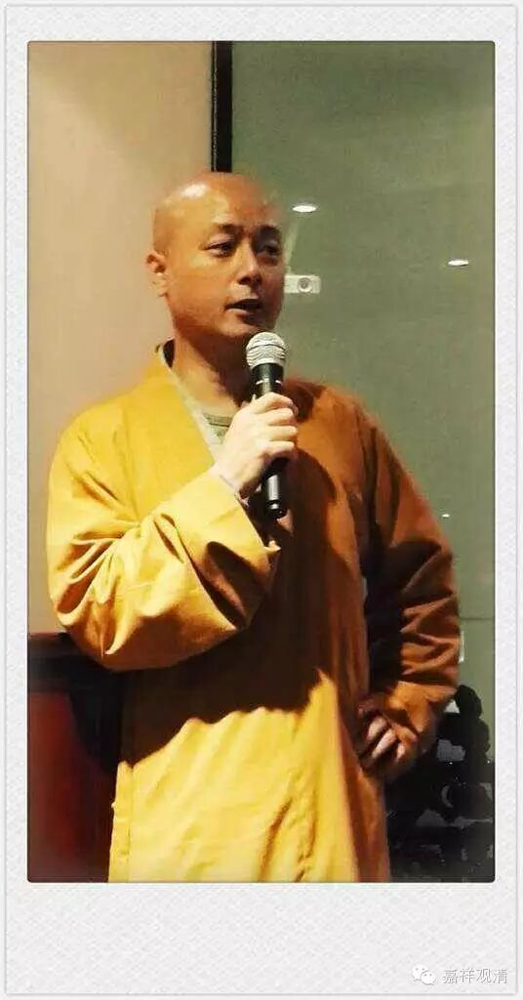
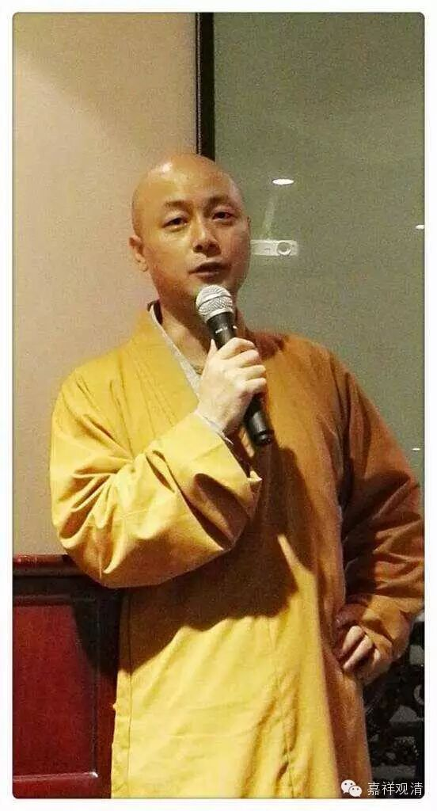
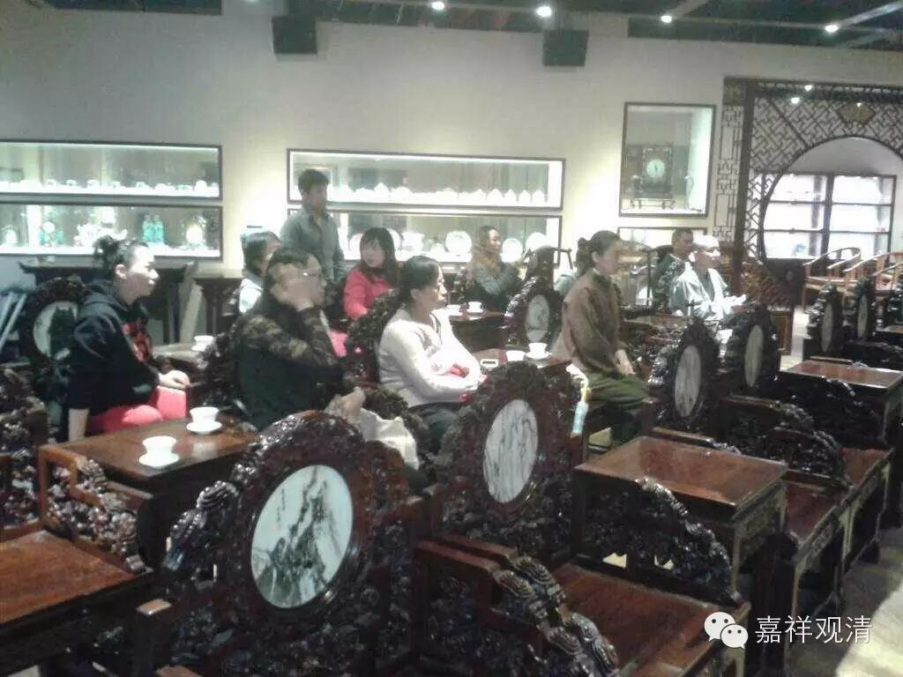

元中堂佛学讲座（一）

学佛的第一堂课

观清法师讲述

仁信整理

什么是佛？

简单说，慈悲，智慧的圆满就是佛。

佛学三个层面

1、形而上学：佛教的最高哲学是空相应的教法

空的哲学，是佛学区别其它哲学的根本特点。

空的意思是缘起无自性

2。伦理

一、要有感恩的本心，心怀“思众皆有恩”的情怀。感恩的结果是让对方得到圆满的快乐！得到究竟的快乐。

二、大乘追求帮助所有众生。

三、小乘追求随缘而助。

3。佛学实践

戒  诸恶莫作，诸善奉行

定  学会控制自己的心

慧  智慧是根本上解除烦恼！把握事物的本质。

以身载道：行为就是理论的最佳注解。

佛教的目的：离苦得乐！

佛学的本质是佛陀的教育。

汉传佛教八大宗派：

一、教下    天台、华严、三论、唯识

二、行门    律宗、净土、禅宗、密宗

一句话解释佛教：

一切为了众生，为了一切众生！

