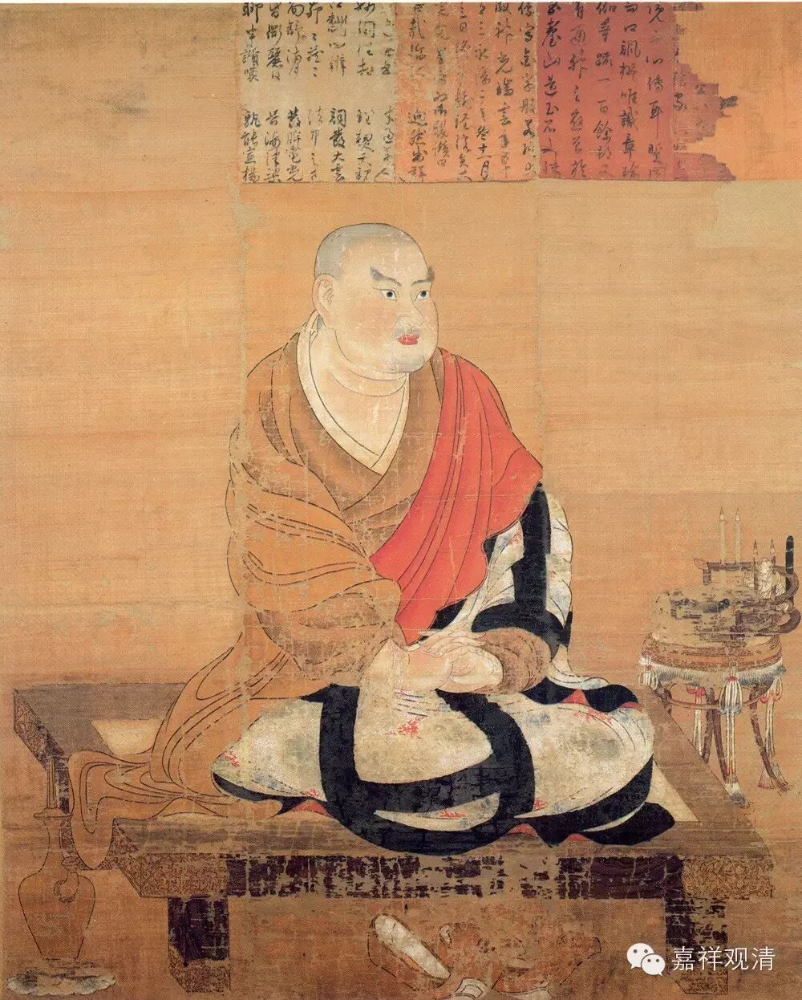

二十七賢聖章

略以五門分別：一、釋名義；二、出體；三、依身地；四、廢立；五、問答決擇。

釋名義者。於中有二：一者、列名；二者、釋名。

言列名者。

總有二類：一者、因位；二者、果位。就因之中，有其十八；果位之中，有其九種。

因十八者：即四向三果即成七種；八者、信解；九者、見至；十者、身證；十一、極七返；十二、家家；十三、一間；十四、中般；十五、生般；十六、無行般；十七、有行般；十八、上流般。此即有學之中十八名。

言無學中九：一者、阿羅漢；二者、慧解脫；三者、俱解脫；四者、退；五者、思；六者、護；七者、住；八者、堪達；九者、不動。

此約大乘列名，若約小乘，其名少異。

小乘之中，即無“信解”、“見至”，遂立“隨信行”、“隨法行”，替前二名。若無學中，無“羅漢”，別開“不退”。

上來即是列名訖。

言釋名者：

言初果者，名為“預流”。預者，入也；流者，類也。即“入”聖之“流”類，故名“預流”。

言第二果者，名“一往來”。即斷六品惑，從人生天，名之為“往”；從天還人，名之為“來”。

言第三果，名為“不還”。欲界九品悉皆並盡，唯有一生，更不還生欲界，名為“不還”。

言四向者，即進趣之義，名為“向”也。四向法更無別義。

言“信解”者，隨他言音而生信解，名為“信解”。

言“見至”者，曾見之法能至於果，名為“見至”。

言“身證”者，“信解”、“見至”二種聖人，至“不還果”身中，證得滅盡定故，轉名“身證”。此但轉名，而不轉體，理說應云：“身證滅定”，由得滅定；得滅定者，必具前七。故《瑜伽》說“得八解脫”。所以者何？前七解脫共異生故，異生唯得前七解脫，不名“身證”。滅定無心，唯身證得，似涅槃法；由身證得，得“身證”名。“身”謂積聚，或復依止；“證”謂成顯。“身”之與“證”，依主、相違，二釋俱得。

言“七返有”者，人、天七返，名為“七返有”。

言“家家”者，從家至家，故名家家。於中有四：一者、從人至人；二者、從天至天；三者、從人至天；四者、從天至人。皆名“家家”。其義不定。或言初果之人不重生二家，從張家死流生王家者，故言“家家”也。

言“一間”者，一生或半生在，名為一間。即是間隔之義，亦名一間，間者，隔也。即由此生堪能障隔聖果之道，名之為間。若斷三品，即三生在；若斷四品，即二生在；若斷五品之時，必斷六品，聖道力合如此；若斷七八品，即半生在。

問：如何得知？

答：初品潤二生，中、下二品各潤一生；中上品潤一生，中、下二品共潤一生；下上品潤半生，下中、下二品共潤半生。

問：何因唯有七生，不至八，不減六？

答：以聖道力故，不增八、不減六者，業力強故。如蛇毒損人之時，行不過七步。以毒力勢故，不減至六。七步者，四大力故。

言“中般”者，謂處中有而般涅槃。

言“生般”者，謂處生有及本有中而般涅槃。

言“有行般”者，謂加行精勤而般涅槃。

言“無行般”者，謂速疾道不假加行而般涅槃。

言“上流”者，從下向上，而往受生，故名“上流”。

問：云何名般涅槃？

答：言般涅槃者，謂得果義。謂“般”命而得羅漢故，名“般涅槃”。

上來有學訖。

言“羅漢”者，即是“應”義，有其三種，如《論》廣釋。

言“慧解脫”，能斷慧障，未斷定障，名“慧解脫”。

言“俱解脫”者，定、慧二障全俱能盡，名“俱解脫”。

言“退”者。退有二義：小乘之中，退失於果，名之為“退”；大乘之中，退失禪定、現法樂住，名之為“退”。若遊散、若不遊散，若思惟、若不思惟，皆退失故，名為“退”。

言“思”者，若不思惟即便退，若思惟已，便不退失，名之為“思”。

言“護”者，若作意防護，故不退失，故名為“護”。

言“住”者，在平等位，亦不練根，亦不退住，平等位故，名為“住”。

言“堪達”者，即是練根，堪能進達，故名“堪達”。

“不動”，性是利根，不進不退，名為“不動”。

上來即是大乘釋訖。

就小乘中，隨信行、隨法行。隨他言音而生信解，名為“隨信行”。言“隨法行”者，是利根，自能依教而生於解，名為“隨法行”。

二、總別出體。

言總者，若有學、無學，總用有為、無為為自性。

言別相，於中有二：一者、向，二者、果。

言向者：

初預流向，即取四善根及見道十五心已來總是向。

言斯陀含向者，總六無間道、五解脫道、六加行道而為體性。

言那含向者，總用九無間、九加行、八解脫而為自性。

言羅漢向者，總用九地八十一無間道、八十一加行道、八十解脫道而為自性。

此約有為出體性。若取無為，於理無違。

上來出向體訖。

言四果體者：

初果，總用八十一品無為。

第二果，總用見道八十一無為，及取修道六品無為，并取六品解脫道中頓修八智、十六行而為體性。

第三果者，總用見道八十一無為，及取修道九品無為，并取第九品解脫道中頓修八智、十六行而為體性。

第四果者，總用見道八十一無為，及取修道八十一無為，并取非想第九解脫道中頓修八智、十六行而為體性。

上來即是出體性訖。

第三依身地門者。

於中有二：一者、依身；二者、依地。

言依身者：四果四向於三界中何界初起？九地之中於何初起？

答：前之三果、三向，唯於欲界身初證初起，第四果，通三界身。第四果向，初起唯欲、色。若約地論，前之三果、向唯一地起，謂欲界地；其第四果通九地；第四果向，準果應知。

釋依身訖。

言依地者：前之二果唯初未至心；若那含果初未至及根本；若羅漢果，通九地心。八根本及初未至即九地成。

即出依身、地訖。

言第四、廢立者。

問：於何果中，而立“信解”、“見至”，及“身證”耶？

答：“信解”、“見至”，即是“隨信行”、“隨法行”。轉至前三果中若向、若果，立為信解、見至，若第三果中為“身證”。

問：“信解”、“見至”此二何別。

答：“信解”是鈍，“見至”是利。由隨信解，轉名“信解”；由隨法行，轉成“見至”。故二差別。

問：於幾品惑盡，建立四果？

答：要斷三界見所斷惑盡，故立初果；謂斷欲六品，建立第二；若斷欲界九品皆盡，而立第三；三界見、修總盡，而立第四。

問：何處建立“七返”？

答：約業而立。謂七生之業而立“七返”。此約多而言，非無四、三等生，數不遮止。

問：於何處而立“家家”？

答：約生、約惑，而立“家家”。言約生者，謂二生、三生。言約惑者，若斷三、四品，彼對治餘二、三，是說名“家家”。

問：何故但於三生、二生而立“家家”？

答：夫論於業還，皆由惑潤，潤生之義，略有二種：一者、總，二者、別。言總者：前之三品以潤四生，中之三品共潤二生，下之三品共潤一生。言別者：就初三中，初之一品以潤二生，次有二品各潤一生；中上品潤一生；中、下品共潤一生；後下三品共潤一生，於中有異：初之一品，獨潤半生；次有二品，共潤半生。約此義邊。即有損生之義。若斷三品，即有三生，即損四生業也。餘有三生在。若斷四品，即有二生，謂第四品獨潤一生故。若約四生立“家家”者。即逆流生之失。若斷三品，即盡四生之業，是故不得約於四生。若斷四品，即損五生之業。若斷五品，必斷第六。

問：何故如是？

答：以近果故，更無遲住。

問：何故但於三、四品而立“家家”，不依斷一、二品而立“家家”？

答：惑品力等，聖道齊同。若斷二品，必斷第三，同上品故。一入斷盡，無出觀義。

問：上之三品齊，不出即斷，中品三品齊，亦應入斷。

問：於何處建立“一間”？

答：“那含向”中，斷七、八品，唯一來生，而立“一間”。

問：於何處而立五種般？

答：於“那含”中立。

問：“上流”有幾種。

答：有其三種：一者、全超；二者、半超；三者、遍沒。言“全超”者，有其二類：一者、樂慧上流：為初禪死，直生五淨居，是樂慧全超；二者、樂定全超：為初禪死，生於非想。皆於初禪死，隨其諸地，而斷受生。言“遍沒”者，次第而生，不得超隔，名“遍沒”。其餘“那含”，如釋名中述。

問：何故建立羅漢？

答：對四果說。

問：何故建立慧、俱解脫。

答：由除定、慧二障，亦立二種。云何“慧解脫”？謂已能證得諸漏永盡，於八解脫未能身證具足安住，是名“慧解脫”。此義意說：障有二種：一、煩惱障，能障聖慧，不得“應”果；二者、事障，就勝而說，唯異熟生，喜、樂、捨受，有下劣障，於上等至，不肯進求，所知障攝。此人唯能斷初障故，慧縛得脫。慧謂簡擇，離縛故名解脫。慧所有脫，名“慧解脫”。又，諸阿羅漢得滅定者名“俱解脫”。由慧、定力，解脫煩惱解脫障故。

問：何故建立餘六種羅漢？

答：約種姓別，立六有別。

第五、問答決擇。

問：九地之中俱有其惑，何故但於欲界之中而立三果？

答：欲界具三性三受，煩雜多生，立多果；上界唯定地，無多煩雜，不立於多果。

問：四果中有其二種，一取有為，二取無為，此二何勝？

答：取有為勝，以彼者是其進取之義。無為之法，義何有進取？以無為無進取故，前解為勝。

問：無間、解脫，何道立果？

答：但於解脫道中而立果，以解脫道得果周圓，而立於果。

問：何故但取解脫耶？

答：得果捨向，得勝捨劣，唯有解脫道。又，解脫道能證無為，是以取之。

問：向中何故不取見道無為，果中即取，斯何意？

問：立果之中，云何名入八智、十六行？

答：取上、下八諦智。言十六行者，即取苦、空、無常等。

問：欲經生“那含”將命終，得果之義不。以彼經生必不生上。以斷惑盡。無由生欲界。

答：有其二解：一解云：約那含身上必定得果，必無命終。第二解云：

問：何故聖人不生中間禪，及不依彼而得聖道？

答：無多勝用，不依彼心。又多障難，故不生彼。

問：初未至，何界所攝。

問：“身證”與“俱解脫”何別。

答：因果二殊。“身證”者，是因所攝；“俱解脫”者，是果所收。

問：且如“初果”即是“第二果向”，此有何別？

答：雖得初果，而未進斷修所斷惑，但名“住果”，不名“向”。若得果已，進斷修所斷惑，隨其所應，是向所攝。

問：頗有是向亦是果耶？頗有是果亦向耶？

答：有其四句。有果而非向：謂中間二果，不進斷位是；有向非果：謂初果向是；亦向亦果：謂中間二果進斷位是；非果非向，反上應知。

問：潤生，下上一品獨潤半生，中下二品共潤一半生，如何斷欲第八品而立“一間”？

問：“中般”“那含”取何“中有”？

答：但取欲界死生於色界，取此中有，不取餘者。

問：何故如是？

答：欲界還生欲界，二性煩雜故；色界生色界，一性無厭；色界生無色，無其中有故。

問：賢聖有二十七，何故諸處但說四果？

答：有五義：一者、捨已曾得；二者、得未曾得；三、集斷行故，謂集諸無為，斷諸煩惱；四者、頓得八智；五者、頓修十六行。具此五義，故立四果。亦無妨難。

《大乘法苑义林章》卷第五

