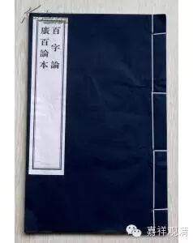

第五章

论曰：非相形而有。

此“非”字指不成,相形而有指“相待”,一句两意,即不成，相待故(此相待故为因,立上不成)。

此义之来,盖以因能生果,已经被破,今即以果反成,而说现有果法,汝不能遣。若许果有,则因仍成,是即此章本意。必有此一章,因义乃足也。

外曰：汝不许泥等为瓶等因,但瓶等果汝应承认。所以者何？现有用故。有用必有法,岂非果法实有？果不离因,故因亦有,此即释论之现有瓶衣等用云云。

内曰：不成,相待故(释本此处错译,内曰二字,当在皆从因生之下,又不相形故成,实为不成相待故,是牒论本句)。意谓汝果不成。何以不成,相待有故。因果相待而有，如见瓶,即知瓶为泥果,泥为瓶因。果待因有,因能生果,故因为因,果之因故。因待果有,果亦应成因,因之因故。如是则成因既是因,果亦是因,两俱为—因,等於无果,无果则无因。所以释论云,汝言有果故有因,此义不成。何以故？相形故,乃至因果俱坏云云。

或疑,中观家如此破法,得非同於无因果外道耶？曰,不然。佛法所谓因果,乃相待立言,表示法法间关系。如父(因)与子(果)亦待为因果,若父有其父,则父成子(因不定也)。子又有子,则子成父(果不定也)。故不能执定因定果。明此,则因果之言通矣。外道谈因果,执一特殊之因生一切果,如执意(此字译错,实为数论之自性,外道中无有执意为因者)、自在、时、方等为因。此中执时为因者谓一切法非至其时,不能成熟,故有定时。今破曰：如此则成相待。所以者何？不能自生，待他生故。若待他生,则不自主,不自主故,同於有为,有为则无常,无常必有成坏，是非外道所许也。故释论说,若言从意,自在乃至时方相形而有,则不成因云云。

