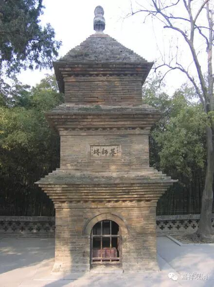

大乘蘊、界、處義

蘊、界、處義。五門分別：一、辨名；二、出體；三、廢立；四、百法相攝；五、十性等分別。

釋名者。

初，釋新舊名；後釋義名。

梵云“塞建陀”，唐言“蘊”，舊譯名“陰”。（於禁反）此“陰”是蔭覆義。若言蔭者，梵本應云缽羅婆陀。案，“陰”音應以於今反，陰陽之陰也。近代諸師競作異釋，或云淡聚，名淡陰。此釋不然。然依醫方說淡飲不言陰。更有異釋，不能具述。若言陰氣是萬物所藏，即是聚義，借喻為名，粗可通途，然非正目。今名“蘊”，或翻為“眾”。故《法華》云：“五眾之生滅”。此亦不然：若言眾者，梵本應云“僧伽”。或翻為“聚”，此亦不然：若言“聚”者，梵本應云“曷羅陀”。

又，言“處”者，梵云“阿野怛那”，舊翻為“入”。此亦不然。若言“入”者。梵云“缽羅吠舍”。舊經亦有譯為“處”者。如“空無邊處”等、“阿練若處”，並與今同。

梵云“馱都”，唐云“界”。有譯為“持”，偏據一義，非盡理也。

釋義名者。

《俱舍》云：“聚、生門、種族，是蘊、處、界義”。“蘊”是“聚”義，可聚十一種義。故《中邊》云：“非一、及總略，分段義名蘊”。彼論釋云：“一、非一義。如契經云：諸所有色，若過去、若未來、若現在、若內、若外、若粗、若細、若劣、若勝、若遠、若近，如是一切略為一聚，說名色蘊。由此聚義，蘊義得成。”《俱舍釋》云：“於此經中，無常已滅名過去，若未已生名未來，已生未謝名現在；自身名內，所餘名外；或約處辨，有對名粗，無對名細；苦集染污名劣，不染名勝；去來名遠，現在名近。乃至識蘊當知亦然”。二、總略義。如經言：如是一切略為總聚。三、分段義。如經言：說名色蘊等，各別安立色蘊等相故。由斯聚義，蘊義得成。《俱舍》云：和合聚義是蘊義，此依內明釋；二云、荷負重擔義，如世間說肩名蘊，物所聚故；（此依俗釋）三云、可分段義是蘊義，故世間有言：汝三蘊還我當與汝。（此依聲論釋）案，《俱舍》三解，與《中邊》“非一、及總略，分段義名蘊”，其意同也。

又，釋蘊有二義：一是“聚”義，二是“滅”義。故《毘曇》云：“陰”是“聚”義。

舊云“十二入”者，是“殺”義。今云“處”者，是出生義，出生六識之門處故。

十八界者，《俱舍》云：“種族義是界義。”大乘釋名，種子義名界。

故《中邊》云：

“非一、及總略，分段義名蘊；

能、所取、彼取，種子義名界；

能受、所了境，用門義名處。”

二、辨體者。

其五蘊性唯是有為，以積聚故。《俱舍論》云：“蘊不攝無為，義不相應故。”又，《毘曇》云：“陰是死法，唯攝有為。”三性之中，依他性；談有法故，非遍計所執；通無漏故亦圓成實。五法之內，體即前四，唯除如如。

十二處、十八界，通以有為、無為為體。總攝五法及以二性，除遍計所執性，以無體故。

三、廢立者。

有二門：一、總廢立三科；二、別廢立五十二等。

總者，《俱舍》云：“愚、根、樂三故，說蘊、處、界三。”彼自釋云：“或愚心所總執為我，或唯愚色，或愚色心。又，根亦有三，謂利、中、鈍。樂亦三種，謂樂略、中及廣文故。如其次第，世尊說為蘊、處、界三。”

《瑜伽》第九廢立離合三科頌云：“隨增說我事，為依、此所行，生、持、分廣略，無別根、所緣。”以上總廢立訖，釋此頌文，下自當悉。

二、別廢立者。

“隨增說我事”者，廢立五蘊也。《對法》云：“何因蘊唯有五？顯五種我事故，謂身具我事、受用我事、言說我事、造作一切法非法我事、彼所依止我自體事。如其次第，配釋五蘊，不減不增。”又《俱舍》云：“隨粗、染、器等，界別次第立。”此亦是廢立，亦是次第先後。《論》云：“色有對故，諸蘊中粗；無色中粗唯受行相，故世間說我手痛言；待二，想粗，男女等想易了知故；行粗過識，贪、瞋等行相易了知故；識最為細，總取境相難分別故。”或從無始生死已來，男女於色更相愛樂；此由耽著樂受味故；耽愛復從倒想生故；此倒想生由煩惱故；如是煩惱依識而生。此及前三，皆染污識，由此隨染，立蘊次第。或色如器；受類飲食；想同助味；行似廚人；識喻食者。故隨器等立蘊次第。或隨界別立蘊次第：謂欲界中，有諸妙欲，色相顯了；色界靜慮有勝喜等，受相顯了；三無色中，取空等相，想相顯了；第一有中，思為最勝，行相顯了；此即識住，識住其中，顯似世間田種次第。是故諸蘊次第如是。由此五蘊，無增減過。

處、界次第頌云：“前五境唯現，四境唯所造，餘用遠、速、明，或隨處次第。”（恐繁不能別釋）依《對法論》第一廢立十八界云：“由身、具等，能持過、現六行受用性故。”釋云：“身者，謂內六根；具者，謂外六境；過現六行受用性者，謂六識。能持者，謂六根、境，能持六識所依、緣故。過、現六識，能持受用不捨自相故。”當知，十八以能持義故說名界。

問：何因處唯十二。

答：唯由身、具，能與未來六行受用為生長門故，所言“唯”者，簡六識也。

第四、以蘊、處、界與百法相攝。

於色蘊中，攝十一種色。

受蘊攝遍行中受數。

想蘊攝遍行中想數。

行蘊攝相應心所四十九法，及攝不相應行二十四法，合七十三法。

識蘊唯攝心法八種。

總攝九十四法，唯除六無為故。《俱舍》云：“蘊不攝無為，義不相應故。”

十二處攝者：

內五處、外五處，攝十種色；

意處攝八識；

法處攝四類法。所謂色法——法處所攝色有五種是——，相應法有五十一，不相應法二十四，無為法有六，合有八十六法。

十八界攝者，唯開意處立六識界，餘並與處同。

第五、十種蘊等分別。

雖無一處具說，總究諸論亦可具立：一、無漏善蘊；二、加行善蘊；三、生得善蘊；四、不善蘊；五、有覆無記蘊；六、異熟無記蘊；七、威儀無記蘊；八、工巧無記蘊；九、變化無記蘊；十、自性無記蘊。

一、無漏色蘊。有說：“唯有定所生色色蘊少分，無五根等”。正義皆具。《涅槃經》言：“捨無常色，獲得常色”等。《勝鬘經》云：“如來妙色身。”《佛地經》言：“有五種法攝大覺地”。《唯識》第十、《佛地論》云：“如來功德，蘊、處、界攝。”如是等文，誠證非一，不能煩引，下皆准知。故五蘊法皆通無漏也。

於百法，總有七十法通無漏。

第一、心法八識，是識蘊性；

第二、心所法，有二十三通無漏，謂遍行五；別境五；善十一；不定二謂尋、伺；

第三、色法有十一，謂五根、五境及法處攝聖所愛戒，并定自在所生色。

不相應行取二十二，除無想定、無想事，除異生性，取非得。若取異生性，唯有漏。

第五、無為有六，並唯無漏。以依真如假立故。《對法》云：空、非擇滅，勝義無記者，亦隨轉門。

二、加行善五蘊。有五十二法：

心有六，除七、八識，因中唯無記故，至轉依位便無漏故；

第二、心所有法有二十五，遍行、別境各五，善有十一，不定有四；

第三、色法有三，以色、聲二表加行善心發故，及定共戒，并一分散無表，是加行善故；

第四、不相應行法有十八法，除命根、同分、無想天、并名、句、文身。

《對法》云：“五蘊一分是善”。又云：“加行善者，謂依止善丈夫，聽聞正法，修習淨善，法隨法行。”五十四云：“威德定色亦通有漏。”此等總說因聞慧等所發身語，定境色等為色蘊性，故通五蘊。

三、生得善五蘊，總四十九法為性。

色蘊中三。謂色、聲表，并法處散無表一分。

心所法二十四。遍行、別境；善十，除輕安；及四不定；不相應十六，除命根、同分、三無心，及與名、句、文身；識蘊中取六識，除七、八識。

故《對法》云：“生得善者，即前所說發起善身語等，由先串習，感得如是報。”乃至廣說，與信等俱任運起故。此意即說，宿習為因，生得善心，所發身語為色蘊性。

四、不善五蘊者，以六十五法為性。

色蘊唯三。謂色、聲二表，并法處不律儀無表。

心所法中四十，遍行、別境，并煩惱六，隨煩惱二十，不定四；

識蘊中取六識，除七、八二識。

不相應中取十六，謂得、非得、四相并後十。

五、有覆無記五蘊，有五十四法。

色蘊唯二。謂身、語表，梵於釋子執手行誑故。

心法有七，除第八識，餘七通有覆故。

心所有法二十九，謂遍行、別境，及根本煩惱五，除瞋；隨惑有十一，除忿等七，及無慚·無愧二；不定中取三，唯除悔；不相應法取十六，謂得、非得、四相，及後十。

《對法》第四云：“若欲界繫，分別煩惱、隨煩惱，是不善，若任運生一切煩惱，發惡行者，亦是不善。所餘皆是有覆無記故。五蘊一分是有覆性，不善五蘊准知。”

六、異熟無記五蘊。

色蘊有十。謂五根、境，唯除法處色，彼非異熟故。

《對法》云：“八界、八處是無記者。”約全分說。今取色、聲據容有說。聲通異熟，依菩薩地，常行愛語、如語、諦語故，感得大士梵音聲相，同餘相好，通異熟故。聲屬第三、第五轉者，隨轉小乘聲非異熟故。

色蘊十，皆通異熟。

心法通七識，唯除末那。

心所有法取十一，謂遍行、別境，并不定中取眠，除餘三。

不相應法取二十二，唯除二定。

第七、威儀路五蘊者。

《對法》云：“謂懷非染非淨心所發威儀路”有三十九法。

色蘊中有四，謂色、香、味、觸。

心法中有五，謂意識緣發威儀，眼、鼻、舌、身，四識緣威儀，以聲非威儀，故不說耳識。若第八識緣四塵故，得名緣威儀。薩婆多更立似威儀心，即總有六識為威儀路，識蘊也。

心所有法有十四，遍行五、別境五，及不定四。

不相應法有十六，謂得、非得、四相及後十。

第八、工巧處五蘊者。

《對法》云：“謂懷非染非淨心所起工巧處，是無記性法。”有四十二法。

色蘊中有五，身工巧，四塵性；語工巧即是聲。

心法取七識，唯除末那，發工巧第六意識，緣工巧五識，及第八。

心所有法取十四，遍行、別境及不定四。

不相應取十六，得、非得、四相、并後十。

第九、變化無記五蘊者。

《瑜伽》第三說：“變化有二：一、善；二、無記。”說定境色亦通無漏。五十三說：“若依勝定，於一切色皆得自在，諸定加行，令現在前。”九十八說：“神通不能變化四事，謂根等。”由此。但有法處色、聲、香、味、觸五，為色蘊性，若為利樂便是善性，初二門攝。《瑜伽》雖說欲界亦有諸變化，此通三性。生得、變化非是通果。設無記者，異熟生攝。此變化蘊有三十五法。

色蘊取五塵，兼取法處色。

心法唯取一，謂第六意識。

心所有法有十二，謂遍行、別境，并不定中尋、伺。

不相應行有十六，得、非得、四相，并後十。

第十、自性無記五蘊，有四十七法。

色蘊中，有五塵，即外器世界，及長養五，既非四無記，是故名自性。

心法唯取二，謂第六、七兩識。

心所法有十，謂遍行、別境，二乘起法執，不障彼果，故非染污，是自性無記。

不相應行有十六，准前應知。

依《瑜伽》第三，說無記有四，無此自性。《唯識》亦說：“法執不障二乘”，故異熟生攝。准《瑜伽》六十六，說無記有五，初四如前，更加第五自性無記，謂諸色根是長養者，外諸色處，非異熟等之所攝者，皆名自性無記，除善、染、色處聲處。案，此文唯說色蘊是自性無記性，不說四蘊通自性無記。今解四蘊亦通自性，如二乘等所起法執，是異熟生，亦名自姓。然異熟生有二種：一、是業感；二、是從生。所以《本地》第三說四無記，已攝自性盡。六十六中開第五者，以從生者，體非異熟，立為自性。前後二文不相乖返。故五蘊法並通自性。諸師於此闕而不論，後學之徒遂無憑據。

《大乘法苑义林章》卷第五

