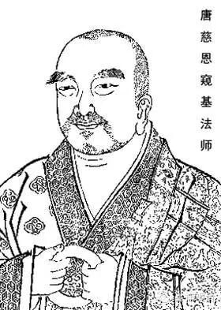

極微章

略以三門解釋：一、辨眼緣；二、釋違難；三、說勝利。

一、辨眼緣者。

一、肉眼，業等所生故。

二、天眼，修方便起故，此二皆是色蘊眼根。

三、慧眼。

四、法眼。此二皆是無漏慧根。

五、佛眼。即前四故。

下六通中當廣分別。五十四說：“除肉、天眼，所餘眼用一切極微為所行境，以彼天眼唯取聚色中表上下前後兩邊，若明、若暗，必不能取極微處所。”由極微體，以思分析而建立故。天眼尚不能，況乎肉眼。

二、釋違難者。

《花嚴經》說：菩薩能知無色宮殿若干微塵成。第五十四云：略說極微有十五種，五根、五塵、四大，并法處實色。如是等教，處處非一。極微無者，彼如何通？

雖無真實極微體性，如慧所析，彼量亦成。說知彼極微如所析量故。五十四說：“非集極微成粗色故”。《成唯識》說：“諸識變時，隨量大小，頓現一相，非別變作眾多極微合成一物。”《瑜伽》亦說：“由諸聚色，最初生時全分而生，最後滅時不至極微，中間盡滅猶如水滴。”此即意顯如熱釜水煎，微滅時不至邊際，諸色頓盡。長讀上文，又翻解此。諸色頓滅不至極微而即滅盡，非如水滴微至邊際，諸色終滅，猶不至邊。況有真實極微可見？故但知慧之所析。又，有體用中最極小者，所謂阿拏，說此名極微，此復何失？

三、說勝利者。

既無極微，說有何義？五十四有五勝利，謂：“由分析一合聚色，安立方便，於所緣境，便能清淨廣大修習。又能漸斷薩迦耶見，斷諸憍慢，伏煩惱纏，及能速疾除諸相執。”此中意說：修法空觀，要析諸色，先至極微，斷諸煩惱，後入空故。由是大義，故說極微。能析彼心何人所作？何諦所攝？皆別思之。

《大乘法苑义林章》卷第五

