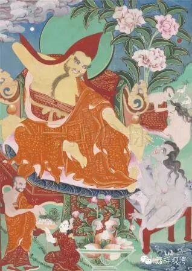

第七章

论曰：汝法则不然。

法字释论译作家法,亦不善巧,意难了故。藏译作假立,亦不明白。研究结果,知是悉檀多之误。悉檀为论议所据,凡有四种。一徧所许,二自承禀,三旁义准,四不顾论。徧许即各家共许,自承乃一家本习,皆为论法上所承认也。悉檀虽四,此章所言,专指自承(译不善巧未能表出)。故彼辩云,自承悉檀,亦论法所容有,汝何不许我之所说。故释论云,此是我家法。

内破曰,悉檀之义,须有理成,方可为据。所谓理者,随其所执广引因缘立义坚固以为其相(见《方便心论》)。如释论云,汝言我家法,其法不成,此二句乃牒论本汝法则不成句。云何不成,即无随其所执广引因缘立义坚固以为其相。是汝悉檀无因等相,自既不成,何能成法？是故释论云汝法不自成,乃至此则非正理云云。

