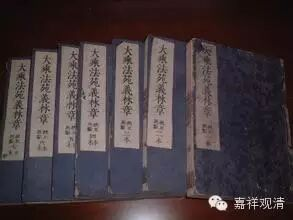

**總料簡章**

第一，總辨諸教、業、宗、體、名。於中略以五門分別：一、教益有殊。二、時利差別。三、詮宗各異。四、體性不同。五、得名懸隔。

第一，教益有殊。復分為二：初明輪益，後辨義益。

明輪益中，復分為二：先明異計，後明大乘。

明異計者：其多聞部、薩婆多部、雪轉部、犢子部、法上部、賢冑部、正量部、密林山部、化地部、經量部十部同說：非諸佛語皆為利益，要逗物機，務心入道名利益故；唯八聖道是正法輪，轂、輞、輻、圓，摧破煩惱名為輪故。故世友說“非如來語皆為轉法輪”；世尊所言亦有不如義，詮八道教八道境故。亦名法輪，所餘功德及所餘教，雖名聖教，不名法輪。如問慶喜：“天雨不耶？”問諸比丘：“汝等乞食易可得不，氣力安不？”此何利益？轉何法輪？故諸經中雖敘佛語，有非利益而非法輪，如說“逆害於父母”等。此教所言何必如義，故佛亦有不如義言。此等十部，總說諸經有不如義而說虛言，有非法輪而無利益。

其大眾部、一說部、說出世部、雞胤部、說假部、制多山部、西山住部、北山住部、法藏部、飲光部十部同說：佛一切語皆為利益，如來所言無不如義；非唯八聖道是正法輪，一切功德能摧諸惑，並名法輪。故一切教法輪因境，皆名法輪。《宗輪論》說：“諸如來語皆為轉法輪。”摧伏轉動說名輪故。佛語轉動，在他身已摧伏他身無知惑等，故號為輪。如問慶喜“天雨不耶？”為令阿難審諦事故。佛無不知，尚問天雨？！況未圓智而不審耶？亦除餘人增上慢故。佛知尚問，況不知者。於餘未了而不審諦；由是多義，故問天雨。佛顯慈悲，令他入道。問比丘等“乞食易耶？”令生喜心，踴躍修道。彼賀悲問，加懃修學；亦令未來習於此事隨順世俗。然以愛為“母”，以業為“父”，有取識為“王”，“戒”、“見”二“取”為“二多聞”，內六處為“國人”，外六境為隨行“畜生”，能誅斷此名為“清淨”，以世惡言轉顯勝義，非害生母等，何必不如言？故佛所說一切三藏，皆轉法輪，咸為利益，悉皆如義，無有虛言。

此則是初明異計也。

明大乘者。雖無正文說“佛所語皆如其義，咸轉法輪”，然正法輪唯八聖道，餘雖非正，是助法輪。《無垢稱經》三轉法輪於大千等。《法花》又云：即趣波羅奈轉四諦法輪。又，《瑜伽論》九十五說：佛轉三周十二行相甚深法輪。見、修、無學三位之中，如其次第，示相、勸修、作證，觀於四聖諦境生聖慧眼，各於去、來、今世，如次生眼智明覺無漏真智，能斷所應永斷煩惱。故八聖道是正法輪。《無垢稱經》第五卷說：佛告阿難陀：以要言之，諸佛所有威儀、進止、受用、施為，皆令所化有情調伏，是故一切皆名佛事。說轂、輞、輻有差別故。其正法輪唯八聖道，諸餘功德是助法輪，摧伏動轉是輪義故。《涅槃經》中第十四說：“復次，善男子，諸佛世尊凡有所說，皆悉名為轉法輪也。善男子，譬如聖王所有輪寶，未降伏者能令降伏，已降伏者能令安隱。諸佛世尊凡所說法亦復如是，無量煩惱，未調伏者能令調伏，已調伏者令生善根……”乃至廣說。故佛身、語，凡所運動皆為利益，故知佛語皆名法輪。

以要言之，法輪有五：一、法輪體：謂八聖道；二、法輪境：謂四諦理等；三、法輪眷屬，謂餘五蘊功德等；四、法輪因：謂教及三慧等；五、法輪果：謂菩提涅槃。如《法輪章》自當廣說。

一切佛語皆為利益，令他有情，或近、或遠，能生真智，推伏怨敵所有二障，故佛所語皆名法輪。摧伏移動是輪義故。以佛所說稱可道理，不可立難，離四失故：一、無非處；二、無非時；三、無非器；四、無非法。處謂處所：應利益處，能化所化在此可益，必於此中作利益故。時謂時分：利益時節，此生、此處、此時應益，應時而說，必不失故。器謂機器：所逗之機，應機而說，無錯謬故。法謂教法：戒、定、慧等應利益法，此法可益，必以逗機，無□亂故。由此道理，准知佛語皆為有情或近、或遠生無漏智，是故一切三藏教法，或曲、或直、皆名法輪，悉皆如義，咸為利益，無有虛言。問天雨等，如前所說，皆利益故，粗言、細語，歸勝義故。

上來總是初明輪益。

辨義益者。於中又二：先辨異計，後辨大乘。

辨異計者：薩婆多等十部同說。佛所說經非皆了義。佛自說有不了義經。如契經說：“不信、不知恩，斷密無容處，恒食人所吐，是最上丈夫。”此即名為“不了義”也。故一切經有不了義。

大眾部等十部同說。佛所說經皆是了義，契當道理，皆法輪故。其密語經有何了義？自證諦理，“不信”他言。能知圓寂，知非恩故，名“不知恩”。永棄後業，名為“斷密”。當果不生，是“無容處”。雖受資具，猶如“食吐”。能如是者，名“上丈夫”。既契正理，寧非了義？所餘經義，准此應知。既爾，如何四依中，說勸諸弟子當依了義？謂：勸彼依世尊所說了義言教，不令弟子依外道說不了義經，非是佛經有不了義。

此即是先辨異計也。

辨大乘者：

《涅槃經》中第六卷說：

“聲聞乘法猶如初種未得果實。是故不應依聲聞乘。如是名為不了義也。大乘之法即應依止。是名了義。”

若依此理，諸大乘經皆名“了義”，聲聞乘等名“不了義”。

然《瑜伽論》四十五說：

“云何菩薩修正四依？謂諸菩薩於如來所，深植正信，深植清淨，一向澄清，唯依如來了義經典，非不了義。了義經典為所依故，於佛所說法毘奈耶，不可引奪。”

廣如彼說。

故大乘中，應言“佛說三藏教法有不了義”。以勸“當依了義經”故。

既爾，如何《涅槃經》說大乘經典名為了義？

此理不然！豈諸大乘皆為了義？！如契經說：“婬欲即是道，覺不堅為堅。”又說：“諸法皆無生無滅”密義趣經。又，《瑜伽》說：“不了義教者，謂契經、應頌、記別等經。”豈大乘經中無契經等？又說“菩薩殟波陀慳具戎尼”等。故大乘經非皆了義！

由如是理，雖無正文，今以義釋，“了不了義”略有四重：一、法印非印門；二、詮常非常門；三、顯了隱密門；四、言略語廣門。

法印非印門者。法印有三：一、諸行無常。二、涅槃寂靜；三、諸法無我。或說四鄔□南，加“有漏皆苦”。若一切教為此三種理印所印等，名為了義；違三法印等，非了義經。由此道理，三藏、二乘、十二分教無非了義，能捨煩惱、業及苦故；諸外道教非了義經，不能永捨惑、業、苦故。故《瑜伽論》六十四說：“歸依有幾？何緣但有爾所歸依？歸依有三，謂佛、法、僧。四緣故有爾所歸依：一、由如來性調善故……”乃至廣說。由佛如是，其佛所說法毘奈耶，亦可歸依。《涅槃》又云：“一切外道所可言說悉皆妄語。”故唯佛教是了義經，順三法印等，可歸依故；諸外道教非了義言，違三法印等，不可歸故。

設有聖教唯說“佛教為了義言，外道所說名非了義！”以此門通，非佛教中唯了義故。

詮常非常門者。

如《涅槃經》第六卷說：“又聲聞乘名不了義，無上大乘乃名了義。若言如來無常變易名不了義；若言如來常住不變，是名了義。”

此經意言：若經中說佛是法身常住不變，名為了義；與此相違，名不了義。《解深密經》、《瑜伽決擇七十六》說：“世尊往昔唯為發趣聲聞乘者，以四諦相轉正法輪，雖是希奇，然是有上，是未了義。”即顯大乘是了義經，聲聞乘教，名非了義。此中一往，依乘所明名為了義，非諸大乘無不了義，聲聞乘經都無了義。如次當引如是證文，故依涅槃詮真常佛名為了義，詮非常佛名非了義。

顯了顯密門者。

《瑜伽論》中四十五說：“又諸菩薩於如來所，深植正信，深植清淨，一向澄清，唯依如來了義經典，非不了義。了義經典為所依故。於佛所說法毘奈耶不可引奪。以佛所說不了義經，依種種門辨本性義猶未決定，尚生疑惑，非了義故。”

即依此文，於大乘中，顯了言教名為了義，隱密言教非了義經。《解深密經》、及《決擇分》亦作是說。世尊在昔第二時中，唯為發趣修大乘者，依一切法皆無自性、無生、無滅，以隱密相，轉正法輪，雖更希奇，而亦有上，猶未了義，即說一切性皆是空，三無性教，名非了義。《成唯識論》第九卷說：故佛密意說一切法皆無自性，非性全無，說密意言，顯非了義。故大乘經說諸法相。言非顯了，所詮不究竟，名不了義。言若顯了，所詮究竟理，名了義經。此據能詮顯了無異，名了義故。

言略語廣門者。

《瑜伽》決擇六十四說：“不了義經者，謂契經、應頌、記別等教世略說。其義未了，應更當釋。了義教者，與此相違，應知其相。”

此中意說：雖是大乘明顯之教，初但略說談理未盡。所明未周名為不了。不是所詮非究竟理名為不了。由此即顯諸聲聞乘亦有了義。除契經等餘自說等。語具廣故名了義經。大乘之中明顯之教契經等中說法。言略語未廣。故亦有不了。此依說義言有廣略名了不了。非約所詮理是究竟非是究竟名了不了。

此中，第一，為令有情捨邪歸正，名了不了：一切佛經皆名了義，外道所說名為不了。

第二，為令捨小歸大，名了不了：一切大乘皆名了義，諸小乘教名為不了。

第三，為令捨隱歸顯，名了不了：一切大乘顯了言教皆名為了；雖是大乘，說法隱密，名為不了。

第四，為令知法廣略，名了不了：諸“重頌”經，言略不盡，皆名不了；非“重頌”經，言廣盡故，說名為了。

以此四門了不了義，釋一切教了不了言。故大乘經雖皆名了，而於其中復應取捨。勸諸弟子，依了義者，隨其所應，當廣思擇。隨所講教，當應配之。

上來總是教益有殊。

第二，時利差別。

復分為二：初敘古說，後述今文。敘古說中，復分為二：初敘古說，後敘其非。

敘古說者。

後魏有菩提流支法師，此名覺愛，唯立一時教。佛得自在，都不起心有說不說，但眾生有感，於一切時，謂說一切法。譬如天樂，隨眾生念，出種種聲；亦如末尼，隨意所求，雨種種寶。《花嚴經》云：“如來一語中，演出無邊契經海”。《維摩經》云：“佛以一音演說法。眾生隨類各得解。或有恐怖或歡喜。或生厭離或斷疑。”故無一教定頓、定漸。又，《無量義經》言：“我得道來四十餘年，常說諸法不生、不滅、不去、不來、無此、無彼、無得、無失、一相、無相，但由眾生悟解不同，得諸果異。”《法花》亦言：“一雨普潤，三草二木生長不同。”《優婆塞經》言：“三獸渡河，淺深成別。”故知諸教但總一時，無二、三等。

又，古來大德立有頓、漸二教：為諸菩薩大根大莖，說《花嚴》、《楞伽》、《大雲》、《法鼓》、《勝鬘》等經，一會之中，說二諦理盡，名之為頓；大不由小起，故名為頓。始從佛樹，終至雙林，從淺至深，漸次說法：因果、三歸、五戒、十善等法，三乘有教，《阿含》等經，《維摩》、《思益》、《大品》空教，《法花》一乘，《涅槃》等說，常住佛性，皆是漸教，會通三乘，大由小起，名為漸也。

又，菩提流支法師。亦立二時教。《楞伽經》說：“漸頓者，莫問聲聞、菩薩，皆漸次修行，從淺至深，名為漸也。頓者，如來能一時頓說一切法，名之為頓。”

又有二教：一者，半教；二者，滿教。《涅槃經》言：“云何解滿字及與半字義。”又云：“為聲聞乘而說半字，為菩薩乘而說滿字。”又，《勝鬘經》言。有作四聖諦、無作四聖諦；聲聞知有作，佛知無作。《瑜伽》等說，安立諦、非安立諦。唯說安立，名為半教；通說非安立，名為滿教。

又有二教：一、生空教；二、法空教。《二十唯識論》云：依此教能入數取趣無我，所執法無我，復由餘教入。此以二空、二障，以明半、滿。

又有二教。一、勝義諦；二、世俗諦。

晉時，有隱士劉虯立五時教。或有說云：真諦三藏立五時教。然菩提流支法師別作文疏破之。真諦居梁，流支在魏，故知不是真諦等作。

第一時者，佛初成道，為提謂波利等五百賈人，但說三歸、五戒、十善，世間因果教，即《提謂等五戒本行經》是，未有出世善根器故。

第二時者，佛成道竟三七日外十二年中，唯說三乘有行之教，未為說空，即《阿含》等小乘經是。

第三時者，佛成道竟三十年中，說彼三乘同行空教，即《維摩》、《思益》、《大品》等經是。

第四時者，佛成道竟四十年中，說有一乘，猶未分明演說佛性常住實有，尚說無常佛。顯一乘佛果以為真實，即法花經是。以前未明一乘義故，此中猶未分明演說常住佛性故。

第五時者，謂雙林中，說諸眾生悉有佛性，常住佛教，即《涅槃經》、《大悲經》等是。

此雖可爾，既無經論誠文說之，未可依信。

前來總是敘古說也。

敘其非者：

只如第一菩提流支法師唯立一時教者，若廢事談理，及在一會有大小機，可如所說。若唯被大，如《勝鬘經》；或但被小，如《遺教經》；或初有大無小，如《花嚴經》至《入法界品》方有聲聞；初有小無大，雖未見文，理必應爾。如斯等教，義類甚多。或有諸經全分、多分大小教異，言唯一時，深為猛浪。豈無一會頓發三乘之心，及無漸入大乘者也？！

第二古德，說有頓漸，理雖可然，定判諸經為頓、漸者，義即難解！只如《花嚴經》中《入法界品》，五百聲聞在于會坐，列名歎德。又，舍利弗將六千弟子從自房出，文殊師利為說十法，即發無上正等覺心。《楞伽經》中亦列聲聞在于會坐。《法鼓經》中說窮子喻與《法花經·信解品》同。《勝鬘經》說三種意生身一乘之義。《攝大乘》云：引攝一類不定性故，非為頓教。《花嚴》等經，未必從首至末皆是為被大根行說，□名為頓。定說五時所說之經為漸教者，後當敘非。

第三，又菩提流支法師，依《楞伽經》立頓、漸二教者，此亦不然。彼經以佛能頓說法，以說為頓，以三乘人漸次修學名之為漸，以行為漸，非約教時。亦不可取！

又，第四，依《涅槃經》等立半滿教者，彼皆據所明理有盡不盡，以明半滿，不定依逗機直往迂會以明半滿。

第五，劉虯立五時者，今者且依菩提流支法師斥破。是義不然。

《提謂經》說：五百價人將受五戒，先懺悔彼五逆十惡謗法等罪，得四大本淨、五陰本淨、六塵本淨、吾我本淨。時提謂等得不起法忍，三百價人得柔順忍，二百價人得須陀洹果，四天王等得柔順忍，三百龍王得信忍，自餘天等發無上道意，十億天人皆行菩薩十善，提謂長者滅三界苦，得不起法忍，即是初地。或第八地。又，《普曜經》第二七日，提謂等五百價人施佛□蜜，佛與授記：汝於來世當得作佛，名曰齊成。云何但言第一時中世間教也？雖作此破，義亦難知。既有賈人得預流等，何不此日名轉法輪，至五比丘法輪方轉？由未分明說三乘者，同所觀諦故，未名轉法輪。

次，第二時，“十二年中唯說有教”者。覺愛破云：是亦不爾。成道五年說《大般若》，正明實相。又，第七年為八菩薩說《般舟三昧經》，正明眾生五蘊本空。又，第九年說《抰掘摩羅經》，第十年中說《如來藏經》，皆明涅槃佛性深理。又，《提謂》、《普曜》等經皆明菩薩行。又與價人授記成佛，明初成道已說大乘。又，《摩訶般若》、《大品經》中說，佛在鹿野轉四諦輪，無量眾生發聲聞心，無量眾生發獨覺心，無量眾生發阿耨多羅三藐三菩提心，行六波羅蜜，無量菩薩得無生法忍，住於初地、二地、三地，乃至十地，無量一生補處菩薩一時成佛。又，成道竟第二七日說《十地經》，云何乃言“十二年內唯說有教”，不說大乘？只如《法花經》云：“於三七日中常思惟是事”，即成道竟三七日中不說法也。《彌沙塞律》云：初成道竟，三昧七日。《十地經》云：“七日不說法，顯示自受法樂故，為令眾生於如來所增愛敬故。”然《律》及《薩婆多》傳云：過六七日，梵天來請方乃說法，始度五人，即四十二日方說法也。《十二由經》云：成道竟一年不說法，經十二年方度五人。《智度論》云：初成道竟五十七日佛不說法。有人解云：“即五十個七日”，與《十二由經》一年不說法同也。如此經傳說成佛道不說法日已各不同，何得以已胸臆之心說“十二年唯說有教”？又，若前後唯度一機可如所說，機器千品，何得一準？今依古說，略破初二，自餘三時，廣如《菩提流支法師別傳》所破。

此即別破立教不同。然此所立，雖理可然，既無教文，未可依據。□違《解深密經》所說時也。

上來總是敘其非也。并前□為敘古說也。

述今文中又分為二：初述今文，後略示教。

述今文者。如《解深密經》第一卷、《瑜伽·決擇》第七十六，世尊廣為勝義生菩薩，依遍計所執，體相無故，說相無自性性；依依他起上無遍計所執，自然生故，說生無自性性；及即依此說無遍計所執一分勝義無自性性；依圓成實上無遍計所執故，又說一分勝義無自性性。說三種無性皆依遍計所執性已，勝義生菩薩深生領解，廣說世間毘濕縛藥、雜釆畫地、熟蘇、虛空諸譬喻已，世尊讚歎，善解所說。勝義生菩薩復白佛言：“世尊，初於一時，在婆羅泥斯仙人墮處施鹿林中，唯為發趣聲聞乘者，以四諦相，轉正法輪，雖是甚奇，甚為希有，一切世間諸天人等，先無有能如法轉者，而於彼時所轉法輪，有上有容，是未了義。是諸諍論安足處所。世尊在昔第二時中，唯為發趣修大乘者，依一切法皆無自性、無生、無滅、本來寂靜、自性涅槃，以隱密相轉正法輪，雖更甚奇，甚為希有，而於彼時所轉法輪，亦是有上，有所容受，猶未了義，是諸諍論安足處所。世尊於今第三時中，普為發趣一切乘者，依一切法皆無自性，無生、無滅、本來寂靜、自性涅槃、無自性性，以顯了相，轉正法輪，第一甚奇，最為希有！于今世尊所轉法輪，無上，無容，是真了義，非諸諍論安足處所。”爾時世尊告勝義生菩薩曰：“勝義生，若善男子，或善女人，於諸不了義經，聞已信解、書寫、護持、供養、流布、受誦、溫習、如理思惟，以其修相，發起加行，比所說了義言教，聞已信解，乃至廣說，以其修相，發起加行所集功德，百分不及一，乃至鄔波尼殺曇分亦不及一，此所生福，難可喻知。吾今略說：如爪上土比大地土，或如牛跡中水比四大海水，百分不及一，乃至鄔波尼殺曇分亦不及一。說此經時，六百千眾生發菩提心，三百千聲聞遠塵離垢，得法眼淨，一百五十千聲聞永盡諸漏，心得解脫，七十五千菩薩得無生法忍。”《金光明經》亦說三時，謂轉、照、持。《涅槃經》說：初令皆服乳，次教總斷乳，後教有應服、有不應服者，與《解深密》所說義同。《瑜伽》釋中，此三時少異，義意無別。由此誠證，若以偏、圓，機宜漸次，教但三時，非一、非五。

上來總是述今文也。

略示教者。四阿笈摩等是初時教；諸說空經是第二時教，以隱密言，總說諸法無自性故。《花嚴》、《深密》，唯識教等，第三時也，以顯了言，說三無性，非空、非有，中道教故。由諸異生，起自無始，迷執有我，不了我無，沈沒愛河，輪迴癡海，故佛初說四諦法輪，令知我空，唯有其法。憍陳那等最初得道，彼聞法有，證我皆空，便執諸法為真實有，封著小果，不求大位。佛為方便，復說法空，破除有執。故次時中，說《般若》等，言一切法本性皆無。須菩提等迴心趣大。彼聞法空隱密言教，便撥諸法，性相都無，何所造修？何所斷捨？佛為除此，復說唯識三性等教。勝義生等信解修學，遍計所執無，知法我俱遣；依他圓成有，照真俗雙存。無，無所無，所以言無；有，有所有，所以言有；言有，而有，亦可言無，遍計所執，真俗無故。言無，而無，亦可言有，當情我法，二種現故。令除所執我法，成無；離執寄詮真俗，稱有。妄詮我法，非無非不無：當情似有，據體無故；妄詮真俗，非有非不有，非稱妄情，體非無故。我法無故，俱是執，皆遣；真俗有故，諸離執，皆存。由此應言：迷情四句，四句皆非，悟情四句，四句皆是。說境我法空，破初執有；說心真俗有，破次執空。諸偏見者，初聞說有，便即快心，於空起謗；後聞說空，亦復協意，便謗於有。今言非空、非有，中道教者，第三時也。約理及機，漸入道者，大由小起，乃有三時諸教前後，《解深密經》說唯識是也。若非漸次而入道者，大不由小，即無三時諸教前後，約其多分，即初成道《花嚴》等中說唯心是。多分頓漸，無別教門，隨一會中所應益故：《花嚴》說有聲聞在會，《深密》亦有聲聞發心。《勝鬘經》中亦說一乘意生身等。《攝大乘》說“為不定人說一乘故”。《法花經》中《分別功德品》言，佛說《如來壽量品》時，“有八世界微塵數眾生發菩提心”。如是等文，上下非一，故知《法花》亦被頓悟，《花嚴》亦有漸悟之人。若依覺愛，定唯一時，無漸次者，即違《深密》說有三時。豈依劉虯定有五時前後次第，復無文說。然違三時，今總不依。若據眾生機器及理，可有頓漸之教，然不同於古說。若不約機理，定判一經為頓、為漸，時增減者，頓漸不成。故《唯識》云：唯我“於凡愚不開演”，非遮不定及定性故。此依證果，若謂人天，即有四時。其二乘者方便學法，是彼初學，故略不說。

今依師授，略敘古今時利差別，其諸有智任情取捨。

第三，詮宗各異。

夫論“宗”者，崇、尊、主義。聖教所崇、所尊、所主，名為“宗”故。且如外道、內道、小乘、大乘，崇、尊、主法，各各有異，說為宗別。

然古大德，總立四宗：一、立性宗，《雜心》等是；二、破性宗，《成實》等是；三、破相宗，《中》《百》等是；四、顯實宗，《涅槃》等是。

今即不爾。

於中分二：初陳異宗，後列自主。陳異宗中，復分為二：初陳外道，後陳小乘。

陳外道者，外道雖有九十五種，大意莫過十六異論。廣如《瑜伽》第六、七卷，《顯揚》第九、第十卷說，彼論皆云：

“執因中有果，顯了、有去來，我、常、宿作因，自在等、害法，

邊無邊、憍亂，見無因、斷、空，計勝、淨、吉祥，名十六異論。”

一、因中有果宗。謂雨眾外道執：諸法因中常有果性。如，禾以穀為因，欲求禾時，唯種於穀，禾定從穀生，不從麥生。故知，穀因中先已有禾性，不爾，應一切從一切法生。

二、從緣顯了宗。謂即僧佉及聲論者。僧佉師計：一切法體自性本有，從眾緣顯，非緣所生；若非緣顯，果先是有，復從因生，不應道理。聲論者言：聲體是常，而相本有，無生無滅，然由數數宣吐顯了。

三、去來實有宗。謂勝論外道，及計時外道等亦作此計：有去、來世，猶如現在，實有非假，雖通小乘，今取外道。

四、計我實有宗。謂獸主等一切外道，皆作此計：有我、有薩埵、有命者、生者等，由起五覺，知有我也；謂見色時，薩埵覺等。

五、諸法皆常宗。謂伊師迦計：我及世間皆是常住，即計全常、一分常等；計極微常亦是此攝。

六、諸因宿作宗。謂離繫親子，亦云無慚外道，謂：現所受苦，皆宿作為因，若現精進，便吐舊業，由不作因之所害故，如是於後不復有漏。

七、自在等因宗。謂不平等因者計。隨其所事，即以為名，如莫醯伊濕伐羅等：或執諸法大自在天變化，或丈夫變化，或大梵變化，或時方、空、我等為因。

八、害為正法宗。謂諍、競劫起。諸波羅門，為欲食肉，妄起此計：若為祀祠，□術為先，害諸生命，能祀、所害、若助伴者，皆得生天。

九、邊無邊等宗。謂得世間靜慮邊無邊外道，住有無邊想者，計：彼世間有邊、無邊、俱、不俱等。

十、不死矯亂宗。謂不死無亂外道。

十一、諸法無因宗。謂無因外道計：我及世間，無因而起。

十二、七事斷滅宗。謂斷滅外道計：七事斷滅。

十三、因果皆空宗。諸邪見外道，計：無愛養等，見行善者返生惡趣，見行惡者返生善趣，便謂為空，或總誹撥一切皆空。

十四、妄計最勝宗。謂□諍劫。諸婆羅門計：婆羅門是最勝種，梵王之子，腹、口所生；餘種是劣，非梵王子。

十五、妄計清淨宗。謂現法涅槃外道，及水等清淨外道，謂：於諸天微妙五欲，堅著受用，是即名得現法涅槃，乃至廣說。持牛狗戒亦復如是。

十六、妄計吉祥宗。謂曆算外道：若日月薄蝕，星宿失度等，若隨日月，所欲皆成；應勤供養日、月、星等，乃至廣如彼論所說。

上來第一，陳外道也。

陳小乘者。小乘雖有二十部計，總束為宗，莫過十一。古來相傳十八部者，深為錯失。依古真諦法師所翻，部成十九：大眾分出七，并本有八——大眾并本，應成九部，遂脫西山住部。上坐部分十一，并本上坐亦在其中。《文殊問經》下卷中說成二十部，然少不同。彼經偈言：

“摩訶僧祇部，分別出有七，體毘履十一，是謂二十部。

十八及本二，皆從大乘出，無是亦無非，我說未來起。”

雖說二十，稍同《宗輪》，而所分出增減有異。

《宗輪論》說：大眾部中分出八部，并本有九：一、大眾；二、一說；三、說出世；四、雞胤；五、多聞；六、說假；七、制多山；八、西山住；九、北山住部。上坐部中分出十部。并本十一。一、說一切有；二、雪轉亦名上坐；三、犢子；四、法上；五、賢冑；六、正量；七、密林山；八、化地；九、法藏；十、飲光；十一、經量部。是故合成二十部。然《文殊問經》大眾部中，并本有八；上坐并本，乃有十二。故知皆是翻譯家誤。

今依新翻《宗輪論》說，總束二十為十一類。

一者：大眾部、一說部、說出世部、雞胤部四部宗說：一切如來無有漏法；佛身壽量悉無邊際；眼等五識身有染、有離染；色、無色界具六識身；五種色根肉團為體；無為有九；去、來世無；一剎那心了一切法；道與煩惱容俱現前……大義如是。

二、多聞部宗說：佛五音是出世教，餘即世間：一、無常；二、苦；三、空；四、無我；五、涅槃寂靜；餘義多同說一切有部。

三、說假部宗說：苦非蘊；十二處非真實；由福故得聖道；道不可修；餘義多同大眾部計。

四、制多山部、西山住部、北山住部三部宗說：一切菩薩不脫惡趣；供養塔廟不得大果；餘義多同大眾部說。

五、說一切有部宗。謂一切有二：一、法有；二、時有。謂心、心所、色、不相應，及三無為，是法一切；去、來、今三，是時一切；諸是有者，皆二所攝。一、名；二、色。

六、雪山部宗說：謂諸菩薩猶是異生；菩薩入胎不起貪愛；無外道得五通；無天中住梵行。

七、犢子部、法上部、賢冑部、正量部、密林山部，合五部宗說：補特伽羅非即蘊、離蘊；五識無染；亦非離染；入正性離生，十二心頃說名行向，第十三心名為住果。

八、化地部宗說：去、來世無；現在、無為有；四聖諦一時觀；定無中有；亦有齊首補特伽羅；有世間正見；無世間信根；無出世靜慮；無無漏尋；善非有因；預流有退；無為有九。

九、法藏部宗說：佛在僧攝；佛與二乘，解脫雖一，而聖道異；無外道得五通；阿羅漢身皆是無漏；餘義多同大眾部計。

十、飲光部宗說：若法已斷、已遍知，即無；未斷、未遍知，即有；業果已熟即無；未熟即有；諸有學法有異熟果；餘義多同法藏部說。

十一、經量部宗說：有勝義補特伽羅；異生位中亦有聖法；有根邊蘊；有一味蘊——一味蘊者，即細意識等；餘所執多同說一切有部。

此中所陳，略標宗要，廣陳宗者，如《宗輪論》。

上來總是陳異宗也。

列自主中復分為二：初列邊主，後列中主。

列邊主者，謂清辨等，朋輔龍猛《般若經》意，說諸法空：雖一切法皆不可言，由性空無，故不可說為空、為有；乃至有為、無為二法，約勝義諦，體雖是空，世俗可有。故說頌言：“真性有為空，如幻，緣生故；無為無有實，不起，似空花。”乃至不立三性唯識。此由所說勝義諦中皆唯空故，名為邊主。

列中主者，謂天親等，輔從慈氏《深密》等經，依真俗諦，說一切法有空、不空：世俗諦理，遍計所執，情有理無，有為、無為，理有情無；勝義諦中，雖一切法體或有、或無，由言不及，非空非有，非由體空，名不可說。《成唯識》說：勝義諦中，心言絕故，非空非有，寄言詮者，故引慈氏所說頌言：

“虛妄分別有，於此二都無，此中唯有空，於彼亦有此。

故說一切法，非空非不空，有無及有故，是即契中道。”

此即建立三性唯識，我法境空，真俗識有，非空非有，中道義立。即以所明，說一切法非空非有中道之義，以為宗也，如別章說。

此中略敘朋諍所宗。其以諸教自部所明別別法相以為宗者，隨其所應，如別處解。

第四、體性不同。

復分為二：初彰異計，後顯大乘。彰異計中，復分為二：初彰外道，後彰小乘。

彰外道者：大類外道，別有六計：一、數論；二、勝論；三、明論；四、聲顯論；五、聲生論；六、順世論。

數論教體，說有二種。依本教法，體即自性，三德為體。依末教法，五唯量中，聲為教體。本唯是常，末是無常。然是轉變，非為滅壞，滅壞之時即歸本故。

其勝論師，以諸德中，聲為教體，無常無礙。

其明論者，婆羅門等執《吠陀論》聲唯是常，不取聲性，非能詮故。其能詮聲詮於明有論所詮之義。此教是常，所詮定故。餘一切教皆無常聲以為教體，不說聲論別有名等，以說名等即是聲故。

聲顯論者，聲體本有，待緣顯之，體性常住。此計有二：一者、隨一一物，各各有一能詮常聲，猶如非擇滅，以尋伺等所發音顯，音是無常，今用眾多常聲為體。二者、一切法上，但共有一能詮常聲，猶如真如，以尋伺等所發音顯，此音無常，今者唯取一常聲為體。其音響等但是顯緣，非能詮體。此二之中，各有二種。一、計全分：內外諸聲皆是常住；二、計一分：內聲是常，外聲無常，非能詮故，猶如音響。故聲顯論，總束為四：計一、計多，各通內、外。

其聲生論，計聲本無，待緣生之，生已常住，由音響等所發生故。此計有二：一、計體多，猶如非擇滅；二、計體一，猶若真如。音響生緣，體無常法，今取新生常聲為體，以能詮故，響非能詮。此各有二：一、計全分；二、計一分。准前應知，還束為四：計一、計多，各通內、外——聲顯、聲生各有四種。

順世外道，一切皆四大故，以常四大為體。

合勝、數論，并明論、聲。總有十二外道教體。

彰小乘者：大類小乘，教體有六：一、大眾部等；二、一說部；三、多聞部；四、說假部；五、說一切有部；六、經量部。

其大乘部、說出世部、雞胤部，三部同說：佛一切法皆是無漏；皆是出世；佛所出言無不如義；佛一切語皆轉法輪；佛一切時不說名等，常在定故；然諸有情謂說名等；即是無思；成自事義；以其無漏；體是實有；聲、名、句等為其教體。

其一說部，說一切法，體非實有，唯有假名。今取無漏假聲名等以為教體。

多聞部說：如來五音是出世教：一、無常；二、苦；三、空；四、無我；五、涅槃寂靜。以此五種，決定能引出離道故。如來餘音是世間教，與五俱起，亦是出世。設引出離道，不與五相應，不決定故，非出世教。論說言音，音即音聲，故但取聲，不說名等。故佛諸教，通以有漏、無漏之聲而為其體，以佛五音是無漏故。

其說假部：聲名句等，若在處等，體非實有，以說依緣有積聚故。若在蘊等，聲等便實，雖有積聚，不說依緣，以名蘊故。聲、名、句等既通蘊等，故通有漏、無漏、假、實，以為教體。

說一切有部說：教體者，有說唯以名、句、文三而為教體，有詮表故；有說但以善聲為體，三無數劫所勤求故。名等無記，故不取之。評家評取，唯有漏善聲以為教體，勤求起故。

其經量部，說名等假，聲體實有，雖彼不立不相應行，仍不取聲，無詮表故。取有漏聲上假屈曲能詮以為體性，然聲處收，前熏於後，展轉聚集，無過未故。

如是合說小乘有六。總是第一，彰異計也。

顯大乘中，復分為二：初顯邊體，後顯中道。

顯邊體者。龍猛、清辨咸作是言：勝義諦中一切無相，諸法皆空，何教、何為體？世俗諦中可亦說有句、言、章、論、聲為教體。梵云□陀，此翻為跡。當古之句，句有二種，一、集法滿足句；二、顯義周圓句。如說“不生亦不滅，不來亦不去，不一亦不異，不常亦不斷。”此一一句，義雖未圓，亦名為句，法滿足故。此當中道所說“名”也。梵云縛（去聲）迦。此云“言”也，此當中道所說“句”也，義周圓故。梵云□剌迦羅，此云“章”也。章即章段，一章、一段，以明諸義，此無所當。梵云奢薩咀羅，此翻為“論”。總周一部，立以論名。此四能詮，“聲”為教體。此准《般若燈論》所說，更應勘彼《智度》論文。

顯中道者。《瑜伽論·攝決擇分》八十一卷說：經體有二：一、文；二、義。文是所依。義即能依。由能詮文義得顯故。能詮文中復分為二：

一者、龍軍論師、無性菩薩，及《佛地論》一師所說。且無性云：此中即是，隨墮八時，聞者識上直非直說，聚集顯現以為體性。此意即取隨世俗說日夜八時，說《花嚴經》八會之時，詮辨諸法。八轉聲時，聞法者識所變聲等，直非直說以為教體。《佛地論》云：謂佛慈悲，本願緣力，其可聞者，自意識上文義相生，似如來說。此意即是由佛本願為增上緣，令聞者識有文義相，此文義相，雖自親依善根力起，而就本緣，名為佛說。佛實無言，故無性云：若爾，云何菩薩能說？彼增上生，故作是說。譬如天等增上力故，令於夢中得論□等。若離識者，佛云何說？此就本緣，佛不說法，乃無文義，唯有無漏大定、智、悲；若依聞者，自識所變，有漏心現，即似無漏聲、名、句、文以為教體；無漏心現，即真無漏文義為體。此即如來實不說法。故《大波若》第四百二十五卷、《文殊問經》、《涅槃經》等皆作是言：我成道來不說一字，汝亦不聞。《十地》亦言三界唯識。故知教體唯心所變，文義為性，善順契經，不違唯識。

問：何故佛寶即有本佛，今說法寶即唯心變？

答：教法戲論，唯說自心；餘非戲論，故取本質，理、行、果法，同佛寶故。《無垢稱經》言：“法非見聞覺知，若行見聞覺知，即是見聞覺知，非求法也。”故唯心變。

問：若取佛說，義即可然，若聞者心所變為教，子細研究，於理實難！過去、未來，既非實有，非有為法，生已便住，如何識上聚集解生？

答：無性解云：“隨墮八時，聞者識上，直非直說，聚集顯現，以為體性。”謂八時中，聞者識上，有直、非直二種言說，聚集顯現故。《瑜伽》說心略有五種：一、率爾；二、尋求；三、決定；四、染淨；五、等流。如《五心章》自當廣釋。如聖教說：“諸行無常，有起盡法”。如言諸字，率爾心已。必起尋求，續初心起，雖多剎那，行解唯一，總名尋求，未決定知諸所目故。如《瑜伽論》第三卷說。又，一剎那五識生已，從此無間必意生故。復言行時由先熏習，連帶解生，有三心現，謂“率爾”、亦“尋求”，及後“決定”，決定知諸目一切行。故《瑜伽》說：尋求無間，若不散亂，決定心生；若散亂時，生即不定。

雖知自性，然未知義。為令了知，復說無字。

於此時中，有先三心，於“無”字上，但有其二，謂率爾、尋求。未決定知無所無故。即從決定後卻起尋求。論但定說率爾、尋求，定無間生，尋求已後許散亂故。復言常時五心□具，其義可解。由前字力展轉熏習，連後字生，於最後時始能解義，染淨等心方乃得轉。故雖無過、未，而教體亦成。若新新解，□有率爾。四字之上皆定有二心，謂率爾、尋求。即於末後，有十二心一時聚集。第一有二，第二有三，第三有二，第四有五。故成十二。既於初字有“率爾”、“尋求”；於第二字新生“決定”，并前為三；第三字中，卻起“尋求”，并前為四；第四字時，但新“決定”、“染淨”、“等流”三心而起，合有七心一時聚集，如是方名“五心具足”。故唯識教其體理成。勘《對法第一疏》應具廣之。

二者、護法、勝子、親光等說：凡論出體，總有四重：

一、攝相歸性體。即一切法皆性真如。故《大波若經·理趣分》說：“一切有情皆如來藏”。《勝鬘經》說：“夫生死者是如來藏。”《無垢稱》言：“一切眾生皆如也，一切法亦如也，眾賢聖亦如也，至於彌勒亦如也。”諸經論說，如是非一。一切有為，諸無為等，有別體法是“如”之相。譬如海水，隨風等緣擊成波相，此波之體，豈異水乎？一切諸法隨四緣會成其體相，然不離如。有漏種子，性皆本識，亦復如是，故皆無記。

二、攝境從識體。即一切法皆是唯識。《花嚴》等說三界唯心，心所從王，名唯識等。如是等文證非一。

三、攝假隨實體。即諸假法，隨何所依實法為體。如說瓶等，四塵為體；諸不相應，色、心分位，即以所依分位為體。《對法論》說不相應行，色、心等中是假立故，是說“不害”等即“無瞋”等。此類非一。

四、性用別論體。色、心、假、實，各別處故。《瑜伽》等說“色蘊攝彼十處、界”等。此類眾多。

又有四重。一、真如；二、無相；三、唯識；四、因緣。

此二四體，攝法義周，隨其所應，釋一切法。今隨義便，略敘明之，庶後學徒詳而易入。

護法等說：諸教體者，謂宜聞者本願緣力如來識上文義相生，實能、所詮，文、義為體。此師意說：眾生本願，願聞佛說，如來識上，文義相生，聽者識心，即聞佛說，亦有如是，似文義相。故《升攝波葉喻經》說，佛取樹葉以問阿難，比其林葉所有多少。復告慶喜，我未所說乃有爾所。故諸經首，佛皆教置“如是我聞”。《二十唯識》天親說云：“展轉增上力，二識成決定。”謂餘相續，識差別故，令餘相續，差別識生，展轉互為增上緣故。是故，世尊實亦說法。言不說者，是密意說：於真如性絕語言故，實無諸事。故《波若》云：音聲尋我，不見如來。推功歸本，仍言應化非說法者。計所執中無說法故，於依他起，譬如幻人為幻人說，唯有假說；似能說者，都無實說。聽者心識文義之相，理有無疑，故諸教體，取本無漏世尊所說文義為體。若取能詮，唯聲名等而為體性。《十地論》說：說者、聽者，俱以二事而得究竟：一者、聲。二者、善字。又，《解深密經》及《瑜伽論》七十八說：於第九地斷二種愚。一、於無量所說法，無量名、句、字、陀羅尼自在愚。《成唯識論》第九卷言：無量名、句、字者，謂法無礙解。所說法者，所詮義也；名、句、字者，能詮文也。《對法》等云：成所引聲者，謂諸聖所說聲。《成唯識論》第二復言：由此法、詞二無礙解，境有差別，法緣名等，詞緣於聲。《金剛波若天親論》說：又，言無記者，此義不然。何以故？汝法是無記，而我法是記。是故一法寶，勝無量珍寶。是故當知，詮表教體，唯聲、名等，體唯無漏，亦唯是善，此通依他及圓成實：從眾緣起，名曰依他；體是無漏，可通成實。《佛地論》說：依隨轉門及二乘者，說十五界唯是有漏，名、句、文身唯是無記。今依大乘，若唯如來後得說法聲、名、句、文，真善、無漏，如前所解諸教中說。故《佛地論》、《成唯識》，說十八界皆通有漏及無漏。若十地菩薩，二乘說法，聲、名、句、文，唯是有漏。若聽者識所變文義，或通有漏及與無漏。一切異生、二乘菩薩、七地已前，有漏後得，能聽法者皆唯有漏。若一切二乘、七地已前無漏後得，八地已去，識上所變聲、名、句、文，皆唯無漏。隨其所應，說之為教。然同所敬，既取本質無漏三寶，故今教體，亦取本質佛等所說任運而現，非有漏戲論聲等為體。《攝大乘》云：如末尼、天鼓，無思成自事。聲等為體，於能說者識上現故，不違唯識。若聞者識所變為教，教唯有漏，三性為體，同識性故。

依前所說四出體中。今出教體，亦應有四。

依前第一，攝相歸性。教即真如。《般若論》說：“應化非真佛，亦非說法者，說法不二取，無說離言相。”故知教體，性即真如。無垢稱語大善現言：“文字性離：無有文字，是即解脫。解脫相者，即諸法也。”又云：“一切法亦如也。”又云：“法非見聞覺知。若行見聞覺知。是即見聞覺知。非求法也。”故知教體，性即真如。

依前第二，攝境從識。若取根本，能說法者識心為體。若取於末，能聞法者識心為體。故天親云：“展轉增上力，二識成決定。”

依前第三，攝假隨實。一切內教，體唯是聲，由名、句、文，體是假有，隨實說故。《對法論》說：“成所引聲”，不說名等，名成所引。

依前第四，相用別論。唯取根本，能說法者識上所現聲、名、句、文以為教體。假之與實，義用殊故。《十地論》云：一者，聲，二、善字。

如前教理成此體訖。

此中四體，約義用分，不乖真俗法相理故。雖說一體，義不違三。即一一法各各有此四種體。故說諸法體，准此應知。雖顯教體義有多途，而未解釋唯識教性。如何說者識上聚集。令聽法者聚集解生。《顯揚論》中第十二說：有字非名，謂一字，有名非句，謂一字名。句必有名字，名亦必有字，字不必有名。名不必有句。既大乘中於“聲屈曲義說名”等，故說名等，非小乘義。

今准此義，釋“說法者及聽法者識心之上聚集顯現。”

如聖教說：“諸惡者莫作，諸善者奉行，善調伏自心，是諸佛聖教。”說“諸”字時，餘“惡”等字並在未來，唯有一字及依一字所成之名於心上現，此即一字成名之義——亦有一字不成名者，非此所明。復言“惡”時，餘者等字並在未來，其前“諸”字雖入過去，現無本質，由熏習力，唯識變力，仍於此念說“惡”字時心上顯現，即有二個一字，一個字身。兩個一字所成名，一個一字所成名、名身，一個二字所成名。

又，言“者”時，有三有一字，兩個字身：一、謂“諸惡”，二、謂“惡者”。以二合說，下應准知。不可隔越合故，無“諸者”合名字身，一個三字多字身；三個一字所成名；二個一字所成名、名身，如前字身，二二合說；一個一字所成名、多名身。論雖二說，今取三字名、名多名身——不取四字者，下准應知；兩個二字所成名，亦二二合，說一個二字所成名、名身；一個三字所成名。

復言“莫”時，有四個一字；三個字身，亦二二合說，準前應知；兩個三字多字身，三三合說，更互除初後一字；一個四字多字身；四個一字所成名；三個一字所成名、名身，謂二二合說；二個一字所成名、三名、多名身，謂三三合說，更互除初後一字；一個一字所成名，四名、多名身；三個二字所成名，謂二二合說；二個二字所成名、名身；一個二字所成名、多名身；二個三字所成名，更互除初後一字，如前准說；一個三字所成名、名身；一個四字所成名。

又言“作”時，有五個一字；四個字身，謂二二合說；三個三字多字身；二個四字多字身；一個五字多字身——至此總合，說字及字身，并多字身，有一十五——五個一字所成名；四個一字所成名、名身，謂二二合說；三個一字成名、三名、多名身，謂三三合說；二個一字所成名、四名、多名身，更互除初後一字；一個一字所成名、五名、多名身；四個二字所成名，謂二二合說；三個二字所成名、名身；二個二字所成名、三名、多名身；一個二字所成名、四名、多名中身；三個三字所成名，謂三三合說；二個三字所成名、名身；一個三字所成名、多名身；二個四字所成名，更互除初後一字；一個四字所成名、名身；一個五字所成名——至此總合名及名身，并多名身，有三十五。合有一句，義究竟故。

梵云阿耨瑟多掣陀，即八字成句，不長不短，以圓滿故。此中皆取無間相合方成名等，不可隔越合成名等。志所隔之字即無用故。此中且依倍倍增長而作其法，合有五剎那，所依之聲，於心上現，不可為難。此依一句事究竟說。字、名、句、聲，都合尚有五十聚集，若約一頌、一段、一卷、一部聚集字、名、句等，理即無邊。

若薩婆多等，說“惡”等字時，“諸”等字已滅，無聚集故；次第而生，不俱時故；無熏習故，不可至後。前已所說字，於後心上現故，彼教義決定不成！亦非由前字等勢力，未後字等能生顯名。過去無體，又無熏習，由何勢力，末後之字能生顯名等。故我今時，其說法者若在因位，及諸聽者亦在因中。由初“諸”字等熏本識已，連帶緣後“惡”者等字，識上解生，乃至末後“作”字之時，先皆聚集，由前熏習，後識之上聚集顯現，詮所詮義，差別圓滿，名為說法。說為聞教。若是佛說，雖無熏習，亦聚集生。故雖無過、未，唯識教成立！說者、聽者，義皆圓滿，俱以聲、字二種，究竟於自心上聚集顯現為教體故。

於此四種出體之中，隨其所應，以圓成等，及相名等，三性、五法，各別出之，唯大乘義。大乘義中，雖有蘊、處、界等三科之法，體性易故，復濫小教，故不取之。三性體性，略而言之：遍計所執，體唯我、法，性、相都無。依他、圓成各有二體：一者，有漏、無漏門。諸無漏法皆名圓成。故《攝論》說：“若說四清淨，是即圓成實，諸有漏法皆依他起。”二者，常、無常門。諸常住者名圓成實，即唯真如，圓成實攝。《瑜伽論》說：五法之中，唯說真如是圓成故，一切有為皆依他起，依他眾緣而得起故。其前教體攝相歸性，唯圓成實。自餘三體可通二說，無漏、有為，通二性故。五法體性如《五法章》，義准應悉。餘一切章，由此門中，已略顯示，更不別顯，准義知之。

此中所說義理研尋，皆是大師別加訓授，傳者實雖文拙，而此義或可觀，冀諸有智委為詳審。其間引證，純用大乘，白日光暉不假眾星之助故也。如有謬錯，希為箴規。

上來合是體性不同，自餘義門，如餘章說。

第五得名懸隔。

於中有二：初談古說，後論今釋。

談古說者。古師解釋諸法名義，但隨己情，各為一解，既無依據難可准憑，義與體乖，遂成□謬。或云當體以彰名，或云就義以為目，或云從能依以受稱，或云從所依以立名，或云從數就義為名，或兩體相應增強為號，或從相違……如是種種解釋不同，□率己情，未為典據。所以諸師紛亂，互起異端，令後學徒無可從受。皆由翻譯之主不善方言，語設融將融，玄旨猶隔，師既墮矣，資亦負焉。

論今釋者。西域相傳，解諸名義皆依別論，謂六合釋。梵云“殺三磨娑”，此云六合。“殺”者，六也，“三磨娑”者，合也。諸法但有二義以上而為名者，即當此釋。唯一義名即非此釋。一義為名，理目自體，不從他法而立自名；二義為名，理有相濫。故六合釋無一義名。初但別釋二義差別，後乃合之。如說“佛陀”名為“覺者”，“者”是主義，通於五蘊；“覺”是察義，唯屬於智。此別解已，有“覺”之“者”，名為“覺者”。此即合之，故名為合。釋此合名，有其六種，名六合釋。雖如“菩提”有其二字，二字但目一“覺”之義，義既是一，理目一體，既無相濫，何用六合？六合之釋，解諸名中相濫、可疑諸難者故。此六合釋，以義釋之，亦可名為六離合釋，初各別釋，名之為離，後總合解，名之為合。

此六者何：一、持業釋；二、依主釋；三、有財釋；四、相違釋；五、鄰近釋；六、帶數釋。

初持業釋，亦名同依。持謂任持，業者業用，作用之義。體能持用，名持業釋。名同依者，依謂所依，二義同依一所依體，名同依釋。如名“大乘”。《無性釋》云：亦乘、亦大。大者，具七義，形小教為名；乘者，運載義，濟行者為目。若乘、若大，同依一體，名同依釋。其體大法，能有運功，故名持業。諸論之中，多名持業，少名同依。《攝大乘論》亦復如是，許能“攝”教即是“論”故。故無性云：是故說此名《攝大乘》。盡其所有大乘綱要，無別說故。此以本經名“大乘”，末論名為“攝”。非以本經《攝大乘品》名“攝大乘”也。又，如《唯識》、《成唯識論》：“識”體即“唯”，能成之教亦即是論，故皆持業。於識名中名為藏識，藏體即識，持業亦爾。如是種類，名義非一，不能煩述，宜應准知。

依主釋者，亦名依士。依謂能依，主謂法體。依他主法以立自名，名依主釋；或主是君主，一切法體名為主者，從喻為名：如臣依王，王之臣故，名曰“王臣”。“士”謂士夫，二釋亦爾。於論名中，《攝大乘論》以本經中《攝大乘品》名“攝大乘”，此論解彼，名《攝大乘論》，義可應言“攝大乘”之“論”，依《攝大乘品》而為主故，以立論名，故依主釋。若許：論亦名“攝”，攝通於理，“論”者是教，“攝”大乘之“論”，類亦應知。“唯識”之“成”，名“成唯識”；以理為“成”，“論”者是教，“成唯識”之“論”，亦是“依主”。於識名中，如名眼識，依眼之識。類此應知。

有財釋者，亦名多財，不及有財。財謂財物：自從他財而立己稱，名為有財，如世有財。亦是從喻而為名也。如論名中，“大乘阿毘達磨集”者，“大乘阿毘達磨”，此乃根本佛經之名，“集”通能、所，能集即“論”，所集即“經”，今以彼“大乘對法”為“集”，名“大乘對法集”，故有財釋。此論以“唯識”為所成，名“成唯識論”，亦有財釋。以“阿毘達磨”為“藏”，名“對法藏”。有財亦爾。如是一切，義皆類然。

相違釋者，名既有二義義，所目自體各殊，兩體互乖，而總立稱，是相違義。如《攝決擇分》初立地名，云“五識身相應地、意地”者。此非“五識身地”即是“意地”，亦非“五識身地”之“意地”，亦非以“五識身地”為“意地”，兩“地”各殊，共立一稱，體各別故。名曰“相違”。今以義准，理有“及”言，應云“五識身地及意地”，但論略之。諸教之中，“與”、“并”、“及”言，皆是隔法令其差別，□相違釋。如《因明》說：“能立與能破。”此顯“能立”義非“能破”，故說“與”言，顯二差別。餘一切法類此應知。

鄰近釋者，俱時之法，義用增勝，自體從彼而立其名，名鄰近釋。如說“有尋”及“有伺”等，諸相應法皆是此體，但“尋”、“伺”增，名“有尋”等。亦如“念住”，體唯是“慧”，但“念”用增，名為“念住”。“意業”亦爾。餘一切法，類此應知。

帶數釋者，數謂一、十、百、千等數，帶謂挾帶；法體挾帶數法為名，名帶數釋。如說《二十唯識論》，言“唯識”者，所明之法；其“二十”者，是頌數名；挾數為名，名帶數釋。《廣百論》等，准此應知。

此中六釋，且依共傳，略示體義。其廣辨相，如餘處說。謂此六中，初持業釋，於八轉聲，何聲中釋？乃至帶數為問亦爾。皆如別處，更有釋名。如《宗輪疏》，恐厭繁多，且指綱要。前總聊簡，義通諸教，所餘有學宜應用之。若講別部用此文義，於一一門中，應結歸自義，不爾便是太為□略。此中所有義理徵釋，皆於大師親加決了，但傳之□謬，非無承稟也。諸有智者，幸留意焉。

《大乘法苑义林章》卷第一

