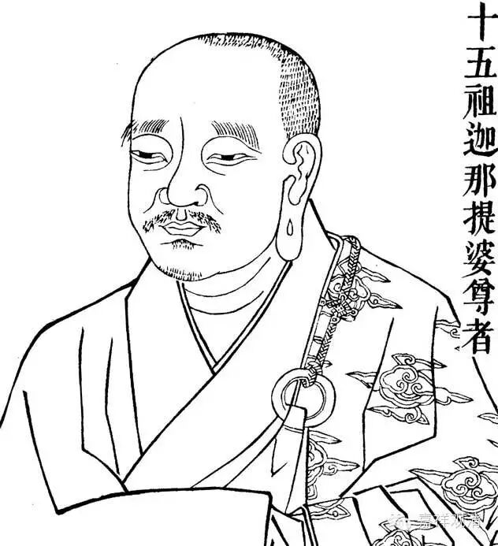

第八章

论曰：如此不用因。

是因无用即无意义。因指了因,几量皆为因,成量之因则因中因。今所破者即此成量之因,言汝因无用,徒有空言故。

前之自承悉檀,虽可为据,但须有因立义坚固不能动摇。所以此章外言有因,且不止一而有五种(此乃数论所立因果)。

一、无不可作故(释中作无法非因生)。谓无性法非因缘作。若法有性,必有因缘,以法有性无性,分别而知有因无因,否则无性有性应无差别。所以释论云如兔角等无法,终不可得以因缘生。

二、必须求因故。谓作此物必求能作材料,可知有因。故释论云如见压油求麻作瓶求泥也。

三、一切不生故。言非一法生一切法,所以者何？因果别故,释论所谓如泥能成瓶不为毡因,缕能成毡不为瓶因。余法亦尔(下二因译文缺)。

四、能作所作故。能作为因,即是因定有作,如泥定能成瓶,此与前第二因相成。前言果必有因,此言因能生果,即因果相成也。

五、随因有果故。此又与第三因相成。彼云果各有因;,此则因各有果,所谓种豆得豆也。

如此五因,皆数论学说之後期结论(见《金七十论》)。

前言自承悉檀须有因成,今具五因则悉檀成矣。

内法破曰：汝言因能生果者,因不能生(四字喋论本文)。汝言盖不论因之多少,但问因之於量能否成立。如此徵之,则知彼所云因,空言无义。中观此种破法,并不论五因各各意义如何,但辩其因之用与名也。

辩因用者,谓量之因,不外立破(译本作成坏)。今汝此因为是立用,为是破用。若有立用,汝有因能成汝之宗,我亦有因成我所立。若有破用,汝因能破我,我因亦能破汝。如火在此热,在彼亦热(立用),若能烧我,亦能烧汝(破用)。是即释论云,因为有所成,乃至在此亦复然云云。

复次,泛论难见其义,更举例言,汝立声常(宗),无质碍(译本作无身)故(因),如空(喻)。空无质碍,外道许为常住不变,以此无质碍因能成常宗。我亦可立声为无常(宗),所作性故(因),如瓶(喻)。瓶为泥等所成,以是所作故为无常,声是唇齿等众缘所发,如瓶无常。如此汝能立,我亦能立,两俱立,即俱不立,故因不定。

就此例说,可见当时因明尚不精细,实则常因不可立,而无常因可立,不能等同也。所作性因决定,而无质碍因不定,於异品心法亦有故(心法无质碍而是无常),故两量并非俱是。後来因明详究,因有三相之说完全,即无此过。又今破法,同於相违决定。如声论立声常,所闻性故,如声性。胜论立声无常,所作性故,如瓶。此二决定,其因皆不能成量,如此相违决定，因即无用也。以上就因之义用而辩,如释论说,复次更明此义,乃至理则不立云云。

辩因名者,辨宗因不俱,亦非先後,终归不成也。此中因望宗而说,有宗而後有因,但宗为谁宗,又是因之宗。如此宗因相待,既是相待,因不得成。所以者何,如论议言辞,必有次第,不能一刹那顷一切俱说。譬如说宗,梵文云鉢罗提若那,是三音成。须有记忆连续三音,相待而成一语,否则鉢罗过去,提在现在,若那未来,则不知所言何义。如此推之,宗因并不能俱。既不能俱,因为谁因。如此正因则不能立。先後亦非。所以者何,因在宗前,未成宗已灭,因在宗後,有宗因未生,皆不成因。如子未生不名为子,因未成宗何能为因。所以宗因同时先後皆不能成,故说无因徒有空言也。

後来因明发展,所谈过类,有与此相似者(如十四过类中,三世有无相似),但彼执有因,而中观不执,仍不类也。

前周八章详破执因已竞,後周十二章乃广破执相。

执相本极繁复,但外道所执总要,不外我我所执(通常亦云内外心物神形灵魂物质等)。故此周即专破我我所执以概一切,所破次第全同《百论》,且撷其精华,今可与《百论》对读而得胜解。前周乃此论所独具,後周则论主所著各种百论所共同也。

