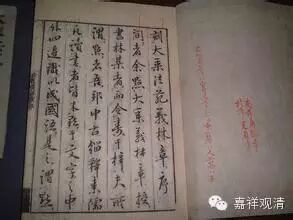

**
**

** 五心章**

“率爾”等五心。略以十二門分別。一、列名；二、辨相；三、八識有無；四、剎那多少；五、亂不亂生；六、諸心對辨；七、初後廣略；八、諸位闕具；九、三性所收；十、緣生總別；十一；何量所攝；十二、問答聊簡。

第一、列名者。一、率爾心；二、尋求心；三、決定心；四、染淨心；五、等流心。《瑜伽》第一卷《五識身地》云：“由眼識生，三心可得。”如其次第，謂：率爾心、尋求心、決定心。初是眼識，二是意識，“決定心”後方有“染淨”，此後乃有“等流”眼識，善不善轉。如眼識生，乃至身識亦爾，由初三心性類同故。但說三言，實兼後二。

第二、辨相者。且如眼識。初墮於境，名“率爾墮心”。同時意識，先未緣此，今初同起，亦名率爾。故《瑜伽論》第三卷云：“意識任運散亂。”緣不串習境時，無“欲”等生，爾時意識名“率爾墮心”。有“欲”等生，尋求等攝故。又，《解深密經》，又，《決擇》七十六說：“五識同時，必定有一分別意識俱時而轉。”故眼俱意，名率爾心，初率墮境故。此既初緣，未知何境為善、為惡，為了知故，次起“尋求”，與欲俱轉，希望境故。既尋求已，識知先境，次起“決定”，印解境故。決定已識，境界差別，取正因等相，於怨住惡，於親住善，於中住捨，“染淨”心生。由此染淨意識為先，引生眼識同性善、染，順前而起，名“等流心”。如眼識生，耳等識亦爾。

第三、八識有無者。《瑜伽》第一但說六識有此五心，不說七、八。又，間斷識，方具此五，非恒續識。然第七識未轉依位，緣境恒定，任運微細，唯有後三，一剎那中可說具故。第八不爾。界初生位有率爾心，有色、無色，境寬、狹故。決定、染淨、等流三心，境有新舊，或前後相望，可具足故，唯無“尋求”，無“欲”俱故。因第七識，界雖初生，境恒一類，故無率爾、尋求二心；初轉依位可名率爾，即是決定、染淨之心；第二念後，即是等流，二念義合，說有四心。或第二時更起淨識，初念即是此之四心，是前所起心等流故。今創墮境，有率爾故。此中且依《論》說六識。七、八道理所具諸心。理而言之，第六具五。前之五識，因果合說可有五心。因但有四；“尋求”，見聞未了之間，五墮意轉，亦是“尋求”，有希望故。不爾，此心應非五攝。“率爾”一念，“決定”未生，若非“尋求”，便為大失。“決定”意識既許多時，“染淨”未生，五隨意轉，若非“決定”，復有何心？因中，五無第四染淨，因無勢力可自引生故；果即具有，勢力勝故。有義：八地以上五識自在，前後相引，亦成染淨。許七、八識前能引後為染淨心。五何不爾？故知五識因亦具五。

總結之者：前六具五心，七、八各四。

此中有義：五識唯二，但有“率爾”及“等流心”，“尋求”等中，五墮生者。即“等流心”許亂生故。今此且依顯勝法說，餘皆准知。《瑜伽論》言：初三心中，初是五識，二是意識。又言：染淨是意識，等流方五識者。且依於一中容無雜易識境說。何因不許尋求不了數數尋求。《成唯識》云：得自在位，任運決定，不假尋求。時五識身，理必相續。故知五識具有五心，不違《瑜伽》，於理亦勝。

第四、剎那多少者。五識“率爾”唯一剎那。《瑜伽》第三云：又，非五識身有二剎那相隨俱生。又，一剎那五識生已，從此無間必意識生。故五識“率爾”唯一剎那。“尋求”未了。復起五識，此之五識但是“尋求”，故五識身無多“率爾”。說五識身有“尋伺”者，有廣尋求，無尋伺者，與“欲”俱故，亦有尋求。諸處所說，五識無有決定尋求。無深廣行相說之為無，非無微細者。若獨生意，若五俱意，“率爾心”位亦一剎那。《瑜伽》第一說：“前三心，初是五識，二是意識。”第三亦說意有“率爾”。雖復相違，以次二心必是意故。初一念中，略不說意，亦有“率爾”。既無“唯”字，理亦不遮。有說：意識說許相續。說“率爾心”通多念起，亦無過失。前解為善，初墮境故。後非“率爾”；“決定”多剎那；“尋求”未知，雖知，未起“染淨心”故。又，定中聞聲，為尋求知，便出定故，許多剎那。已得自在，任運決定。故“決定心”，亦多念起。“染淨”之心亦復如是。多念相續，以難生故。此依五識為等流心。若意等流，“染淨”唯一念，次第二念即“等流”故。唯“等流心”略有二說。意識等流相續無妨。一云：五識唯一念生，說“等流心”亦不相續。如前引說。二云：五識許相續生，一剎那者，說“率爾”故。《決擇》亦說六識相望成等無間。故“等流心”許相續起。《唯識》亦言。如熱地獄^8□忘天等理必相續。故今正義：“率爾”多唯一念，餘四多相續，或□通多念。

第五、亂不亂生者。先明不亂，後明亂生。

不亂生中復有三門：一、自他俱不亂；二、他亂自不亂；三、自亂心不亂。

自他俱不亂者。《瑜伽》第三云：又一剎那五識生已，從此無間必意識生，從此無間若不散亂，必定意識中第二“決定心”生。由此“尋求”、“決定”二識，分別境界，及為因故，“染淨法”生。此所引故，從此無間，眼等識中染淨法生，然此不由自分別力，無分別故，唯由引生，故得染淨。

他亂自不亂者。謂有他識中間，間生自識，五心仍前後起。如眼觀色，起“率爾心”，必有“尋求”續初心起。故《瑜伽》說：“又，一剎那五識生已，從此無間，必意識生故。”《瑜伽》又云：“定中聞聲，若有希望後時方出，希望即是‘尋求心’”故。”故五，“率爾”後定起“尋求心”。有人說言：“有率爾後不起尋求者”，不然！違教理故。《瑜伽》又云：“尋求無間，或時散亂，或餘五識隨一識生”。故“尋求”後，或入餘心，或起“決定”。雖起餘心，中間隔亂他境非上勝，不能引脫他識，久不生故。復卻入眼識“決定”。“決定”起時，或還起“尋求”引，或即起“決定”。“決定”為因，若無異緣，自“染淨”起；有他識奪，自“染淨”不生，他識既滅，自心方能入“染淨”位。“染淨”位起，或還入“決定”引，或即起“染淨”。下皆準知，更不別說。許多念故，“染淨心”後，若無他緣，自“等流”起；他緣識起。自“染淨”後，“等流”不生；他識既滅，自等流起，眼意二識，乃至未趣所餘境界，經爾所時，恒相續轉。是名他亂自不亂。

三、自亂心不亂者。如眼先觀一大眾色，“率爾”、“尋求”定相續已，未起“決定”，有一上好像色現前，眼識遂於餘色而轉，復起“率爾”及尋求心，或并“決定”，或“染淨心”等；見像色已，卻觀眾色；先已見故，不起“率爾”，或卻起“尋求”，引生“決定”。以許尋求多剎那故，或即起決定，下皆準知；或從初心至“決定”已，復見火色，火色之上起“率爾”等，隨多少心，既見火已，卻觀眾色，始起“染淨”；“染淨心”後，或觀雲色，隨其多少，起“率爾”等已，卻觀眾色，而起“等流”，皆準前說。是名自亂心不亂。

上來明不亂。自下後明亂者，於中有二：一、他亂自亦亂；二、自亂心亦亂。

他亂自亦亂者。如眼識生，緣一像色，起“率爾”、“尋求”已，別有聲至，復起“率爾”、“尋求”等心。像遂放光，像光既新，起前“尋求”，後復起“率爾”、“尋求”、“決定”。復別有香正現前，嗅，復起“率爾”等。像光變色，“決定”心後，復起“率爾”至“染淨心”。復值上味正現前□，遂起舌識多少心已，卻觀像光。光或大小，從“染淨心”後，復起“率爾”、“尋求”、“決定”。如是乃至復觸妙觸，起“率爾”等已，卻觀像光，光即離質，變為現異彩，復起“率爾”等……或二、或三，或至四心，名之為亂；若連次起，至“等流”心，即名不亂。餘心例然。

自亂心亦亂者，準他亂說。如眼識生，緣一像色，至“尋求”已，像色現前，卻起“率爾”，像或放光，卻起“率爾”、“尋求”等心。如是乃至不至“等流”，唯以自他境界差別。與前亂異，餘作法同。

第六、諸心對辨者。如眼識“率爾”心，亦得與餘識“率爾”心□，乃至“等流”亦復如是。《瑜伽》等說：“八識一時得俱起故。”亦有眼識“率爾”得與耳識“尋求”等四俱，眼識“尋求”得與耳識“決定”等三，“染淨”等二，乃至“等流”，一心俱起。亦有眼“率爾”，耳識“尋求”，鼻識“決”定，舌識“染淨”，身識“等流”一念俱起，理無遮故。如眼識生，乃至身識等，類此可知。有說不得，既非正義，故不說之。

第七、初後廣略者。或有“率爾”“尋求”心多，“等流”心少，初多境現有，後少境現故。或有“率爾”、“尋求”心少，“等流”心多，由前前“染淨”勢力引生故，“率爾”等境別別遇故。中間三心多說意識，不辨多少。若在果位，隨所有心，皆得俱起，隨應無失。既許因位五識有五心，隨應五心皆得□有，多少不定。

第八、諸位闕具者。此說五心，唯依因位新遇一境次第別生，有未知故。若遇舊境，但有“決定”、“染淨”、“等流”，或唯“染淨”、“等流”二心，或唯“等流”，或唯“染淨”，或唯“決定”，一念不續故。無唯“尋求”不起“率爾”，若可“尋求”，必先不了。故定有“率爾”。五識之中，無唯“率爾”無“尋求”心，《瑜伽》說故，非所餘識故。《成唯識》說：八地以去乃至成佛，任運決定，不假“尋求”。故但有四。三乘通論，無漏具五，有“尋求”故。即諸剎那，義別說有，非前後起，初轉依等，如前已說。

第九、三性所收者。《瑜伽論》說初三心是無記，第四、五通三性，此依因位中容無亂境，五識中一與第六識連續生說。若在因位，境界強勝，諸識雜生，□生五心，皆通三性所攝。若無漏位及得自在，一切多善。

第十、緣生總別者。既許一識得引六識為無間生，亦許多識能引一識為無間生。故多“率爾”引生一識“尋求”心起，乃至廣說。一“染淨”心引生多識“等流”心生，其義決定。許一識、一心得多識，引心一念生故。由斯義準，諸識一念得具五心，境有新舊，識引生別。此理微細，智者應思。

第十一、何量所攝者。因中五識，或四、或二，或許五心。皆唯現量，緣現世境。果中五識所有四心，亦唯現量，緣三世境。有義亦緣非世之境，第七因位許有三心皆非量攝。本質境及影像唯現在，行相非世境轉。果位有四心，皆唯現量，通緣三世及非世境。第八因果俱唯現量。在因緣現在，果緣三世及非世境。第六意識定位，五心皆唯現量，通緣三世及非世境。若在散位，獨頭五心通比非量，通緣三世及非世境，行相亦作世非世解。《瑜伽論》說：意識散亂“率爾”墮心緣過去者，約五後意多分緣故，與五俱意所有五心，有義唯現量作證解故。陳那菩薩《集量論》，說五識俱意是現量故。設五俱時緣十八界亦現量攝，隨五現塵明了取故。有義不定性尚不同，何況現量。《集量》不說五俱之意唯是現量，何得定判？堅執、比度既許五俱，定唯現量，於理未可。故五俱意義通現、比及非量攝，通緣三世及非世境。若緣一境，與五一俱“率爾”、“等流”，定唯現量，中間三心不與五俱，通比、非量，剎那論之，緣過去境。《瑜伽論》言：五識無間所生意識“尋求”、“決定”。唯應說緣現在境者，此依分位事緒究竟名為現在。《瑜伽》自言：“若此即緣彼境生故”。 “染淨”亦爾。三心性同。故論偏說。

第十二，問答聊簡者。

何故立五心，非增、非減？

答：據極多分，決定有五，極小有一，非圓滿故。

問：此五心通無漏不？

答：五皆通。聞聲定心通無漏故，因無漏心有希望故，或說尋伺通無漏故，設不通無漏，與欲俱故，此尋求心，亦通無漏。

問：通三界耶？

答：通。無理遮故，一一心中亦緣三界，三界諸心別識類者，隨應可俱。

問：何故須辨如是五心？

答：為令了知心之分位，入“法無我”唯識相故。

問：此說五心，聞緣教時，幾字即具？

答：且依此方，一字成名，亦能詮表，但聞一字即具五心。如聞“佛”言。二字具者，如聞“菩薩”。三字具者，如聞“慈氏佛”。四字具者，如聞“能寂如來”。五字具者，如聞“諸惡者莫作”。如是等類，乃至無量。聞緣解了即具五心，不須別限聞幾字時五心方具。若說理事未究竟來五心不具，若聞了訖方具五心，即隨所說字之多少，若名、若句竟，但意解圓滿，即說具五心。隨爾所時，意識所引五識隨生，隨彼意識，彼心所攝，亦不違理。

故六具五，七、八唯四，深為允當！

《大乘法苑义林章》卷一

