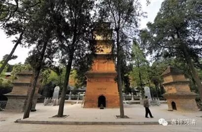

**
**

** 唯識義林第三**

唯識義章，略以十門辨釋：一、出體；二、辨名；三、離合會釋；四、何識為觀；五、顯類差別；六、修證位次；七、觀法何性；八、諸地依起；九、斷諸障染；十、歸攝二空。

第一、出體者。此有二種：一、所觀體；二、能觀體。

所觀唯識。以一切法而為自體，通觀有無為唯識故。略有五重。

一、遣虛存實識。觀遍計所執，唯虛妄起，都無體用，應正遣空，情有理無故。觀依他、圓成，諸法體實，二智境界，應正存有，理有情無故。無著頌云：“名事互為客，其性應尋思，於二亦當推，唯量及唯假。實智觀無義，唯有分別三，彼無故此無，是即入三性。”《成唯識》言：“識言總顯一切有情各有八識、六位心所、所變相、見分位差別，及彼空理所顯真如。識自相故，識相應故，二所變故，三分位故，四實性故。如是諸法皆不離識，總立識名。唯言但遮愚夫所執：定離諸識實有色等。”如是等文。誠證非一。由無始來執我、法為有，撥事理為空，故此觀中，遣者，空觀，對破有執；存者，有觀，對遣空執。今觀空、有，而遣有、空，有空若無，亦無空、有。以彼空有相待觀成。純有、純空，誰之空有？故欲證入離言法性，皆須依此方便而入。非謂有空皆即決定，證真觀位，非有、非空，法無分別，性離言故。說要觀空方證真者，謂要觀彼遍計所執空為門故，入於真性。真體非空，此“唯識”言，既遮所執，若執實有諸識可唯，既是所執，亦應除遣。此最初門所觀唯識，於一切位，思量修證。

二、捨濫留純識。雖觀事理皆不離識，然此內識，有境、有心，心起必託內境生故，但“識”言“唯”，不言“唯境”。《成唯識》言：“識唯內有，境亦通外。恐濫外故，但言‘唯識’。”又諸愚夫迷執於境，起煩惱業，生死沈淪，不解觀心懃求出離，哀愍彼故，說“唯識”言，令自觀心解脫生死，非謂內境如外都無。由“境”有濫，捨不稱“唯”。心體既純，留說“唯識”。《厚嚴經》云：“心意識所緣，皆非離自性。故我說一切，唯者識無餘”。《花嚴》等說三界唯心。《遺教經》言：“是故汝等當好制心，制之一處，無事不辨”等，皆此門攝。

三、攝末歸本識。心內所取，境界顯然，內能取心，作用亦爾，此見、相分，俱依識有，離識自體本，末法必無故。《三十頌》言：“由假說我法，有種種相轉，彼依識所變，此能變唯三。”《成唯識》說：“變謂識體，轉似二分，相見、俱依自體起故”。《解深密》說：“諸識所緣，唯識所現，攝相、見末，歸識本故。”所說理、事、真、俗觀等，皆此門攝。

四、隱劣顯勝識。心及心所俱能變現，但說“唯心”非“唯心所”，心王體殊勝，心所劣，依勝生，隱劣不彰，唯顯勝法。故慈尊說：“許心似二現，如是似貪等，或似於信等，無別染善法。”雖心自體能變似彼見、相二現，而貪、信等體，亦各能變似自見、相現，以心勝故，說“心”似二，“心所”劣故，隱而不說，非不能似。《無垢稱》言：“心垢故，有情垢，心淨故，有情淨”等，皆此門攝。

五、遣相證性識。識言所表，具有理、事：事為相用，遣而不取；理為性體，應求作證。《勝鬘經》說“自性清淨心”。《攝論》頌言：“於繩起蛇覺，見繩了義無，證見彼分時，知如蛇智亂。”此中所說，起繩覺時，遣於蛇覺，喻觀依他，遣所執覺；見繩眾分，遣於繩覺，喻見圓成，遣依他覺。此意即顯，所遣二覺皆依他起，斷此染故，所執實蛇、實繩、我、法，不復當情，非於依他以稱遣故，皆互除遣。蛇由妄起，體用俱無；繩藉麻生，非無假用。麻譬真理，繩喻依他。知繩、麻之體、用，蛇情自滅；蛇情滅故，蛇不當情，名遣所執，非如依他須聖道斷。故漸入真，達蛇空而悟繩分，證真觀位，照真理而俗事彰，理、事既彰，我、法便息。

此即一重，所觀體也。

能觀唯識，以別境“慧”而為自體。《攝大乘》第六說：“為何義故入唯識性？由緣總法，出世止觀智故。”無性解云：“由三摩呬多無顛倒智故。”或有解言：能觀唯識通以止觀而為自性，此亦不然！若取相應四蘊為體，若兼眷屬，即通五蘊。今且依名，觀體唯“慧”。無性又云：“唯識，現觀智故。”又云：“由三摩呬多無顛倒智，但舉定中所起之智以為觀體，作尋思等，勝唯識觀必居定故。”不言即以止觀為體。《攝論》又云：“由四尋思、四如實智，如是皆同不可得故，以諸菩薩如是如實，為入唯識，勤修加行，即於似文心義意言，推求文名，唯是意言。”乃至廣說。《瑜伽》、《對法》等。尋思如實智皆慧為體，尋思唯有漏，如實智通無漏。《攝大乘》云：“入所知相者，謂多聞熏習所依，非阿賴耶識所攝者。”此文唯舉無漏種子在彼位增，名為聞熏，稱非藏識，非諸能觀皆唯無漏。不爾，四尋思應非加行智。

此雖總說。若別顯者，略有二位：一、因；二、果。

因通三慧，唯有漏故，以聞、思、修所成之慧而為觀體。此唯明利簡擇之性，非生得善。故《攝論》云：“似法、似義意言，大乘法相等所生起，勝解行地、見道、修道等”。《成唯識》云：“此中唯識，資糧位中，聽聞、思惟能深信解；在加行位。起尋思等。引發真見。”

果唯無漏，修所成慧而為觀體，通以正智、後所得智為自體故。《攝大乘》等云：“如理通達故，治一切障故，離一切障故，見、修、無學道。”如其次第，證真理識，唯正體智；證俗事識，唯後得智。文多義顯，不引教成。

上來雖復辨能、所觀，總義說者，若總言“唯識”，通能、所觀。言“唯識觀”，唯能非所，通有無漏，通散及定，以聞、思、修、加行、根本、後得三智而為自體。若言“唯識三摩地”，通有無漏，唯定非散，唯修慧，非聞、思，通三智。若言“正證唯識”，唯無漏，非有漏，唯定非散，唯修慧，非聞、思，唯正智、後得，非加行。此非義說。不爾，三摩地等亦通聞、思，《十地論》說故，至下當知。

然總遍詳諸教所說“一切唯識”，不過五種。

一、境唯識。《阿毘達磨經》云：“鬼、傍生、人、天，各隨其所應，等事心異故，許義非真實。”如是等文，但說唯識所觀境者，皆“境唯識”。

二、教唯識。由自心執著等頌。《花嚴》、《深密》等說唯識教者，皆教唯識。

三、理唯識。《三十頌》言：“是諸識轉變，分別、所分別，由此彼皆無，故一切唯識。”如是成立唯識道理，皆理唯識。

四、行唯識。“菩薩於定位”等頌，“四種尋思”、“如實智”等，皆行唯識。

五、果唯識。《佛地經》言：“大圓鏡智，諸處、境、識，皆於中現。”又，《如來功德莊嚴經》言：“如來無垢識，是淨、無漏界，解脫一切障，圓鏡智相應。”《唯識》亦言：“此即無漏界，不思議善常，安樂解脫身，大牟尼名法。”如是諸說唯識得果，皆果唯識。

此中所說五種唯識，總攝“一切唯識”皆盡。

然諸教中，就義，隨機，於“境唯識”種種異說：

或依所執以辨唯識。《楞伽經》說：“由自心執著，心似外境現，以彼境非有，是故說唯心。”但依執心虛妄現故。

或依有漏以明唯識。《花嚴經》說“三界唯心”，就於世間說唯識故。

或依所執及隨有為以辨唯識。《三十頌》言：“由假說我法，有種種相轉，彼依識所變。”依識自體起見、相分，二執生故。

或依有情以辨唯識。《無垢稱經》云：“心清淨故有情清淨，心雜染故有情雜染。”

或依一切有無諸法以辨唯識。《解深密》說：“諸識所緣，唯識所現。”

或隨指事以辨唯識。《阿毘達磨契經》頌言：“鬼、傍生、人、天，各隨其所應。”隨指一事辨唯識故。

如是等輩，無量教門，舉此六門，類攝諸教。理義盡者，唯第五教，總說一切為唯識故。或束為三：謂境、行、果。如《心經贊》，具廣分別。

第二、辨名者。

梵云“毘若底”，此翻為“識”。識者，了別義。識自相、識相應、識所變、識分位、識實性，五法事、理，皆不離識，故名唯識。不爾，真如應非唯識，亦非唯一心更無餘物。攝餘歸識，總立識名，非攝歸真，不名如也。

梵云“摩咀刺多”，此翻為“唯”，“唯”有三義。

一、簡持義。“簡”去遍計所執生、法二我，“持”取依他、圓成識相識性。《成唯識》云：“‘唯’言為遮離識我、法，非不離識心、心所等。”

二、決定義。故舊《中邊頌》云：“此中定有空，於彼亦有此。”謂俗事中定有真理，真理中定有俗事。識表之中此二決定，顯無二取。

三、顯勝義。瞿波論師《二十唯識釋》云：“此說唯識，但舉主勝，理兼心所。如言“王來”，非無臣佐。”

今此多取“簡持”解唯。

識者，心也，由心集起、綵畫，為主之根本，故經曰“唯心”，分別了達之根本故。論稱“唯識”，或經義通因果，總言“唯心”。論說唯在因，但稱“唯識”。識，了別義，在因位中識用強故，說“識”為“唯”，其義無二。《二十論》云“心、意、識、了，名之差別，”識即是唯，持業釋也。或順世外道及清辨等，成立境唯，為簡於彼，言“識”之“唯”，依主無失。為令捨識而依於智，說“唯識”言。若能觀中，智強、識劣，若以為境，皆不離心。今為所觀，故名“唯識”。又，不離依主，稱為“唯識”，決斷從能，故可依智。又，從欣為目，經唯名皆般若；從厭為號，論標□唯毘若底。攝法歸無為之主，故言“一切法皆如也。”攝法歸有為之主，故言“諸法皆唯識”。攝法歸簡擇之主，故言“一切皆般若”。

是名第二，辨名號也。

第三、離合會釋者。離者，別也；合者，同也。謂諸經論各各別說諸觀等名，今合解之，但是“唯識”之差別義，非體異也。

一名，有三十一類。

《花嚴》等中，遮境離識，名為“唯心”。

《辨中邊論》：遮邊執路，名為“中道”。

《般若經》中：明簡擇性，名為“般若波羅蜜多”。

《法花經》中，明究竟運，名曰“一乘”。

此之四名，通能、所觀，真、俗境觀：正智唯真，加行、後得□通真、俗；若言證者，後得唯俗。《法花》有說唯依果智，但說三車在門外故，宅中出者，名衣□、机案及門，不與“乘”名。理亦不然。聲聞、緣覺、不退菩薩，乘此寶車，直至道場，故通因位。《勝鬘經》中，六法既為大乘故說，故通加行。《至乘章》中，當具顯示。

《勝鬘經》中，遮餘虛妄，名“一實諦”。

顯法根本，亦名“一依”。

由空為證，又是空性，亦名為“空”。

彰異出纏，顯攝佛德，佛從中出，名“如來藏”。

明體不染，真實法性，名“自性清淨心”。

功德自體，亦名“法身”。

《無垢稱經》，遮理有差別，名“不二法門”。

《大慧經》中：表無起、盡，亦名“不生不滅”。

《涅槃經》中，彰法身因，多名“佛性”。

《楞伽經》中，表離言說，名“不思議”。

《瑜伽》等中，顯不可施設，名“非安立”。

《攝大乘》等，顯此遍常等，名“圓成實”。

《對法論》等，明非妄倒，名曰“真如”。

此十三類名，唯所觀理，唯真智境，恐文繁廣，略舉爾所，非更無也。

謂：法界、法性、不虛妄性、不變異性、平等性、離生性、法定、法住、法位、真際、虛空界、無我、勝義、不思議界等十四名，如《大般若》廣釋。合前，三十一單名。

二名，有四。

《瑜伽論》中，施設、非施設。淺深異故，名為安立、非安立諦。

即《勝鬘經》，有作四聖諦，無作四聖諦。

《涅槃經》中，亦名勝義、世俗二諦。

《顯揚論》中，能詮、所詮，名、名事二法。

此之三名，通能、所觀，亦真、亦俗，初、中、後智。

《攝大乘》等，顯所執無，名生、法二無我，亦通能、所觀，唯真、非俗，通初、中、後智。

三名，有四：

《解深密》等，顯一切法有無事理種類差別，名為“三性”；顯三俱無遍計所執，亦名“三無性”。此二唯所觀，亦通三智、真、俗二境。若言三性等觀者，唯能觀，非所觀，通三智及真、俗。

《瑜伽》等中，明離繫之方便，亦名“三解脫門”。表印深理，名“三無生忍”。唯能觀，非所觀，唯本、後二智，通真及俗。

四名，有四。

《菩薩地》中，明義總集，名“四嗢□南”：諸行無常，有漏皆苦，諸法無我，涅槃寂靜。

《大智度論》顯宗差別，名“四悉檀”：一、世界悉檀；二、第一義諦悉檀；三、對治悉檀；四、各各為人悉檀。

此上二門，通能、所觀，真、俗三智。

諸論以初觀粗，亦名“四尋思”。唯能觀，非所觀，唯加行智，非中、後智，通真、俗二。

諸論以後觀細，亦名“四如實智”。亦唯能觀，非所觀，通三智，真、俗所攝。

五名，有一。

《仁王經》中，位別印可，亦名“五忍”。

一、伏忍：在地前伏印故。

二、信忍：在初、二、三地，創得不壞信，相同世間類故。

三、順忍：在四、五、六地，順為出世行故。

四、無生忍：在七、八、九地。，時任運觀無相理故。

五、寂滅忍：在十地、佛地因果位中圓滿寂故，唯能觀，非所觀。

初唯加行智，後可通餘智，皆通真、俗。

或名六現觀、七覺支、八聖道、九奢摩佗、十無學法、四念住、四正斷、四如意足、五根、五力等。非菩薩正觀，故不別說。

如是一切雖異名說，皆是此中“唯識”境、智差別名也。

第四、何識為觀者。

大眾部等說：六識有染，皆能離染。

犢子部等說：五識非染，亦非離染，第六俱有。

薩婆多等：六識有染，離染唯第六。

於大乘中，古德或說七識修道、八識修道，皆非正義，不可依據。

若能觀識，因唯第六。《瑜伽》第一云：“能離欲是第六意識不共業”故。通真、俗、三智，餘不能起，行總緣觀，理趣入真故。《瑜伽》又云：“審慮所緣唯意識故。”第七由他引亦為此觀。通中、後智。佛果通八識，能為唯識觀，三智，通真、俗、理、事二門，成事非真，唯觀俗識。此解依論，理或有真。但真如識定非能觀。

若論所觀，八識皆通因果二位，真識亦爾。

第五、顯類差別者。其圓成真性識，若加行、後得觀，是共相，非別相，以總緣遍法故。根本智觀，是別相，非共相，諸法別知故。然體非共相，萬法不離此，理一無二故，亦可名共相。諸經論云共相作意，能斷惑者，依此道理，及前加行，并能詮說。然諸法上各自有理，內各別證，不可言共其幻性。

依他識，或說因果體俱一識，作用成多，一類菩薩義。

或因、果俱說二：《決擇分》中《有心地》說，謂“本識”及“轉識”。

或唯因說三：《辨中邊》云：“識生變似義，有情、我、及了。”《三十唯識》云：“謂異熟、思量，及了別境識。”多異熟性，故偏說之。“阿陀那”名，理通果有。

或因、果俱說三，謂心、意、識。

或唯果說四：《佛地經》等《說四智品》。

或因、果俱說六，《勝鬘經》中說六識。

或因、果俱說七，諸教說七心界。

或因、果俱說八，謂八識。

或因、果合說九。《楞伽》第九頌云：“八九種種識，如水中諸波。”依《無相論》、《同性經》中，若取“真如”為第九者，真俗合說故。今取淨位第八本識以為第九，染、淨本識各別說故。《如來功德莊嚴經》云：“如來無垢識，是淨無漏界，解脫一切障，圓鏡智相應。”此中既言“無垢識”與“圓鏡智”俱，第九復名“阿末羅識”，故知第八識，染、淨別說，以為九也。

或因八、果三識：《佛地》等云，前十五界唯有漏故。

或因八、果七識。安慧論師云：末那唯染主故。

或因、果俱八識。如護法等正義所說。

依他識中，或說唯一自證分，謂安慧師。

或說唯二，見、相分，難陀師。

或說有三，自證、見、相分，陳那師。

或說四分，加證自證分，護法師。

如是所說諸識差別。

一往而論，依《成唯識》云，八識自性，不可言定異，因果性故，無定性故，如水波故。亦非定一，行、相、所依、緣、相應異故，起滅異故，熏習異故。《楞伽經》云：“心意識八種，俗故相有別，真故相無別，相所相無故。”

如是一切識類差別，名為“唯識”。

此幻性識，若加行觀，唯共，非自，若後得觀，通自相觀，一一依他各各證故。

第六、修證位次者。

《攝大乘》說：“何處能入？謂即於彼有見似法，似義意言，大乘法相等所生起，勝解行地、見道、修道、究竟道中，於一切法唯有識性，隨聞勝解故，如理通達故，治一切障故，離一切障故。”

無性解云：“在勝解地，於一切法唯有識性中，但隨聽聞生勝解故。在見道中，如理通達此意言故。在修道中，由此修習，對治煩惱、所知障故。究竟道中，最極清淨離諸障故。”

《成唯識》說：“云何漸次悟入唯識？謂諸菩薩於識性相，資糧位中，能深信解；在加行位，能漸伏除所取、能取，引發真見；在通達位，如實通達；修習位中，如所見理，數數修習，伏斷餘障；至究竟位，出障圓明，能盡未來，化有情類，復令悟入唯識相性。”

《五十九》說：“云何能斷煩惱？齊何當言已斷煩惱？謂善法資糧已積集故；已得證入方便地故；證得見地故；積集修地故；能斷煩惱得究竟地，當言已斷一切煩惱。”正同《唯識》。

《攝大乘》中，以資糧道，聞、思位長，大劫修滿方起加行，等持位中作唯識觀，從多為論，但說四位。以觀時少，略隱不說。《唯識》等中，據實為論，別修行相，見道前位亦有伏除。《攝論》、《唯識》等，各言“煖”等中作“尋思”等，觀故伏除，直往、迂迴，地前皆同。迂迴之人雖得無漏，遊觀心中，亦不能伏除，未證真識，終不能了如幻識故。

上來明位，下當辨修。

辨修有三：一、證修；二、相修；三、地修。

證修者。此見道前，雖作真、俗二唯識觀，似而非真。入見道中，真相見道，俱了真識；後得俗智方了俗識。四地以前真、俗別觀。第五地中真俗方合，然極用功始能少起，至第六地，無相雖多，未能長時。於第七地方得長時，猶有加行亦未任運。八地以上，無勉勵修，任運空中起有勝行，真俗二識恒俱合緣。至佛位已，三智俱能緣真俗識。第六不定，隨意樂故：成事唯俗，行緣淺故；或亦通真，自在滿故。

相修者。云何名為修唯識觀？謂令有漏、無漏觀心種子現行，展轉增勝，生長圓滿。初修習位，隨所聞法，託境思惟，令此觀心純熟自在，後伏所取、能取二執，觀心轉明勝，境相像漸微，忽心境乃冥，觀轉成無漏，如是展轉，下轉成中，中轉成上，究竟圓滿，名之為修。於初二位，有漏三慧皆現、種修，種修無漏，用漸增故。通達位中，唯有修慧，純是無漏，通現、種修，種修有漏。在修習位，七地以前，有漏、無漏皆具三慧，通現、種修；八地以上，無漏三慧，通現、種修，種修有漏。於究竟位，有漏皆捨，無漏滿故，而更不修。然具現、種、真、俗二門無漏之觀。

地修者。有得修、習修。《對法》九云：“又，道生時，能安立自習氣，是名得修，從此種類展轉增盛，相續生故。又，即此道現前修習，是名習修，由即此道現前行故。”習謂現行，得謂種子。有依下地起下地心，習修唯下。得修通上。得緣上境，令勢增長。下體用俱增，上唯用增故。《成唯識》云：“前三無色有此根者，有勝見道傍修得故。”有依下地起上地心，習修唯上，得修通下地。有依上地起上地心，習修唯上，得修亦通下。有依上地起下地心，習修唯下，得修通上。諸上修下，及自地修，通一切品。下修上者，必是曾得自在者修，非餘品類。《對法論》云：“下地不能修於上者。”以諸初業及漸鄰近習修者說，未得自在，未得上定，不能上修，近未生果故，非勝者可爾。

第七、觀法何性者。此有二種：一、能觀；二、所觀。

能觀定非遍計所執，彼無體故。此據正義。有漏觀者，定屬依他。無漏觀者，二性所攝：常無常門，屬依他起；有無漏門，攝屬圓成。決定無唯屬圓成者，非真理故。即顯地前唯是有漏，依他能觀；七地已前有漏、無漏，二性能觀；八地以上，唯以無漏二性能觀。

所觀性者。

《攝大乘》云：“如是菩薩悟入意言似義相故，悟入遍計所執性；悟入唯識故，悟入依他起性；若已滅除意言，聞法熏習種類唯識之相……”乃至“爾時菩薩平等平等無分別智已得生起，悟入圓成實性。”

又云：“名事互為客，其性應尋思，於二亦當推，唯量及唯假。實智觀無義，唯有分別三，彼無故此無，是即入三性。”初半頌悟入遍計所執，次半頌悟入依他起性，後一頌悟入圓成實性。

《成唯識》云：“非不見真如，而能了諸行，皆如幻事等，雖有而非真。”

如是上下三處不同。

《攝論》初文，煖、頂二位悟入所執，忍、第一法悟入依他，初地初心入圓成實。

《攝論》第二文，煖頂尋思悟入二性，四如實智悟入圓成。

《成唯識》文，要入初地，方悟三性。

雖有三文，義理唯二。一者，實證；二者，相似。

《成唯識》中，據實親證。由無漏二智，真俗前後方可證得後二性，故證二性時不見二取，即名證彼計所執無。無法體無，智何所證？心所變無，依他起攝，真如理無，圓成實攝。故計所執不說別證，但於二性不見二取，可名悟入遍計所執。然正體智，達無證理。多說此智證計所執，雖見道前亦已不見，未親得二，不名證無，故於初地方名證得。

《攝論》初文。悟圓成者，據實證得，與《唯識》同；悟前二性，據相似悟。長時、多分，意解、思惟前二性故；短時、少分，雖亦相似悟入圓成，非長時、多分，亦非親證，故據實說。

《攝論》次文，悟入三性，總據相似意趣而說。創觀名事不相屬故，名悟入所執；次觀唯有識量及假名等諸法，雖未證實，名悟依他；如實智位，雖實有相，而未證真，二取俱亡，與真智觀相似趣入，意解亦謂即是真如，故實智位名入圓成，實未悟入。

《攝論》據相似意解三性，別明悟入。《唯識》據真實別證二性，通證所執，雖文有異，而不相違。餘所有文，皆準此釋。

第八、諸地依起者。

此中有二：初辨依身、後明地起。

依身者。若頓悟者：初起依於欲界身得，創發勝心唯欲界故。《顯揚》等說：“極戚非惡趣，極欣非上二，唯欲界人天，佛出世現觀。”初地以前，三界依身一切容得，許毘□舍那菩薩生無色界，以無色心了一切故。非此何人得有是事？七地以前，得依欲、色二界身起，菩薩不生無色界故。八地以上，唯定依於色界身起，託勝所依得菩提故。

其漸悟者：初、二果人，初起必依欲界身得，不經生者，七地以前，亦通色界依身而起。雖未入地，亦不生無色，悲願自在隨受生故，亦不因修，許轉生故，不同頓悟。見道已前，自己得無漏，彼業力多故。或亦許生，三界業縛彼猶有故，非此生上厭下染故。若經生者，必不上生，發心及後唯欲界故。第三果人不經生者，欲界發心後通色界依身而起，不生無色，無利益故。若經生者及第四果，欲界發心，初後唯依欲界身起，色界發心，亦唯依於色界身起。

初證頓悟必欲界身，由斷生執，慧厭深故。漸證初依亦通色界，《顯揚》等說唯欲界中入現觀者，據各初入，非漸悟故；唯斷法執，非深厭故。

上明依身，下明地起。

欲界自地，觀通聞思，唯散非定，亦非無漏。此依正義，不取傍說。色界觀中，通聞、修慧，無色界觀，唯修無餘。色界無思慧，無色又無聞，諸教同故。此唯加行善，故非生得攝。然依《瑜伽》六十五說：“若定、若生，毘缽舍那，菩薩未得自在，及得廣慧聲聞，若諸有學，若阿羅漢，以無色界心，了三界法及無漏法”，故知無色亦有此觀。菩薩即是見道以前四十心位，地上不生，處處說故。廣慧聲聞者，隨應說之，不愚於法故。除此二外，不說餘人亦得無色心通緣於一切。菩薩見道及金剛定唯第四定，後通諸地。色六、無色四、十地隨應依起此觀。斷惑九，遊觀十，隨應別說。無漏聞、思隨依無爽，上七未至，唯有欣厭，行相猶局，故不能作。

第九、斷諸障染者。

障有二種：一、俱生；二、分別。此復有二：一、煩惱障；二、所知障。

《成唯識論》第十卷云：分別煩惱障現行，資糧道中漸伏。加行道中能頓伏盡，種、習俱初地斷，俱生煩惱障現行，地前漸伏。初地以上能頓伏盡。然故意力，有時猶起，而不為失。八地以上永不現行，習地地除，種金剛斷。其身見等及此俱生，四地永伏，法執無故。此所生起，五地不行，以害伴故。所知障中，分別現行，亦資糧道中漸伏。加行道中能伏盡。種習初地斷。俱生現行，地前漸伏，乃至十地方永伏盡。若別說者，前之六識，八地頓伏盡。種習皆地地斷。七識現行，金剛喻定加行道伏。金剛喻定起時，種、習俱斷。

《菩薩地》，說煩惱、所知障，皆有三住所斷。

一、極喜住。一切惡趣諸煩惱品，及所知障，在皮，粗重，皆悉永斷，能令一切中、上煩惱皆不現行，最初證得二空真智。

二、無功用無相住。一切能障無生法忍諸煩惱品，及所知障，在膚，粗重，皆悉永斷，一切煩惱皆不現前，最初任運得無生忍。

三、最上成滿菩薩住。一切煩惱、習氣、隨眠，及所知障，在骨，粗重，皆悉永斷，入如來住。

《解深密經》，說有三隨眠：

一、害伴隨眠。謂前五地，諸不俱生煩惱，是俱生煩惱現行助伴，彼於爾時，永無復有。此意說言，第六識俱身見等攝，說名俱生，所餘煩惱，名非俱生。然體稍粗，因彼而起，由彼斷故，此亦隨無，故名害伴。

二、羸劣隨眠。謂第六、七地，微細現行，若修所伏不現行故，非俱生身見，斷此亦隨滅。稍難斷故，不違《楞伽》俱生身見斷故貪即不生。彼約二乘斷煩惱說，不依菩薩所知障無故煩惱不生說。或依二隨眠究竟斷位，彼《經》此《論》，亦不相違。

三、微細隨眠。謂於第八地已上，彼此已去，一切煩惱不復現行，唯有所知障為依止故。然由初地已斷皮粗重故，方可顯得初二隨眠位。復由第八地在膚粗重斷故，顯微細隨眠位。若在骨粗重斷者，我說永離一切隨眠，住在佛地。

《實性論》中，或說四障：一、闡提不信障；二、外道著我障；三、聲聞畏苦障；四、緣覺捨心障。

十信第六心，伏初障，信不退故。

十住第四住，伏第二障，分別我見粗不生故，此二種子，入初地斷。

第三所知障，五地斷，樂於下乘涅槃之障五地斷故。

緣覺捨心所知障，七地方斷，六地猶觀十二緣故。

或，初、二煩惱種，見道斷；後二煩惱種，金剛斷。

《勝鬘經》說：五住地煩惱：謂見一處住地、欲愛住地、色愛住地、有愛住地、無明住地。見一處住地，初地斷。次三，金剛斷；無明住地，見、修二道，如其次第，頓、漸而斷。若初四習隨同所知障，見、修道中，頓、漸而斷。

或說六煩惱，或說七隨眠、八纏、九結、十煩惱、十散動、十分別等。如《斷障章》廣說。

此說唯識觀斷，不說餘所除。

第十、歸攝二空者。

諸論說二空：一、生空；二、法空。

其唯識觀通二空觀。尋思實智，通生、法空，為生所依。但說觀法，意求種智，觀法空故，為於二空生正解故。

然且法觀，必帶生空。《論》誠說故。何故？翻悟說迷，生執必兼法執；返迷說悟，生空不帶法空。若以解有淺深，悟生未必悟法，亦應迷有深淺，迷用不迷於體。今釋：未有解體而迷用，所以生執必帶法執；悟淺不達深，生空未必帶法。《二十唯識》云：“所執法無我，復依餘教入。”此唯識教入於法空，此說法空，必依唯識，非唯識觀唯是法空，獨作生空亦唯識故。但是法空觀，必定是唯識，生空不定。二乘生空，非唯識觀。故唯識觀寬，通生、法觀；法觀義局，唯是唯識；生觀義寬，通唯識、非唯識觀。唯識觀局，有生空非。由此，唯識觀望生空觀，順前句分別：無唯識觀非生空，但法空觀必帶生故；有生空觀非唯識。謂二乘生空觀。法空對唯識，亦復如是：有唯識非法空，謂唯生空唯識觀；無是法觀非唯識。此二作句，其義可知。總相而言。唯識通二空觀，《論》但說法觀為唯識觀者，據決定故。

復說諸空互相攝者，如《空章》說。

《大乘法苑义林章》卷第一

