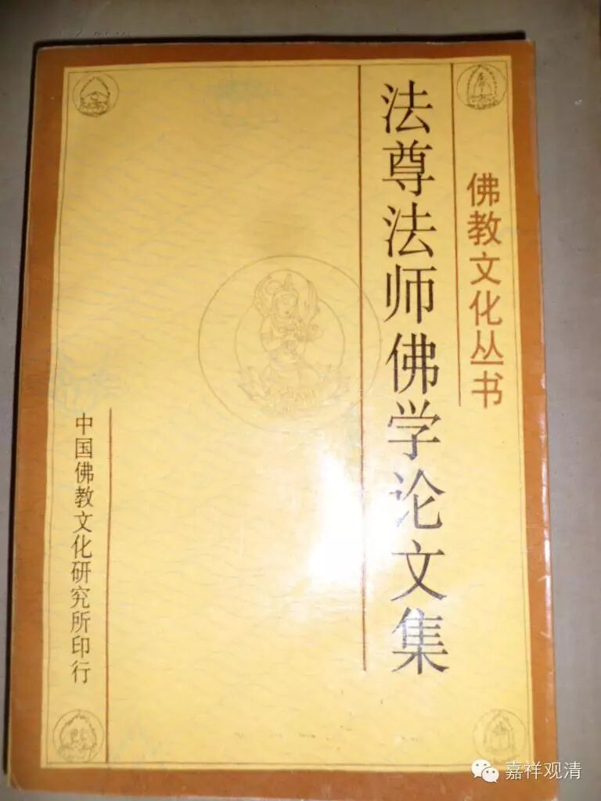

略谈定学

法尊法师

现在想谈一谈佛教根本法门的三学中的定学，势必也牵扯到全部的佛法。佛教法门无量，说之不尽，今约略言之，不出教和证二类，如《俱舍颂》云：“佛正法有二，以教证为体。”属于教的佛法，是通常说的经律论三藏；属于证的佛法是通常说的戒定慧三学。教，是指示学佛的人们如何去修行的方法；证，是学佛的人们依着方法去修行的进程。在这进程中也势必要先依着戒律才能修定发慧，而后方能断烦恼、证解脱，乃至成佛。这是佛教中修行的一定途径。再说修定的人，也必须要知道修定的资粮，如《瑜伽师地论·声闻地》广说十三种资粮：“自他圆满善法欲，戒根律仪食知量，觉寤正知住善友，闻思无障舍庄严”。其中最为主要的是：严持净戒、少欲知足、达离愦闹、制伏欲念、灭除一切虚妄散乱(诸恶寻伺)、学会修定的教授。如果修定的资粮完备，则当找一个环境适宜于修定的所在。先使身心安适(身不能太劳顿，心亦不能有事牵扯，身心若匆遽不宁，绝对没有办法修定)，入座后，先应调息，使息和柔不躁，不粗不急，身便安静。身安静后，令心专注于修定所缘的境。修定所缘境的种类繁多：有属胜义谛方面的，如空性、真如、法界、唯识性等等；有属世俗谛方面的，如不净观、持息念、五蕴、十二处、十八界等等。这也有属于自身以外的，如观尸陀林中九种不净及观清净佛土中诸佛菩萨依正庄严等等；有属自身以内的，如观自身三十六种不净物、出息入息，及修密法所观之本尊身语意、种子、咒轮、三味耶相，乃至圆满次第的安乐智等。总之，修定的人，事先自己选定一种所缘的对象。身安静后，就应令心专注这种所选定的定境而修定。

　　初步修定的方法：或依《瑜伽师地论·声闻地》所说的九住心的次第，或依《辨中边论》所说八断行的次第而修(这两种次第仅是在说明方面有详略的不同，其内容是一样的)，进而渐次灭除妄念、散乱、掉举、昏沉等过失，令心在所缘的境上明了有力地安住。久而久之，其心便能不沉不掉，平等正直，任运地安住了。这是欲界定中最高的境界，即第九住心名等持心。从这个等持心也会发起身心轻安，即成为经论常说的奢摩他，即止观的止。这奢摩他已超出欲界心，而成为色界定中最低的定，名未到定，又名色界少分作意。这未到定是修世间出世间一切功德的基础。

　　从欲界上达色无色定地，未到定是起着过渡桥梁的作用的，而它的前面只有两条路：一条是世间道，即四禅四空定，是内道佛弟子和一切外道仙人所共走的；另一条是出世间道，即修四谛十六行相，或人法二种无我的道理，是佛弟子所独走的。因为其他仙人皆计有我不相信无我的道理，所以也就不能修出世间的道了。修出世间道的方法，散在许多经论中，俱舍论贤圣品中说的也很详尽，这里不繁说了。这里只略说一下内外共趣的世间道的定地过程，因为经论中对世间定往往只列举其名字，不谈修法。

　　世间禅定，即通常说的四禅四空定（即四种静虑和四无色定）。这八种定的境界，一个比一个高深，必须先得到低的浅的，才能进修高的深的；而八种定，是指已经修成功的根本定。每一种定在修行的过程中，都有他的加行，即修定的方法。声闻地举出七个作意（就是七个阶段，或七个步骤），称近分定。

　　修行人在得每一地的根本定时，必须已经断尽下一地的烦恼，如得到初禅根本定的时候，必已断了欲界的烦恼。但每一地的烦恼，都不是一下能断完的，必须先断粗猛的，渐断微细的。乃至最后把这一地的烦恼断完，就叫离了下一地的染，得到上一地的根本定。这每一地的烦恼个数虽然很多，但在断烦恼的过程中，不是一个一个地断，而是将每一地的烦恼总为一聚，就其粗细的程度分为九品而渐断(如贪有九品，嗔也有九品，慢、无明、疑、恶见等也各有九品)。故在一般经论里说断每一地的烦恼时，皆有九无间道，九解脱道。这修定的加行过程中说有七个作意，也就是因为必须断尽下一地烦恼，才能得到上一地的根本定。在断烦恼的过程中，又有准备、正断、检查等工作，所以就分了七个作意。这里把七个作意的名义解说一下。

　　第一是了相作意。了相的相，是指所要知道的事情、情形、义理。就修初禅来说，它所要了知的相，是欲果的种种痛苦和初禅的种种快乐的情形。也就是说得了未到定而想进一步修初禅的人，必须先了知欲界的过患(起厌离心)和初禅的功德(起求得心)。由闻思慧的力量，数数思惟这过患与功德而得到的一种明确的认识，所以名叫了相作意。由这个作意的力量，奠定了进修的基础。但这一个作意，却属于下一地所摄。

　　第二是胜解作意。胜解，就是对于一件事情起了明确而决定的认识。即对于所了知的下地过患和上地功德以修习力确定认知更不可转，所以称之为胜解作意。这时就专注于所了知的过失、功德等所缘的境相上，兼修止观、培养成断除烦恼的慧力。这个作意，是断除烦恼的近加行，也就是引生远离作意的亲因，是属于上一地所摄；如修初禅时的胜解作意即属初禅摄。

　　第三是远离作意。远离指能断除下地烦恼的意思，由这作意初能断除下地的三品粗烦恼，故名远离。基于胜解作意数数修习决定明确上下地功德过失之相，定慧的力量增强到能断上三品烦恼的时候，即名远离作意。因这个作意正能断除烦恼，所以是真对治道。

　　第四是摄乐作意。这摄乐的“乐”字在修初、二禅的时候容有喜乐二种受，在修三禅的时候只有乐受，在修四禅以上诸定的时候，便没有喜乐受心所，只有舍受了。摄乐，指见到断除下地烦恼的胜利方面，假名为乐。由作意力断除了下地最粗的三品烦恼，但较细的烦恼仍常现行，因而倍起精进，于得失境勤加修习，使定慧力量更加增强，进一步能断除下地的三中品烦恼。到了将下地烦恼多分断除，已能引生上地的少分喜乐，滋润着身心，因之名摄乐作意。这个作意也是正断烦恼的真对治道。

　　第五是观察作意。观察，是指详细检查自己心中是否尚残余下地烦恼未曾全断。假使未断谓断，未证谓证，误起增上慢，便会障碍修行的上进。由于摄乐作意断了六品烦恼；所剩下的极微细的三品烦恼，多不现起；若稍为粗心大意，容易错认为把下地的烦恼完全断尽，堕增上慢。所以在这个阶段上，必须彻底检查一下自心，检查的方法，是特别思维下地可爱的境界(即看在未学修定之前，见了什么境界能使自心发生烦恼，现在就用那个境界作为试验自心的手段)，如果说已将下地烦恼断完，则任随思维何种可爱的境界，也只是视为粗苦障碍的境相，终不起一丝烦恼。若是烦恼未真断完，仅是断了粗的而潜伏着细的不起现行而已的话，那末，特别思维可爱境相时，那些微细烦恼仍然会慢慢地现起。根据这观察，便知自己烦恼实未断尽，仅是暂为定力所伏而不现起，还须进修断除所余微细烦恼，这就是观察作意的作用。

　　第六是加行究竟作意。加行是修定的方便，究竟是修定最后完成的意思；这个作意，在修定断除下地烦恼过程中，是断除下地最后烦恼的方便。在经过上面的观察作意的检查，发现自心实在尚残余有微细三品烦恼潜伏未断，于是重加精进审谛思惟上地功德和下地过患境相，以熏修定慧的功力，使其增强到能断除最下三品烦恼；这时，这个修定断烦恼的过程即将圆满，因之名为加行究竟作意。这作意也是正断烦恼，名真对治道。

　　第七是加行究竟果作意。这个作意是在这个定地中从下地烦恼中解脱出来的最后解脱道，是修诸加行的究竟功德果实。故名加行究竟果作意。但这解脱道是否即成为这个上地之根本定？据《瑜伽论》的《声闻地》说，解脱下地第九品烦恼的解脱道，即是上地的根本定。如说：“由是因缘，证入根本初静虑定，。即此根本初静虑定俱行作意，名加行究竟果作意。”但俱舍论则说，离欲界第九品惑的解脱道和离初静虑地、第二静虑地第九品惑的解脱道，或转入各自上地的根本定，或仍属近分，这是没有一定的。从第四静虑乃至有顶地的五地中，各离下地第九品烦恼的第九品解脱道，必定转入各地的根本定。因近分定是舍根相应，而初二静虑根本定是喜根相应，故三静虑根本定是乐根相应。故近分定和根本定的受根不同，转根较难，所以有能转入、有不能转入的。第四静虑以上的根本定都是舍根相应的，较之于近分定的受根，容易转入。如《俱舍颂》云：“近分离下染，初三后解脱，根本或近分，上地唯根本。”当知瑜伽是约粗相说，俱舍是约细相说，所以并无乖违。

　　上面说的七作意中，有三作意是正近分定、有三作意是近分定的因，有一作意是近分定的果。正近分定就是正能断除下地烦恼的作意，即远离作意(能断下地的三粗品烦恼)、摄乐作意(能断下地的三中品烦恼)、加行究竟作意(能断下地的三下品烦恼)。近分定的因，就是了相作意、胜解作意、观察作意。由初二作意之力，使近分定未生者生起，即生起远离和摄乐。由观察作意之力，使已生起的近分定不致中途停滞，而转更上进，这就是加行究竟作意。近分定的果，即加行究竟果作意，它是修定的胜利果实。

　　此中所说的七种作意，在其它经论所说断除一一地的烦恼有九无间道、九解脱道，只是开合不同，并不相违。初二作意属于加行道。远离作意包括下三品无间道和三品解脱道。摄乐作意包括中三品无间道和三品解脱道。观察作意是后三品无间道的加行道。加行究竟作意包括上三品无间道和第七、第八品解脱道。加行究竟作意包括上三品无间道和第七、第八品解脱道。加行究竟果作意就是第九解脱道。

　　七种作意多分约欲界人间的修知禅人的定境而说，即修二禅以上诸定也都有这七个过程，也多分未离人间。如《瑜伽论·声闻地》说：“如初静虑定有七种作意，如是第二、第三、第四静虑定及空无边处、识无边处、无所有处、非想非非想处定，当知各有七种作意。”这八地的近分定，若是欲界身修，在第一作意时，有闻思二慧间杂而修。若是色界身修上地的定、容有闻慧，决无思慧，因为一起思维，即入定心而成修慧。无色界有情，只有生得，更无闻思所成慧。

　　还有，世间近分定断除的烦恼：据婆沙师说，是把下地的见所断烦恼与修所断烦恼合为一聚，分为九品而顿断；经部师则说，世间道仅能断下地的修所断烦恼，不能断见所断烦恼，说见所断惑，唯无漏道方能断除。那些主张有七识八识的论师，则说诸世间道，也不能把下地修惑断尽，如得初禅的欲界凡夫，对于第七染污末那尚不能伏，如何能断；所谓断，仅是以定力暂伏前六识上的烦恼现行，非真能断除诸烦恼种子。又此八地的近分定中，唯初静虑的近分定有净定和无漏定(这是约性质说，待下文详说)。有人说，也有味相应定。第二静虑以上七地的近分定，则只有净定。如《俱舍颂》说：“近分八舍净，初亦圣或三。”

　　上面已略谈了修定的方便加行，今继续谈一下所修得的定的体性。定，大体可分为二类：一是世间性的，即有漏定；一是出世间性的，即无漏定。有漏定又可分为两大类：一是有烦恼相应的，即杂染定；一是善性的，即清净定(有时略称净定)，这样，也可说为三大类：即杂染定、清净定、无漏定。以上是就性质说。若就定的程度来说：一类是有色定，就是四静虑，普通简称四禅；一类是无色定，就是四无色处，普通简称四空定。附带说明一点，即初静虑中又有两个阶段：一个是有寻伺两个心所法相应的，就是普通说的初禅根本定；一个是已断寻心所、只有伺心所相应的，普通叫作中间定。如是包括近分定共是十七个阶段，就是八个近分定、八个根本定和一个中间定。

　　近分定中，除了初禅的近分定亦通无漏外，其余七个近分定性质，只是有漏的清净定。因为这些定都是厌离了下一地的定而进修上地定的加行，就是上面说过的七种作意的阶段，在这阶段上，既不起烦恼而成杂染，也不起出世道而成无漏。现在主要的是进而说诸根本定。

　　所言杂染定，是指修定的人依着修定的方法，经过七个作意，得到了清净根本定。例如得到初禅，自己对于所得的定，没有真实的认识，住在定上发生了贪爱等烦恼(上界心相应的烦恼都是无记性)；致使所住的定，变成了有覆无记的性质，这就叫作杂染定；而被它所杂染的是清净善性的根本定。如俱舍论说的“味着”，正指定地中所起的贪爱，而所味着的定就是净定，因而这种定是有漏，是杂染。至于无漏定则味着不上，因为无漏法能治烦恼，烦恼所不能染着故。同是一种禅定而性质上却有杂染与清净之分，主要的是指在清净定中能使净定变成杂染定的，因为有贪、慢、疑、见四种烦恼相应。也就是说，有的定被贪爱杂染了，有的定被慢心杂染了，有的定被疑惑杂染了，有的定被恶见杂染了。

　　一、净定被贪爱杂染的情形。例如有人修得根本初禅，这禅定境界寂静安适，远非欲界的快乐所能比拟，于是对于这个定境生起贪爱，味着不舍。好像我们贪着一种美味一样。那时他所住的这个定，就被贪烦恼杂染了，它的性质变了，它的功力也减退了。但是修定的人，自己也许还不觉得。若由这烦恼逐渐增强，也可能引起下地的烦恼，那就会把得到的定退失了。故修定的人，对于定境的认识，也是最要紧的。

　　二、净定被慢心杂染的。例如有人修定，经过许多困难方把净定修成，一旦住在定心，回想自己修定非易，觉得一般迷恋五欲的人，固不能修定，即使有志于修定的人，也有因环境不顺、众缘不具足，也有被散乱、掉举、昏沉等烦恼所障，也有因经历长时而中途放弃的，也有因业障、疾病或其它因缘走入歧途的；以是不能心入定境安住净定。我今得定实属希有，唯我能得他人不能得，一起这个念头时，已经生了慢心。这时他所住的禅定就被慢烦恼所杂染，这定的性质也就变成了有覆无记的杂染定。

　　三、净定被疑惑杂染的。例如有人修得净定，而不了知此定是否是真能断除烦恼、解脱生死的道。这也就是学问不够，或是不曾亲近过真善知识，不曾听闻过佛法，不了知世间道和出世间道的差别，所以对于自己所得的净定究竟是个什么道、程度有多高、功用有多大，一概弄不清楚。因而有人得了初禅的自己误认为得了初果，乃至得到四禅的自己便误以为得了四果成了大阿罗汉，这样，就成为未得谓得，未证谓证的增上慢人。倘若对于所住的定疑为真能解脱生死之道(无漏道)，或疑为非真能解脱生死之道，不管他疑的对、或不对，只要生起这一类的疑惑，那时的净定，就和疑心所相应，成了有覆无记的杂染定了。

　　四、净定被恶见杂染的，主要是被身见(萨伽耶见)、边执见、邪见的三种恶见所杂染。例如我执重的人，修得清净定时，自以为是由“我见”的力量而修成的。如计有神我的外道们，认为神我有如何如何的伟大作用，修得定时，亦以为是由神我的力量而得的。边执见(或计我是常，或计我是断)重的人，认为自己的见断见常是正确的，即得定时，亦以为是由此见的力量而得。邪见重的人，或拨无善恶因缘果报，拨无解脱道、涅槃果，或妄计有创造宇宙、主宰人生善恶苦乐之真神等邪见。由这些邪见所迷，对于自己所得的净定，也以为是无因果，或以为是由神力而得等。不论是哪一种恶见，只要有一恶见现起，净定即被恶见所杂染，变成了有覆无记的杂染定。

　　上面列举被四种烦恼染污的定，其实都有无明烦恼渗杂在里面，尤其是疑惑烦恼，它和无明同缘一个境界而起，由对于所得的定不能明了(无明)，才起疑惑的，所以不另外说无明为能染污的烦恼了。嗔恚烦恼只有欲界心中才有，上二界心已无嗔恚，故以不说嗔恚为染污定的烦恼。《俱舍论》中，依着迦湿弥罗国毗婆沙论师们的主张，只说贪爱是染污定的烦恼，颂称“味谓爱相应”；长行释云；“初味等至，谓爱相应，爱能味着故名为味，彼相应故此得味名。”这就是说杂染的定，也名“味等至”(等至即定的别名)，味字指的是贪爱烦恼，因为对定境贪爱味着不舍故，定的本身虽不是味，而它和贪爱相应，所以也就把这定叫“味等至”。凡染污定，多半是被贪所染污，所以毗婆沙师偏说贪爱所染的为杂染定(味等至)；其实染污定亦有被慢、疑、见所染的。

　　如果修定的人知道所修得的定，还有这些不纯净的、有过患的、容易退堕的情形，便随时检查自己的定心，一发现染污相，即赶快纠正，以免被它所迷误以至退堕。

　　次谈清净定。清净定就是依着修定的方便(七种作意)而得到的善性根本定。这定所以名清净，是由于和无贪、无嗔、无痴等善心所法相应而起，善性即清净，所以名净定。又因为住此净定时，本地的烦恼亦不起现行，以没有本地烦恼染污故，名为净定。就此定本身说，虽是善净无过，但住定以后的心境是有着如下四种转变的：一、住此净根本定中将起烦恼而转成杂染定的，这净定名顺退分摄；二、住此净根本定中不起烦恼，保持继续起清净定的，这净定名顺住分摄；三、住此净根本定中却不起自地心而引生上地定心的，这净定名顺胜进分摄；四、住此净根本定中却不继起有漏定而引生无漏定的，这净定名顺决择分摄。《俱舍颂》说的“净谓世间善”；又说明“净定有四种，谓即顺退分、顺住、顺胜进、顺决择分摄；如次顺烦恼、自、上地、无漏”。初禅净根本定，乃至无所有处净根本定，都容有此四种；唯有顶地(非想非非想处)的净根本定，只能有三种，没有顺胜进分摄，因为它是有漏定地最高境界了。

　　末了谈无漏定。如有修定的人在未得定前，或在已得定后，学习出世间道的行相、修法等；即于得定后，在定心中更进行观察四谛十六行相，或观空无我；到了亲证真见道而升起真空无漏智时，或亲证四谛的十六行相而升起苦法智忍等时，这无漏道所依的净根本定，也就成了无漏定。智慧，是转有漏为无漏的力量，它能使与它相应的一切心王心所法，皆转成了无漏。能为无漏道作所依止的定，只有九种：即初禅的未到定(近分定)、初禅根本定、中间定、二禅根本定、三禅根本定、四禅根本定、空无边处定、识无边处定、无所有处定。也就是说，这九种定，可能成为无漏。欲界心过于散动，不能升起无漏道；有顶心过于昧劣，也不能升起无漏道。二禅以上的七种近分定，过于匆遽，不暇修出世间道；与其依止二禅以上的近分定，还不如依止初禅近分定或根本定而修出世道较为从容易成。但这里要知道的，初禅近分定，并非说七种作意，是说七种作意前的奢摩他，即上面提到过由欲界九住心后发起轻安之止，这止也名未到定。修无漏道(即观察四谛十六行相或二无我等)的方便。广如俱舍论的贤圣品、瑜伽论的声闻地及集论、摄论、毗婆沙论、成唯识论等所说，现不能详谈。

　　现在附带谈一下住四静虑、四无色定的支分。

　　四静虑是以支分多少而安立的。初静虑有寻、伺、喜、乐、等持五支；第二静虑有内等净、喜、乐、等持四支；第三静虑有正念、正知、行舍、受乐、等持五支；第四静虑有念清净、行舍清净、舍受、等持四支。

　　初静虑五支中的寻支，是唯寻求诸义自性的内心“意言”(意言即心理上的分别)，是以思慧心所为体的。伺支，是能详细思察诸义之因由等的内心意言，也是以思慧心所为体的。俱舍论说这二支可同时起；而经部以上诸宗则主张这二是迭次相生，非同时起。乐支，俱舍说初二静虑中的乐支，是以轻安心所的乐为乐支，不是乐受心所；因为初二静虑中没有乐根(乐根指前五识相应五受中之乐受)，正住在定的时候是不起前五识的，当然也不起前五识相应的心所乐受。次之，初二静虑中也没有如第三静虑的“心受乐”，因为心受乐是意识相应的受心所法，初二静虑中有喜受(即喜支)，这喜受即意识相应的受心所法。喜支，是指意识相应的喜受心所法。集论疏中说喜乐二支是意识相应的一个受心所，就其能摄益同分根身(就是由此受心所的力量能使自身的色根增长受益)，安立为支；就其能使其余的相应法等适悦(就是由受心所喜悦的力量使其与它相应的心王心所等也都喜悦)，安立为喜支。故支虽立为二，体实是一个心所。等持支，即禅定的本身，指由此定力，能使与定心相应的心王心所等皆专注于所缘的定境。这定心即别境心所中之定心所。以上初静虑的五支，集论意说寻、伺、等持三支，为五蕴中的行蕴摄，喜乐二支，为受蕴摄；而俱舍则说寻、伺、乐、等持四支为行蕴摄，唯喜支为受蕴摄。

　　得初禅后，如对于五支中的寻支能厌其粗苦而加以断除；便能进而证得上说的中间定(以其在初禅二禅之间，故名中间)，这无寻唯侗的中间定，也名初静虑胜根本定；因为定体仍是初禅，而功德较初禅为胜，故名胜根本定。二禅以上各地各支，没有这种粗细的差别，所以也就没有断除一支分的中间定。

　　第二静虑四支中的内等净支，俱舍论说是信根；即证得第二静虑根本定时，对于第一静虑亦可出离，发起深信，名内等净。瑜伽师地论决择分中则说是在第二静虑地所摄的正念、正知、行舍三法上假立名内等净。内等净的意义，是指第二静虑能息灭初静虑心境上的寻侗鼓动，使内心相续平等清净而转，所以名内等净。至于喜、乐、等持三支，如初静虑所谈。

　　第三熟虑五支中的正念支，指能忆持不忘修第三静虑教授的念心所法。正知支，指能防慎昏沉掉举等过失的心所法。行舍支，指远离昏沉掉举过失、令心平等运转的心所法(即十一善心所中之行舍心所)。心受乐支，指第六意识相应的适悦行相的受心所。这与第六意识相应的适悦受，在初二静虑时，系初息灭于境界散动得名为喜；第三静虑时，已厌喜动、息灭喜受，在此时所有的适悦行相受，转名为乐而不复名喜；同时为简别前五识相应的乐受，故名心受乐。等持支义，如同前说。

　　第四静虑四支中的念清净支，即远离静虑的八种灾患(寻、伺、苦、忧、喜、乐、出息、入息)而能正忆持修第四静虑教授的心所法。行舍清净支，即远离八种灾患、令心平等转的心所法(清净即远离八种灾患的意思。初禅已离苦忧二灾，二禅更离寻伺二灾，三禅更离喜受灾，四禅更离乐受与出入息的灾患)。舍受支，即指已远离八种灾患的第六意识相应的非苦非乐的中庸舍受心所法。等持支如前说。第四静虑中虽也有正知，但不再立为支，因此已离八种灾患，不须要更加防慎沉掉的过失了。为什么说寻伺喜乐为静虑之灾呢？要知道这是对待障碍上地说的，不是指在此地也名为灾。如寻伺心所，对进修二禅虽是灾障，但对于初禅自地，非但不是灾障，却是必不可缺少之功德。

　　实际，四种静虑的根本定，一一皆有很多功德为体，而诸经论中但说五支四支的，只就静虑地中的对治、胜利、安住方面而偏说的。如初静虑五支中的寻伺即对治支，以在修初静虑加行时，全仗寻伺的力量断除下地(欲界)的烦恼，而证得初静虑(在根本定时，则是远离对治，非断对治；四种对治之理，如俱舍论中说)。喜乐是胜利支，要用寻伺断了下地烦恼，方能生起此喜乐。等持是安住支，要依止等持，其寻伺对治支和喜乐胜利支，方能生起。第二静虑四支中的内等净是对治支，仗此能远离初静虑的寻伺。第三静虑五支中的正念、正知、行舍为对治支，仗此能断除第二静虑之喜。第四静虑四支中的正念清净、行舍清净即对治支，仗此能远离第三静虑之乐受。其余可以类推。

　　区别四种静虑的根据，是依定境渐次离掉下地粗支而安立的。如以离掉欲界的一切恶不善法并忧苦的受而安立了初静虑，因之初静虑的喜乐，名离(欲)生喜乐。次之以离掉初静虑的寻伺而安立第二静虑，因之第二静虑的喜乐，名定生喜乐。复次以离掉第二静虑的喜受而安立第三静虑，因之第三静虑之乐，名离喜妙乐。最高的也是最后的以离掉第三静虑之乐受而安立第四静虑，因之这地名舍念清净地。《俱舍论》总结四静虑定境心理云，“初俱伺喜乐，后渐离前支”，这是四种静虑渐次胜进的最简明的说明。

　　在四静虑之支方面，依名数说，共有十八支。约事实说，俱舍论举出十一事，即寻、伺、喜、轻安乐、等持、内等净、正念、正知、行舍、心受乐、舍受；集论只举九事，即寻、伺、喜受、等持、行舍、正念、正知、心受乐、舍受、不别立轻安乐和内等净。如第二静虑有轻安乐支，实际第三静虑的轻安微妙，乐遍身心，胜过初二静虑，照理亦应立为支，但第三静虑是不立的，集论可能依据这种理由，少举了二事。

　　现在略谈四无色定。四无色定是从第四静虑更进入另一阶段的定境。第四静虑已离八种灾患，一切禅定中是最为殊妙的，因为止观力量均衡，对引生一切世出世功德是最为有力的。但终是有色想存在着，而色是粗法，是有障碍法，是有种种差别的法。所以在有智慧的人看来，觉着像疮像痈，像被箭射着一样的痛苦。因此进一步观察色的粗、苦、障等过患，观察无色无拘无碍、自由自在、寂静安适等功德。在第四静虑中运用了相等七种作意，逐渐地超越青黄赤白等诸显色想，除遣墙壁等诸有对(障碍)想，息灭园林河流等种种差别想，最后只缘虑着空无边处的受想行识四蕴及虚空想，那就是空无边处定的缘相，而得名空无边处定。在修空无边处定的加行时，尚有时缘色界(第四静虑)，有时缘无色界；到根本定时，则只缘无色界，不复缘下界了。已得空无边处定的人，进一步感觉到心缘无边虚空的粗相徒自劳累，于是弃舍外空，专缘内识的微细相，逐渐除遣空无边想，最后识无边处的四蕴细相现前时，即名为识无边处定。已得识无边处定的人，进一步感觉内识攀缘，犹被识所系缚，仍是拘碍，仍是粗相；于是进而弃舍攀缘内识，内外都觉无所有，所缘境相极为微细寂静，这时即名为无所有处定。已得无所有处定的人，进一步觉察到都无所有的缘相，而内心却是即把此“都无所有”作为所缘之境，既有特殊的所缘，则心仍有所拘而非自在，这无所有仍是粗相。于是进观：若全无想，便同痴暗，若存有想，便如病、如痈、如被箭射中的过患；唯有处于“既非有粗动、明显、强盛之想，亦非无微细、昧略、劣弱的想”，此非想非非想才是最静、最妙、最为出离，在出间定中，再没有比这定境更为微细的了。这样地修习静相，终至能除遣都无所有的缘相而专缘于有顶地的四蕴最静妙相现前时，即名为非想非非想处定。

　　就是这样地由遣除色想而安立空无边处定，遣除空想而安立识无边处定，遣除识想而安立无所有处定，遣除无所有想而安立非想非非想处定；故四无色定是依所缘相的递次胜进、递次超越下地而进升于上地的意义而安立的。

　　以上列举的四静虑和四无色定，都是就人间所修的禅定而谈。但修得这些禅定之后，将来会得什么果报呢？修禅定既划分为世间与出世间、有漏与无漏的不同，果报也当然有所不同。无漏定是断烦恼的工具，它能使：一、获得禅定的人也享受着现生的禅悦妙味；二、再不感受世间什么果报了。有漏的禅定，通称为不动业，如修成而不退失，那么也是能感果的。如有漏的四种静虑，就感生色界的禅天。即初静虑的梵众天、梵辅天、大梵天；第二静虑的少光天、无量光天、光音天；第三静虑的少净天、无量净天、遍净天；第四静虑无云天、福生天、广果天。由于修定力量的强弱，所感禅天果报的上中下而于中受生的，就总的果报说，即异熟果；就色界天宫殿等器世间说，得称之为定的增上果。有漏的无色定力感生无色界天，其总果还是异熟果；唯无色故，便无处所可言，故也无器世间之增上果。

　　修习这些禅定，一般地是指就人间修得禅定的境界；到了感生禅天，在自地上可继续进修，下地也可修上地。如欲界的人，初禅天的人，都能修一切定。二禅天以上的人，则循次只修二禅以上的定，不修以下的定，因为这对于自地是没有用的了；例外地只有非想非非想处天的三果罗汉须修下地定(无所有处定)，借下地定起无漏道而断烦恼；因为非想非非想处定不通无漏故。《俱舍颂》说：“诸定依自下、非上无用故、唯生有顶圣、起下尽余惑。”这就是说明这个道理的。

　　因修习这些禅定而获得这些禅定时，在自己的精神上产生了一种特殊的感觉，如瑜伽论声闻地说，入静虑的时候，自觉其身的相状，如在空中；入无色定的时候，自觉其身的相状，如处虚空。

　　以上只是主要地谈了四静虑和四无色定。此外尚有依于第四静虑所修的无想定，依于非想非非想处所修的灭尽定，以及三果圣人的杂修静虑或四无量、八解脱、八胜处、十遍处、九次第定(即四静虑四无色灭尽定)、超越三昧、狮子奋迅三昧、金刚喻定等，待将来有机会时再谈。

