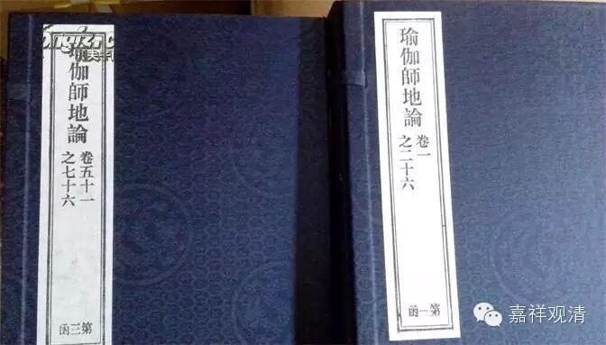
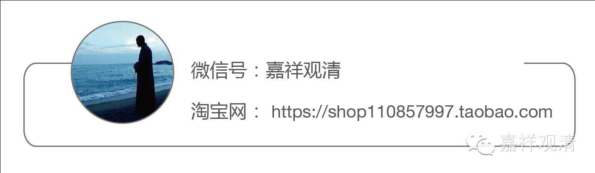

依世间修七种作意

何等名为七种作意？谓了相作意、胜解作意、远离作意、摄乐作意、观察作意、加行究竟作意、加行究竟果作意。
　　云何名为了相作意？谓若作意、能正觉了欲界粗相、初静虑静相。云何觉了欲界粗相？谓正寻思欲界六事。何等为六？一、义，二、事，三、相，四、品，五、时，六、理。
　　云何寻思诸欲粗义？谓正寻思如是诸欲、有多过患，有多损恼，有多疫疠，有多灾害。于诸欲中多过患义、广说乃至多灾害义、是名粗义。
　　云何寻思诸欲粗事？谓正寻思于诸欲中、有内贪欲；于诸欲中、有外贪欲。
　　云何寻思诸欲自相？谓正寻思此为烦恼欲；此为事欲。此复三种。谓顺乐受处、顺苦受处、顺不苦不乐受处。顺乐受处、是贪欲依处，是想心倒依处；顺苦受处、是嗔恚依处，是忿恨依处；顺不苦不乐受处、是愚痴依处，是覆恼诳谄无惭无愧依处；是见倒依处。即正寻思如是诸欲、极恶诸受之所随逐；极恶烦恼之所随逐。是名寻思诸欲自相。
　　云何寻思诸欲共相？谓正寻思此一切欲、生苦老苦广说乃至求不得苦、等所随逐；等所随缚。诸受欲者、于圆满欲驱迫而转。亦未解脱生等法故；虽彼诸欲胜妙圆满、而暂时有。是名寻思诸欲共相。
　　云何寻思诸欲粗品？谓正寻思如是诸欲、皆堕黑品。犹如骨锁，如凝血肉，如草炬火，如一分炭火，如大毒蛇，如梦所见，如假借得诸庄严具，如树端果。追求诸欲诸有情类、于诸欲中、受追求所作苦；受防护所作苦；受亲爱失坏所作苦；受无厌足所作苦；受不自在所作苦；受恶行所作苦。如是一切如前应知。如世尊说：习近诸欲、有五过患。谓彼诸欲、极少滋味，多诸苦恼，多诸过患。又彼诸欲、于习近时、能令无厌，能令无足，能令无满。又彼诸欲、常为诸佛及佛弟子贤善正行正至善士。以无量门呵责毁呰。又彼诸欲、于习近时、能令诸结积集增长。又彼诸欲、于习近时、我说无有恶不善业而不作者。如是诸欲、令无厌足，多所共有，是非法行恶行之因。增长欲爱、智者所离、速趣消灭，依托众缘，是诸放逸危亡之地。无常虚伪妄失之法，犹如幻化、诳惑愚夫。若现法欲、若后法欲、若天上欲、若人中欲、一切皆是魔之所行，魔之所住。于是处所、能生无量依意所起恶不善法。所谓贪、嗔、及愤诤等。于圣弟子正修学时、能为障碍。由如是等差别因缘，如是诸欲、多分堕在黑品所摄。是名寻思诸欲粗品。
　　云何寻思诸欲粗时？谓正寻思如是诸欲去来今世、于常常时、于恒恒时、多诸过患，多诸损恼，多诸疫疠，多诸灾害。是名寻思诸欲粗时。
　　云何寻思诸欲粗理？谓正寻思如是诸欲、由大资粮、由大追求、由大劬劳、及由种种无量差别工巧业处、方能招集生起增长。又彼诸欲、虽善生起；虽善增长；一切多为外摄受事。谓父母、妻子、奴婢、作使、亲友、眷属、或为对治自内有色粗重四大、糜饭长养、常须覆蔽、沐浴按摩、坏断、离散、消灭法身、随所生起种种苦恼。
　　食能对治诸饥渴苦；衣能对治诸寒热苦，及能覆蔽可惭羞处。卧具能治诸劳睡苦，及能对治经行住苦；病缘医药能治病苦。是故诸欲、唯能对治随所生起种种苦恼；不应染著而受用之。唯应正念、譬如重病所逼切人、为除病故、服杂秽药。
　　又彼诸欲、有至教量、证有粗相。又彼诸欲如是如是所有粗相、我亦于内现智见转。又彼诸欲、有比度量、知有粗相。
　　又彼诸欲、从无始来本性粗秽、成就法性、难思法性，不应思议，不应分别，是名寻思诸欲粗理。如是名为由六种事、觉了欲界诸欲粗相。复能觉了初静虑中所有静相。谓欲界中一切粗性、于初静虑皆无所有。由离欲界诸粗性故、初静虑中说有静性。是名觉了初静虑中所有静相。即由如是定地作意、于欲界中、了为粗相；于初静虑、了为静相。是故名为了相作意。即此作意、当言犹为闻思间杂。
　　彼既如是如理寻思、了知诸欲是其粗相，知初静虑是其静相；从此已后、超过闻思、唯用修行、于所缘相、发起胜解，修奢摩他毗钵舍那。既修习已；如所寻思粗相静相、数起胜解。如是名为胜解作意。
　　即此胜解、善修善习善多修习为因缘故；最初生起断烦恼道。即所生起断烦恼道俱行作意、此中说名远离作意。
　　由能最初、断于欲界先所应断诸烦恼故；及能除遣彼烦恼品粗重性故。从是已后、爱乐于断，爱乐远离；于诸断中、见胜功德，触证少分远离喜乐。于时时间欣乐作意、而深庆悦；于时时间厌离作意、而深厌患；为欲除遣惛沉睡眠掉举等故。如是名为摄乐作意。
　　彼由如是乐断乐修正修加行善品任持；欲界所系诸烦恼缠、若行若住不复现行。便作是念：我今为有于诸欲中贪欲烦恼、不觉知耶？为无有耶？为审观察如是事故；随于一种可爱净相、作意思惟。犹未永断诸随眠故；思惟如是净妙相时、便复发起随习近心、趣习近心、临习近心；不能住舍，不能厌毁、制伏、违逆。彼作是念：我于诸欲、犹未解脱，其心犹未正得解脱；我心仍为诸行制伏、如水被持，未为法性之所制伏。我今复应为欲永断余随眠故；正勒安住乐断乐修。如是名为观察作意。
　　从此倍更乐断乐修、修、奢摩他毗钵舍那、郑重观察、修习对治；时时观察先所已断。由是因缘，从欲界系一切烦恼、心得离系。此由暂时伏断方便，非是毕竟永害种子。当于尔时初静虑地前加行道、已得究竟；一切烦恼对治作意、已得生起。是名加行究竟作意。
　　从此无间、由是因缘、证入根本初静虑定。即此根本初静虑定俱行作意、名加行究竟果作意。
　　又于远离摄乐作意现在转时、能适悦身离生喜乐、于时时间微薄现前；加行究竟作意转时、即彼喜乐、转复增广，于时时间深重现前；加行究竟果作意转时、离生喜乐、遍诸身分、无不充满，无有间隙。彼于尔时、远离诸欲，远离一切恶不善法，有寻有伺，离生喜乐，于初静虑、圆满五支、具足安住；名住欲界对治修果，名随证得离欲界欲。
　　又了相作意、于所应断、能正了知；于所应得、能正了知；为断应断、为得应得、心生希愿。胜解作意、为断为得、正发加行。远离作意、能舍所有上品烦恼。摄乐作意、能舍所有中品烦恼。观察作意、能于所得、离增上慢，安住其心。加行究竟作意、能舍所有下品烦恼。加行究竟果作意、能正领受彼诸作意善修习果。
　　又若了相作意、若胜解作意、总名随顺作意；厌坏对治俱行。
　　若远离作意、若加行究竟作意、总名对治作意、断对治俱行。若摄乐作意、名对治作意，及顺清净作意。
　　若观察作意、名顺观察作意。如是其余四种作意、当知摄入六作意中。谓随顺作意、对治作意、顺清净作意、顺观察作意。
　　如初静虑定、有七种作意，如是第二第三第四静虑定、及空无边处、识无边处、无所有处、非想非非想处定、当知各有七种作意。
　　若于有寻有伺初静虑地、觉了粗相，于无寻无伺第二静虑地、觉了静相；为欲证入第二静虑。应知是名了相作意。谓已证入初静虑定已得初静虑者、于诸寻伺观为粗性、能正了知。若在定地、于缘最初率尔而起匆务行境粗意言性、是名为寻。即于彼缘、随彼而起随彼而行徐历行境细意言性、是名为伺。又正了知如是寻伺、是心法性；心生时生，共有、相应、同一缘转。又正了知如是寻伺、依内而生，外处所摄。又正了知如是一切过去未来现在所摄，从因而生，从缘而生，或增或减，不久安住，暂时而有，率尔现前，令心躁扰、令心散动、不静行转；求上地时、若住随逐。是故皆是黑品所摄。随逐诸欲离生喜乐、少分胜利；随所在地、自性能令有如是相。于常常时、于恒恒时、有寻有伺心行所缘、躁扰而转，不得寂静。以如是等种种行相、于诸寻伺、觉了粗相。又正了知弟二静虑无寻无伺、如是一切所说粗相、皆无所有。是故宣说第二静虑、有其静相。彼诸粗相皆远离故。为欲证入第二静虑、随其所应其余作意、如前应知。如是乃至为欲证入非想非非想处定、于地地中、随其所应、当知皆有七种作意。
　　又彼粗相、遍在一切下地皆有，下从欲界、展转上至无所有处。当知粗相略有二种。谓诸下地、苦住增上，望上所住、不寂静故，及诸寿量、时分短促，望上寿量、转减少故。此二粗相、由前六事、如其所应、当正寻思。随彼彼地乐离欲时、如其所应、于次上地寻思静相；渐次乃至证得加行究竟果作意。

《瑜伽师地论》卷三十三

