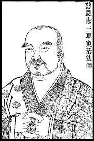

大種造色章

大種所造色。合以六門分別：一、辨體；二、釋名；三、生等五因，以明造相；四、依因緣以辨大造；五、同異大造相望辨造；六、問答分別。

辨體者。

順世外道：不別立有能造、所造，俱是四大。吠性是常，更無別物。

然世史迦：四大乃是“實”句，有礙，通常、無常。眼根即火，耳根即空，鼻根即地，舌根即水，皮根即風。色、味、香、觸、聲，“德”句所攝，然是無礙。聲、香唯無常，餘通常、無常。色等四種是四大德，四大非能造，色等非所造。地有色、味、香、觸，水有色、味、香、觸，火有色觸，風唯有觸。聲是“空”德，非四大德。

僧佉師說：色等五種，名五唯量，乃是能造地、水等造。地、水等方造眼等五根，能造、所造，雖皆是無常，然非生滅，是轉變無常，並皆有礙。然有別造，亦有通造。

聲論師說：聲唯是常，餘四大種及眼等根，色、味、香、觸，並是無常。聲或顯常，或是生常。

大眾部說：四大為能造，四塵為所造。無別五根，即四塵故。俱通有漏及以無漏，許佛有故。

《成實論》說：四塵為能造，造於四大；四大成五根，五根唯所造。四塵唯能造，四大通二。聲亦唯所造。

薩婆多師：四大為能造，唯有漏、有礙，觸處所攝。五根、五塵及法處無表色為所造。五根、五塵皆唯有礙，唯是有漏。法處無表說通無漏，是無礙攝。皆是實有。

經部師說：能造、所造，雖並有礙，皆通假、實。極微是實，麤色是假，並皆有漏。無表假立，法處無色，不許色蘊有無表色。

說假部說：能造、所造，若麤若細，在蘊門中，體皆是實，義積聚故。體非積聚，在界、處門，並皆是假，依、緣並皆體積聚故，通有、無漏。

一說部說：能造、所造，唯有一名，都無實體。

說出世部說：能造、所造，若有漏者，並皆是假，從顛倒起故；諸無漏者，並皆是實，非倒生故。

今依大乘：觸處、法處，皆是有大種，散、定別故。造色通於十一處有。大種造色，隨應俱通依他、圓成二性所攝。五法之中，相及正智二法所收。通有漏、無漏、善、無記性。有漏大造，定屬依他；無漏大造，亦圓成、依他所攝。智有漏，造色唯無記性，假性通三。故《瑜伽》六十四說：“色、聲、表色，假通善惡，實唯無記。無表既假，許通善惡。無漏大造，一切唯善。大種唯實，造色通假。”

釋名者。

《瑜伽》第三說：“由此大種，其性大故，為種生故。”名為大種。

“大”有四義：

一、為所依故：與諸造色為所依處；

二、體性廣故：體性寬廣於造色故；

三、形相大故：大地、大水、大火、大風，相狀大故；

四、起大用故：成、壞世界，作用大故。

種者，因義；或是類義。

此四能為生第等五因，起眾色故，種類別故。虛空雖大，不能為因。內種子等雖能為因，體相非大。所餘諸法，非大、非種。由此地等，亦大、亦種，故名“大種”。持業釋也。若言“四大種”，四是數名，即帶數釋。

“造色”名者。《顯揚》第五說：“謂依止大種”，即於大種處，所有餘造色生，由是因故，說四大種，造所造色，所造即色。《五十四》云：“是同一處，攝持彼義，名之為造。”所造即色，持業為名。大所造色，依士為目。

別名者。

堅勁義是地義；流濕義是水義；溫熱義是火義；輕等動義是風義。其地即大，乃至風即是大，皆持業釋。造色別名，至章中解。

生等五因以辨造者。

《對法》第一說：“所造者，謂以四大種，為生、依、立、持、養因義。”即依五因，說名為造。

生因者，即是起因。謂離大種，色不起故。諸所造色，雖自種生，若離大種，必不能起。

《瑜伽第三》問云：“諸法皆從自種而起，寧說大種能生諸色，乃至長養耶？”

彼自答云：“由諸內外大種，造色種子，皆悉依附內相續心。諸大種子未生諸大，造色種子終不能生。要大種子先生大種，造色種子方生造色。為前導故，說彼能生，故名生因。”《第六十六》說此同之。

今應問曰：若爾，別解脫及定道俱戒，既離大種，應不得生。此隨所遊、所防名色，亦隨彼二，假說大造。不離義有二：一、定同處；二、必假藉。別解脫戒等，必藉大生。非定同處亦名“不離”。離質聲、光皆亦如是。

《瑜伽論》五十四說：“勝定果色，唯依勝定，不依大種。”彼如何通？

彼自解云：“然從緣彼種類影像三摩地發，說彼大造，非依彼生，說名為造。”《法處色章》，當具陳述。

或復五因，非遍一切。如離輪光等，無所依因故。

依因者，《對法》云：“即是轉因”。謂捨大種，諸所造色，無有功能，據別處故。諸所造色，依據大種方乃得生。故捨大種無別處住。《瑜伽第三》云：“由造色生已，不離大種處而轉，故名依因。”

若爾，如何《五十四》說離輪光明，大種香等皆不可得？

今依即質，以辨依因。離質光等，無依因義，故不相違。

或說：彼光亦有大造，隨有光處有大造故。此釋不然！聲、香離質，何大所造？故前說善。

立因者，即隨轉因。由大變異，能依造色隨變異故。能造、所造，安、危必同。故大變時，造隨變異。《瑜伽第三》云：“由大種損、益，彼同安、危故。”

別解脫戒後相續生表業變異，如何相續？

或說後時所依猶有，故不變異。如實義者，此隨所遊、所防大造。不爾，無色定道俱成，無所依故，應無此因。若爾，所防久已斷滅，既無能造，應無立因，不可防他說名為色，將他四大造自無表。此唯是彼遠分對治義名為造，曾有類故。二定已上，無表□然。論說“防他”，他，四大造，此義不然。非已過故，防不得故，應非對治。此義名色假名為造，遠分對治，故無有失。遠防自身曾有惡戒，即從過去大造今色，或無表戒等，無立因義，依質實色具立因故。若取依身大種名造，無色聖者，應無無表，便非大乘，亦違《顯揚》諸律儀色依不現行法建立色性。故以隨彼所防大造。

持因者，即是住因。謂由大種諸所造色，相似、相續生，持令不絕故。造色續生，由大持力。不爾，造色應有間斷。《瑜伽》第三說：“由隨大種等量不壞，故名持因”。又，聲、光等，大、小有異，如何但說“等量不壞”。《對法》依全分總說持因，《瑜伽》依小分，故作是說，彼依即質造色說故。或《瑜伽》言“等量不壞”，非是大造，二量齊等。“等”者，前後相似之義。前說為善。

養因者，即是長因。謂由大種養彼造色令增長故。由大親養，造色增長，或長即因，或長之因，故名“長因”。《瑜伽》第三云：“由因飲食、睡眠，修習梵行、三摩地等，依彼造色，倍復增廣，故說大種為彼養因。”能養造色有因、有緣，大為養因，彼為養緣，各據一說，故不相違。又，由彼緣先養大種，令造色增，故無有失。或彼通養大造及色、心、心所等一切法因。此唯造色能養別因，由造性鈍，不如心等，故藉二養，心等不爾。《五十四》問：“諸行皆從自種而起，如何說大造所造耶？由彼變異而變異故，彼所建立，及任持故。”《顯揚》第五說：“謂依大種，有餘造色，攝在一處，名大所造。”此義即顯相依而有，是為造義，非辨體者。現行相望，增上緣故。

依因緣辨造者。

初、辨因造；後、辨緣造。

因造有二：一、十因；二、六因。

十因造者。大望造色，總有七因。

一、牽引因。

二、生起因：無記因中，未潤已潤，外穀麥等望牙等故。

三、攝受因：士用依處所攝受故。

四、引發因。

五、定異因：引同類起，及自性故。

六、同事因。

七、不相違因：攝前諸因為此二故。

其相違因，互能相損而為因故，無相違因。大非言說，無隨說因。觀待因疏，無觀待因。

有義為八，唯除隨說及相違因，亦通觀待，立此二故。

有義或九，加相違因。

造色望大，能為八因。

一、隨說因：音聲言說，詮辨大故。

二、觀待因：疏相待故。

三、牽引因。

四、生起因：染淨因中，律不律儀，及定俱戒，未潤、已潤，為此二故。

五、攝受因：作用、依處所攝受故。

六、定異因：定別能招自異熟故。

七、同事因。

八、不相違因。

除引發者，能引自類同品、勝品為彼因故。

除相違者，不相順故。

或說有九，加引發因。義亦得成，相引發故。

或為十因，有相違故。

六因造者，現行六因。《顯揚》十八說皆“增上緣”。《對法》第四云：“當知一切因，皆能作因所攝。”為顯差別義，復別建立餘五因。若依因緣辨六因者，《攝大乘論》、《唯識》等說：種子望現為能作、俱有、相應、遍行。種望於種，亦為“同類”。然無“異熟”，非因緣故。大望造色，皆非六因。造望大種，為異熟因，感彼果故。

今依增上緣，辨六因造者。

大望造色，唯有三因。

一、能作因：能與彼力不障礙故。

二、同類因：令增長故。《對法》文中，依前熏種引後果生，亦依現行相望而說，非種望種。

三、俱有因：《對法》第四說：大種造色，必俱生故，為俱有因；非是同得一果義故，非心心所，無相應因；非善惡業，無異熟因；非煩惱性故，無遍行因。

造色望大，亦為三因。

一、能作因：此因寬故。

二、俱有因：不相離故。

三、異熟因：律、不律儀及定俱戒能招大故。或為四因，加同類因，如引發故。無餘可知。此說同世，非別世造；依處而有，非異世故。唯律儀色，依不現行法，建立色性，亦異世造，過去大種造現色故。有漏色聲，唯無記性。若無漏位，大、造俱善，故但應如此中所說，應如是說：過為現因，非過、未因；現為現因，及未來因；未非未因，過、未無故。此中不說過為未因，因果俱無故。亦非後際為前際因，倒因果故。

辨因造已，緣造云何？

大、造相望，為一增上；現行相望，非辨體故，非是因緣。生等五因，增上緣故。非心等故，無餘二緣。此因緣造，依總相說，依有、無漏，及十二處、三性、三界，綺互相望，以大望大，或造望造，因緣多小，皆如理思。

同異大、造相望辨造者：初、以類異大造相望；後、以即離大、造相望。

類異大、造相望辨造者，《瑜伽》第三、五十四說，類異有三：

一、異熟類。此有二種：一、業生，最初起者；二、相續。初是總異熟，後是別異熟。或初是初剎那，後是後時者。

二、長養類。此亦有二：一、處寬遍，飲食、睡眠、梵行、等至之所長養；二、相增盛，亦由食故，彼所依故，修勝作意故，長時淳熟故，云所長養。

三、等流類。此有四種：一、異熟等流；二、長養等流，即前二類皆等流故；三、變異等流，四、本性等流，異熟、長養，二種不攝，皆後二故。

五根唯有異熟、長養，離此二外，無別等流。此依三類體別而說，非根諸色具有三類，或此不說聲界，聲非異熟故。除法處色，彼唯長養及等流故。離根諸色亦無異熟。

於前色中，具三類者，具二異熟、二種長養、四種等流。無三類者，五內色根，具二異熟及二長養。法處諸色，有後長養，無處寬遍，有後三等流，無是異熟者。諸心、心所，雖具三類，無初長養。色界諸蘊，除由段食、睡眠、梵行之所長養。三界長養皆通等持。內外聚中，隨應或有三、二、一類大種造色。隨應說彼一切大種造一切色。相依而有是造義，故非辨體。故五十四說。依大種處有造色生，說名為造。又此聚中，有彼大種所造可得，當知此中即有彼法。故諸大種同聚所有，一切造色相依有者，皆可名造。互得造義，非定屬義。理異小乘，不應別釋。

此中，或可大造種子本性各異，後生現行各依自類，自類大種不生現行。此類造種，終不生造，故自類造。此亦不然。相依而有，說名為造。故同聚中，所有大、造相依有者，隨應皆造。前說為善，即離大種相望辨造者。謂所造色與大種處不相離者，名即質造。若所造色與大種處體相離者，名離質造。五十四說。離輪光明，大種香等皆不可得，離質光、香、及與聲等，即以取發處四大所造，無居處所依故，言不可得。

諸律儀戒。《顯揚論》說依不現行法建立色性，皆以所防欲界惡戒大種所造。

不律儀戒，《顯揚論》說：依現行法，建立色性，即以所發惡身語色，大種所造，名離質造，所餘皆名不相離造。

其極略、極□，隨本質大，可名即質及離質造。

遍計所起亦爾。

無色界無表及佛身無表，以何大造？應以過去自身所有能造惡戒大種所造，義名懸造，如《無表章》。

問答分別者。

問：於欲界諸色聚中，幾物可得？

《瑜伽》第三說：

或有聚中，唯有一大，如石、末尼、江河、池沼、火焰、燈燭、有無塵風。

或唯二大，如熱、末尼、雪、濕樹等。

或唯三大，如濕熱樹，或樹搖濕。

或四大俱，或唯有色，如離輪光；或唯有聲，離質聲等；或唯有香，孤行香等；若有味、觸，必亦有香色；或唯有四，外器除聲。

或唯有五，外器有聲時；或有身根，并色等四。

或有唯六，隨有眼根等，并身等五。

有聲為七，如上造色身，增地為六；眼等增為七；加水、火、風為八、為九、為十；增聲十一。離輪光等，隨其所應，增四大種，成其多小。

《六十四》等說：若於此聚有大造可得，當知此聚，即有此大種造色。若彼大造，自相都無，當知此處，無有彼法。不同餘宗：無彼現事，有彼極微。諸廣問答，皆如彼說。此中說相，或有、或無。若約界攝，隨應皆有，廣如彼論第三卷說。六十六說：欲界有地，亦有色、香、味；色界唯有色，色界繫，除香、味；及無色界色，隨所應有，說彼可得。恐厭煩文，故略應止。

問：於欲界身起色界大種，彼諸大種與下界色，同、異處耶？

答：如水處沙，非異處住。由本識內有二類種：一、純生；二、雜生；引彼大起。純滅雜生，故非異住。有義：此為隨順理門。大乘同處，如異類大，此二之色，本不相礙，何須間住，故隨順門。

問：大種造色，有對同處既無障礙，云何不說無對性耶？

答：互相順生不相礙故。又此類業增上所生，諸根遍彼共受用故，如中有等，雖有對性，而不相礙。此亦應爾。

問：大種造色云何而住？為有上下？為內外處？為雜亂耶？

《六十五》說：俱時而有，互不相離，由彼種類因所成故。如一味團，更相涉入，遍一切處，非如□稻、末尼等聚。又此有三：一、同處；二、和雜；三、相雜不相離。

又，《瑜伽》第三說。諸色處有二不相離：一、同處不相離；二、和雜不相離。

同處不相離者。如一眼根阿拏色，四大阿拏與造色阿拏，隨應所有，□相涉入，合成一處，無別處所。即一阿拏色中，有八阿拏，加聲為九，加身為十，隨餘根為十一。或眼、身、地、色、香、味、觸七阿拏，一因、一果，同在一處，互相涉入。非如薩婆多宗，極微各別，各成阿拏。亦不同經部，合成阿拏。今者，大乘本無極微，如色等微，至阿拏時，隨其所應多少，同在一處，諸根於彼，能遍受用，以心知境故。爾由境生心故，然為同處不相離也。

和雜不相離者。即前同處不相離，阿拏色能造、所造相涉入者，雖在一處，同處而住，而不相入，合為一體。諸根得時，各各別故。然不可說如胡麻、豆等聚，可為分折得故。名和雜不相離。

又解：大、造同類相望，同一處住，名同處不相離。異類大、造相望，亦同在此一處住，名和雜不相離。非如他宗，同類、異類，極微各別，非同一處。

問：異熟有時增長廣大，何故異熟非即長養？

答：由彼長養能攝、能持，異熟相續現增長等。猶如外墎，防援內城，故非即彼。

問：為一四大，造一造色，為造多耶？為多四大，造多造色，為造一耶？

答：相依而有，立以“造”名，造一、造多，理皆無妨。《攝決擇》說：要大種生，先據處所，後造色起，不離彼處，名為造故。日輪光等，即小生多，因俱聲等，即多生少。如是等類，皆應准知。既無極微，故容皆得。

