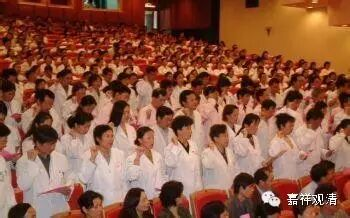

**再苦、再脏、再累，该出手时他们绝不含糊**

** 图 1**

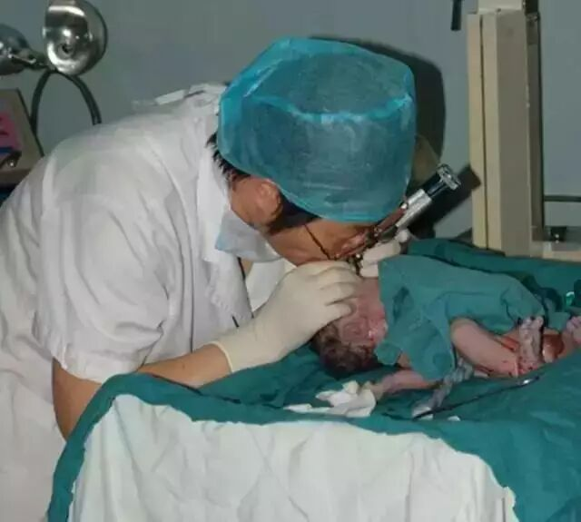

一个胎盘早剥的新生儿，误吸羊水和粪便导致窒息，资深麻醉师用双唇通过气管插管将患儿气管内的误吸物吸出，患儿得以抢救成功。

** 图2**

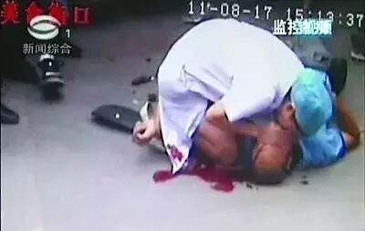

一起车祸，一名伤者倒在血泊之中，一名乘车路过的女医生上来，跪在滚烫的柏油路面上，对嘴中还在冒血的伤员进行人工呼吸。

** 图3**

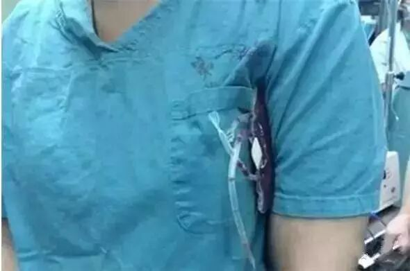

病人急需输血，医生在用体温加热血液。

** 图4**

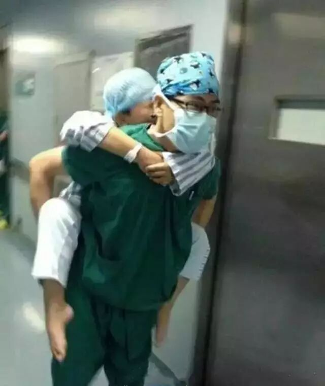

地震了！麻醉医生立即把病人移到更安全的地方！手术室护士都去安抚自己手术间的病人，随后，他们又组织将病人安全的送回病房。由于病人较多，麻醉医生直接把病人背起送回病房。

** 图5**

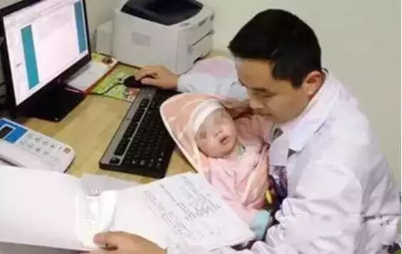

你一定以为这是孩子的父亲，错！他是一个未婚医生，主动承担起一个患有先天疾病、被父母抛弃的孩子在医院治疗时的照顾任务。

** 哪里有需要，哪里就有白衣天使的身影**

** 图6**

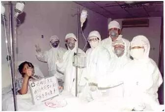

非典战役中，一共有33名医护人员牺牲，把中国从一场瘟疫当中挽救了回来。

一位殉职医生在最后的日记里这样写：“妻是进不来的。我坚决不同意。他们拿进来一盘磁带，是妻录的。先是妻的说话，然后是孩子说。我让小张帮我打手机，我对妻说了句，我今生最大的快乐就是认识你，我爱你。然后就静静的合上眼。磁带没听完，后面还有段女儿叫爸爸的声音。”

** 图7**

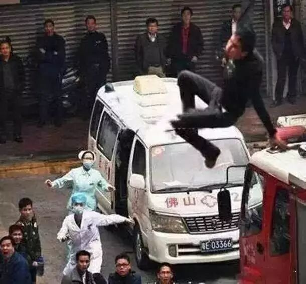

当众人围观时，医生和护士勇敢地冲了上去，与其说是勇敢，不如说是一种职业的本能。

** 图8**

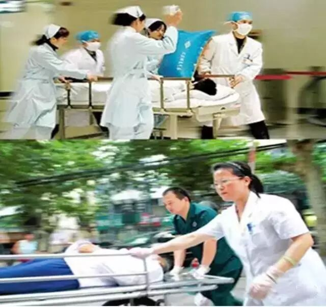

这是我们最常见的画面，为病人医生与死神争分多秒！

“只要手术成功，什么都值了！＂有时为之付出的，甚至是生命.......

** 图9**

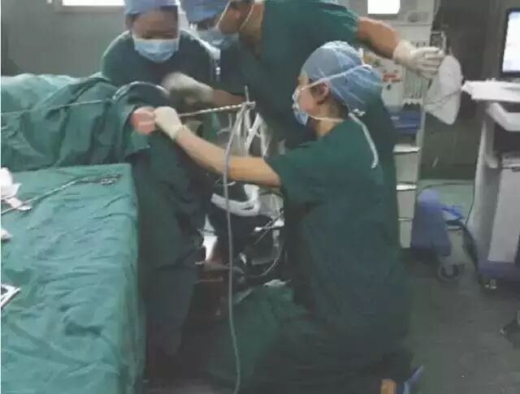

很多手术需要跪着完成，不管时间多长，操刀的医生都得跪着.....

** 图10**

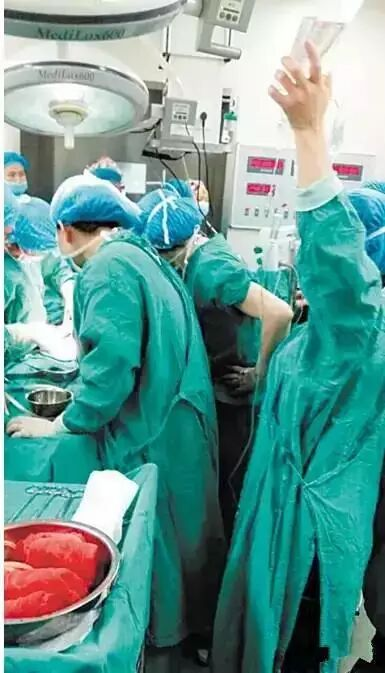

为抢救一位羊水栓塞的产妇，30余名医务人员大抢救，历时12个小时，终于将产妇从死神手中抢了回来，而医生却晕倒在手术台旁。

** 图11**

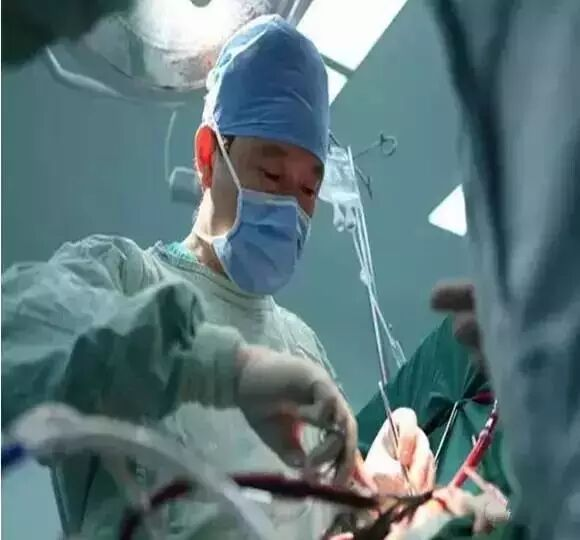

武警总医院原心外科主任王奇，连做5天手术抢救患者后，过劳逝世。

** 图12**

常常有中青年麻醉医师猝死，近两年来见诸报道的就有15人之多。与之相对应的，则是因麻醉引发的医疗死亡、致残事件连年大幅下降。这是中央电视台正在做相关报道。

** 他们的日常作息是这样的**

** 图13**

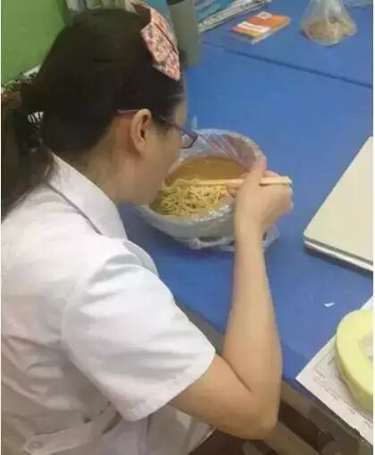

别人吃大餐的时候，他们吃的是这个.......

** 图14**

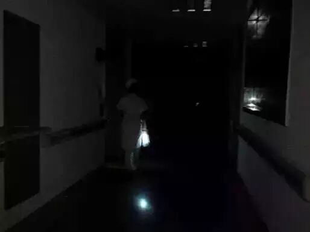

别人在睡觉的时候，他们还在这里......

** 图15**

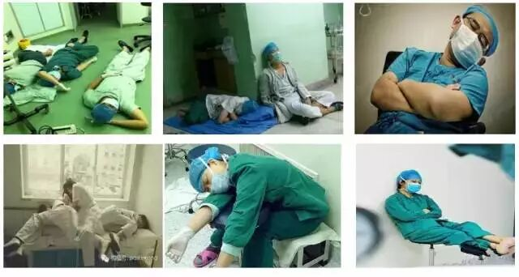

而他们的睡姿是这样的......你一直认为他们是优雅的，可是在极度疲劳的时候，优雅神马的都是浮云。

** 我们真的不该让他们这样.....**

** 图16**

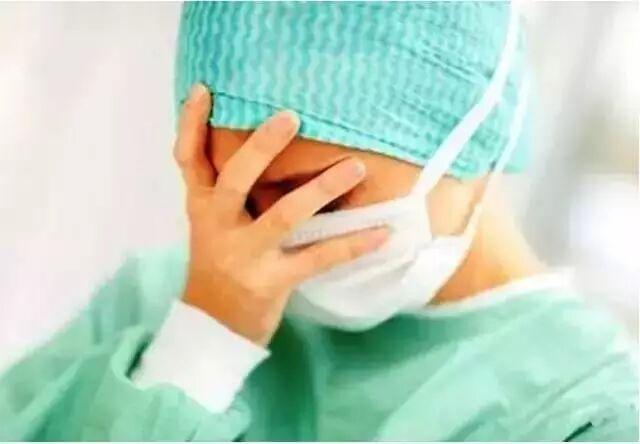

医暴、医闹让他们如此伤心......

** 图17**

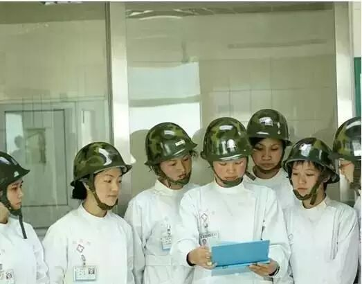

他们被逼成这样来上班......

** 其实，有些真相你不知道......**

** 图18  **

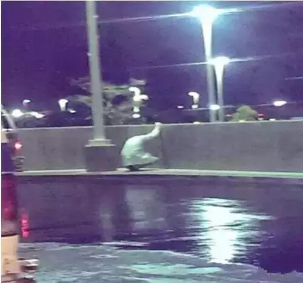

这是来自美国的一张照片，一位急诊科医生因为没能挽救一位19岁患者的生命，心痛地蹲在路边。

医学有限，医疗不是万能的。没能治好你的病，他们其实比你更难过……他们或多或少都有过这样的心痛时刻，只是你不知道。

** 他们要求的并不多：一句感谢，或者一个善意的拥抱......**

** 图19**

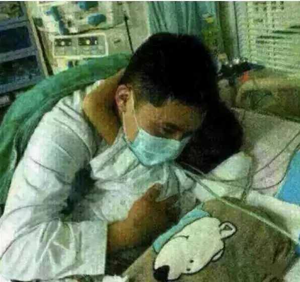

麻醉恢复室插管拔管的孩子，管床大夫来看他时，孩子紧紧搂着他不放！

** 图20**

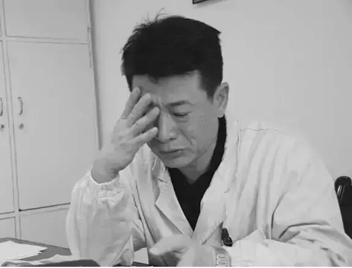

一位患者留下遗嘱，感谢曾经救治过他的大夫，这一刻，他感动得泪流满面！

** 所以……**

请让身边的人看看，告诉更多的人，更多的患者，让他们了解医生，理解医生的辛苦和不易。愿医患和谐，互相关爱，相互理解。

尊重医者！给他们一个坚持下去的理由！

