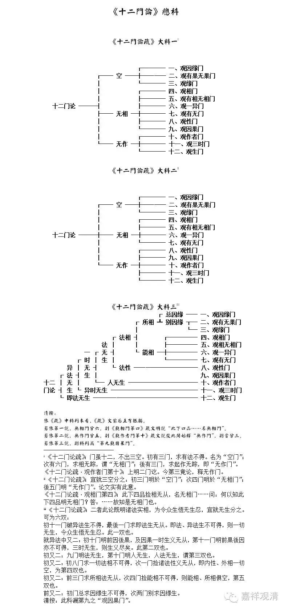

1、 《十二门论疏》：门虽十二，不出三空。初有三门，求有法不得。名为“空门”；次有六门，求相无踪，谓“无相门”；後有三门，求起作无踪，即“无作门”。

《十二门论疏·观作者门第十》：上明二门讫。今第三竟论，释无作门。

2、 《十二门论疏》：宜就三空分之：初三门明於“空门”；次四门明於“无相门”；後五门明“无作门”。论文实有此意。

《十二门论疏·观相门第四》：此下四品捡相无从，名无相门……问：何以知此下四品明无相门？答：……故知是无相门也。

3、 《十二门论疏》：二者此论既明诸法实相，为令众生悟无生忍，宜就无生分之。可为六双：

初十一门破异法生不得，最後一门求即法生无从。即法、异法生不可得，则一切无生，令众生悟无生忍。此一双也。

就异法中又二：初十门明前因後果，及因果一时生义无从，第十一门明前果後因亦不可得，三时无生，则生义尽矣。此第二双也。

初又二：九门明法无生，第十门明人无生，人法无生，谓第三双也。

初又二：初八门求一切法相不可得，次一门捡诸法性义无从，即内性、外相一切空，为第四双也。

初又二：前三门求所相法无从，次四门捡能相不可得，则能相、所相俱空，第五双也。

前又二：初门总求因缘生不可得，次两门别求因缘生。

清按：此科漏第九之“观因果门”。

清按：

依《疏》中科判来看，《疏》文前后互有抵触。

若依第一说，无相门分六，则《观相门第四》疏文明说“此下四品……名无相门”。

若依第二说，无作门分五，则《观作者门第十》疏文说从此开始释“无作门”，则当分三。

若依第三说，则科判漏“第九观因果门”。

嘉祥吉藏大师此《疏》科判与疏文不协。当再考。

