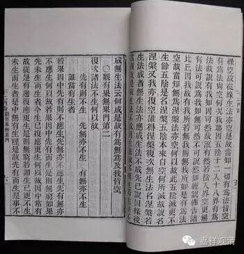

观有果、无果门第二

复次，诸法不生！何以故？

**先有则不生，先无亦不生，

** 有无亦不生，谁当有生者？

若果，因中先有，则不应生；先无，亦不应生；先有无，亦不应生。何以故？

若果，因中先有而生，是则无穷。

如果先未生而生者。今生已复应更生。何以故？因中常有故。从是有边，复应更生，是则无穷。

若谓生已更不生，未生而生者，是中无有生理。

是故先有而生。是事不然。

复次，若因中先有果，而谓未生而生，生已不生者，是亦二俱有，而一生一不生，无有是处。

复次，若未生定有者，生已则应无。何以故？生、未生共相违故。生、未生相违故，是二作相亦相违。

复次，有与无相违，无与有相违。若生已亦有，未生时亦有者，则生、未生不应有异。何以故？若有生，生已亦有，未生亦有。如是生、未生有何差别？生、未生无差别。是事不然，是故有不生。

复次，有已先成，何用更生？如作已不应作，成已不应成。是故有法不应生。

复次，若有生，因中未生时果应可见，而实不可见。如泥中瓶、蒲中席，应可见，而实不可见，是故有不生。

问曰：果虽先有，以未变故，不见。

答曰：若瓶未生时，瓶体未变故不见者，以何相知？言泥中先有瓶，为以瓶相有瓶，为以牛相马相故有瓶耶？若泥中无瓶相者，亦无牛相马相，是岂不名无耶？是故汝说因中先有果而生者，是事不然。

复次，变法即是果者，即应因中先有变。何以故？汝法因中先有果故。若瓶等先有，变亦先有，应当可见，而实不可得。是故汝言未变故不见，是事不然。

若谓未变不名为果，则果毕竟不可得。何以故？是变先无，后亦应无。故瓶等果毕竟不可得。若谓变已是果者，则因中先无，如是则不定，或因中先有果，或先无果。

问曰：先有变但不可得见。凡物自有有而不可得者。如物，或有近而不可知；或有远而不可知；或根坏故不可知；或心不住故不可知；障故不可知；同故不可知；胜故不可知；微细故不可知。

1、近而不可知者，如眼中药。

2、远而不可知者，如鸟飞虚空高翔远逝。

3、根坏故不可知者，如盲不见色、聋不闻声、鼻塞不闻香、口爽不知味、身顽不知触、心狂不知实。

4、心不住故不可知者，如心在色等，则不知声。

5、障故不可知者，如地障大水，壁障外物。

6、同故不可知者，如黑上墨点。

7、胜故不可知者，如有锺鼓音，不闻捎拂声。

8、细微故不可知者，如微尘等不现。

如是诸法虽有，以八因缘故不可知。

汝说因中变不可得，瓶等不可得者，是事不然。何以故？是事虽有，以八因缘故不可得。

答曰：变法及瓶等果，不同八因缘不可得。何以故？

若变法及瓶等果，极近不可得者，小远应可得。

极远不可得者，小近应可得。

若根坏不可得者，根净应可得。

若心不住不可得者，心住应可得。

若障不可得者，变法及瓶法无障应可得。

若同不可得者，异时应可得。

若胜不可得者，胜止应可得。

若细微不可得者，而瓶等果麁应可得。

若瓶细故不可得者，生已亦应不可得。何以故？生已、未生，细相一故。生已、未生，俱定有故。

问曰：未生时细生已转麁，是故生已可得，未生不可得。

答曰：若尔者，因中则无果。何以故？因中无麁故。

又因中先无麁。若因中先有麁者，则不应言“细故不可得”。今果是麁，汝言“细故不可得”，是麁不名为果。今果毕竟不应可得，而果实可得，是故不以“细故不可得”。

如是有法，因中先有果，以八因缘故不可得，先因中有果。是事不然。

复次，若因中先有果生者，是则因，因相坏；果，果相坏。何以故？如氎在缕，如果在器。但是住处不名为因。何以故？缕器非氎果因故。若因坏，果亦坏。是故缕等非氎等因。因无故，果亦无。何以故？因因故有果成，因不成，果云何成？

复次，若不作，不名果。缕等因，不能作氎等果。何以故？如缕等，不以氎等住故能作氎等果。如是，则无因、无果。若因、果俱无，则不应求因中若先有果，若先无果。

复次，若因中有果而不可得，应有相现，如闻香知有华，闻声知有鸟，闻笑知有人，见烟知有火，见鹄知有池。如是因中若先有果，应有相现。今果体亦不可得，相亦不可得，如是当知，因中先无果。

复次，若因中先有果生，则不应言因缕有氎，因蒲有席。若因不作，他亦不作，如氎非缕所作，可从蒲作耶？若缕不作，蒲亦不作，可得言无所从作耶？若无所从作，则不名为果。若果无，因亦无，如先说。是故从因中先有果生，是则不然。

复次，若果无所从作，则为是常，如涅槃性。若果是常，诸有为法则皆是常，何以故？一切有为法皆是果故。若一切法皆常，则无无常。若无无常，亦无有常。何以故？因常，有无常，因无常，有常。是故常、无常二俱无者，是事不然！是故不得言因中先有果生。

复次，若因中先有果生，则果更与异果作因。如氎与着为因，如席与障为因，如车与载为因。而实不与异果作因，是故不得言因中先有果生。

若谓如地先有香，不以水洒，香则不发。果亦如是，若未有缘会，则不能作因。是事不然。何以故？如汝所说，可了时名果，瓶等物非果。何以故？可了是作，瓶等先有非作，是则以作为果。是故因中先有果生，是事不然。

复次，了因但能显发，不能生物。如为照闇中瓶故然灯，亦能照余卧具等物。为作瓶故，和合众缘，不能生余卧具等物。是故当知，非先因中有果生。

复次，若因中先有果生，则不应有今作、当作差别。而汝受今作、当作，是故非先因中有果生。

若谓因中先无果而果生者，是亦不然。何以故？若无而生者，应有第二头第三手生。何以故？无而生故。

问曰：瓶等物有因缘，第二头、第三手，无因缘，云何得生。是故汝说不然。

答曰：第二头、第三手及瓶等果，因中俱无，如泥团中无瓶，石中亦无瓶。何故名泥团为瓶因，不名石为瓶因？何故名乳为酪因，缕为氎因，不名蒲为因？

复次，若因中先无果而果生者，则一一物应生一切物。如指端应生车、马、饮、食等，如是缕不应但出氎，亦应出车、马、饮、食等物。何以故？若无而能生者，何故缕但能生氎而不生车、马、饮、食等物？以俱无故。

若因中先无果而果生者，则诸因不应各各有力能生果。如须油者，要从麻取，不笮于沙。若俱无者，何故麻中求而不笮沙？

若谓曾见麻出油，不见从沙出，是故麻中求，而不笮沙。是事不然。何以故？若生相成者，应言余时见麻出油，不见沙出，是故于麻中求，不取沙。而一切法生相不成故，不得言余时见麻出油，故麻中求不取于沙。

复次，我今不但破一事，皆总破一切因果。若因中先有果生，先无果生，先有果、无果生，是三生皆不成。是故汝言余时见麻出油，则堕同疑因。

复次，若先因中无果而果生者，诸因相则不成。何以故？诸因若无，法何能作、何能成。若无作无成，云何名为因？如是作者不得有所作，使作者亦不得有所作。

若谓：“因中先有果，则不应有作、作者、作法别异。何以故？若先有果，何须复作。是故汝说作、作者、作法诸因皆不可得。”因中先无果者，是亦不然。何以故？若人受作、作者分别有因果，

应作是难：我说作、作者及因果皆空。若汝破作、作者及因果，则成我法，不名为难。是故因中先无果而果生，是事不然。

复次，若人受因中先有果，应作是难。我不说因中先有果故，不受此难，亦不受因中先无果。

若谓，因中先亦有果亦无果而果生，是亦不然。何以故？有、无，性相违故。性相违者，云何一处？如明、闇，苦、乐，去、住，缚、解，不得同处。

是故因中先有果先无果，二俱，不生。

复次，因中先有果、先无果，上有无中已破。

是故先因中，有果亦不生，

无果亦不生。有无亦不生。

理极于此，一切处推求不可得，是故果毕竟不生。果毕竟不生故，则一切有为法皆空，何以故？一切有为法，皆是因、是果，有为空故，无为亦空。有为、无为尚空，何况我耶？

 