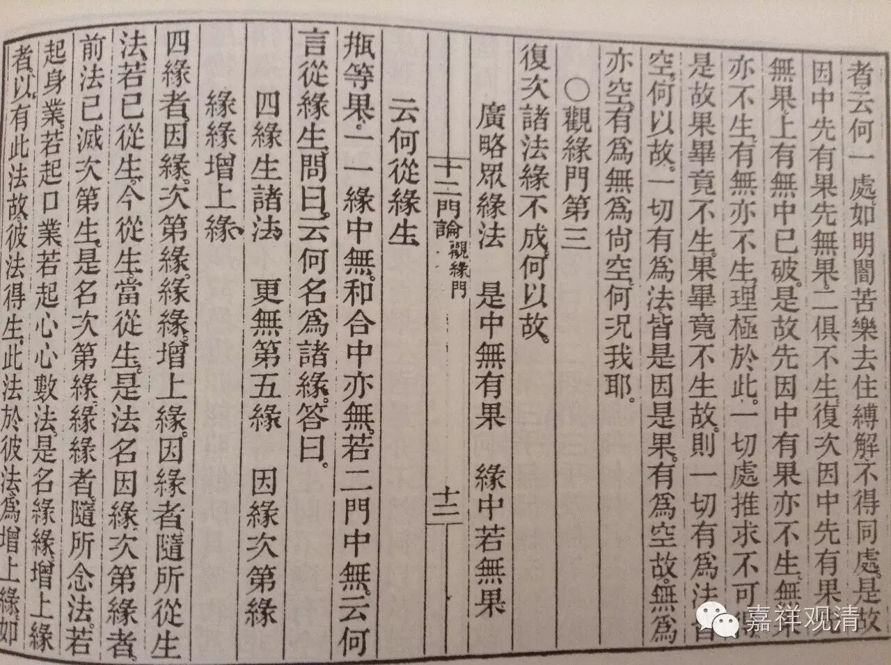

观缘门第三

复次，诸法缘不成。何以故？

**广略众缘法，是中无有果，

** 缘中若无果，云何从缘生。

瓶等果，一一缘中无，和合中亦无。若二门中无，云何言从缘生？

问曰：云何名为诸缘？

答曰：

**四缘生诸法，更无第五缘，

** 因缘次第缘，缘缘增上缘。

四缘者，因缘、次第缘、缘缘、增上缘。

因缘者，随所从生法，若已从生、今从生、当从生，是法名因缘。

次第缘者，前法已灭次第生，是名次第缘。

缘缘者，随所念法，若起身业，若起口业，若起心、心数法，是名缘缘。

增上缘者，以有此法故，彼法得生，此法于彼法为增上缘。

如是四缘，皆因中无果。若因中有果者，应离诸缘而有果，而实离缘无果，若缘中有果者，应离因而有果，而实离因无果。

若于缘及因有，果者应可得，以理推求而不可得，是故二处俱无。如是一一中无，和合中亦无，云何得言果从缘生？

复次，

**若果缘中无，而从缘中出，

** 是果何不从，非缘中而出。

若谓果，缘中无，而从缘生者，何故不从非缘生？二俱无故。

是故无有因缘能生果者。果不生故，缘亦不生。何以故？以先缘后果故。缘、果无故，一切有为法空。有为法空故，无为法亦空。有为、无为空故，云何有我耶？

