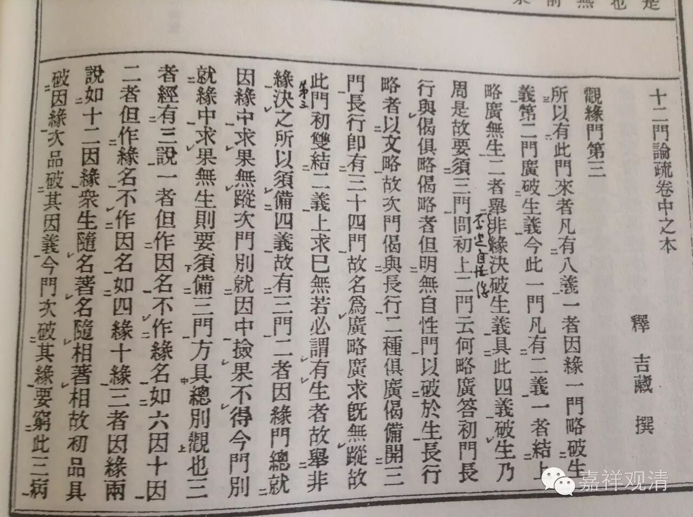

十二门论疏·观缘门第三

所以有此门来者，凡有八义：

一者，因缘一门略破生义，第二门广破生义，今此一门凡有二义，一者结上略广无生，二者举非缘决破生义。具此四义，破生乃周，是故要须三门。

问：初上二门云何略广？

答：初门长行与偈具略，偈略者，但明无自性门以破於生。长行略者，以文略故。次门偈与长行二种俱广。偈备开三门，长行即有三十四门，故名为广。

略广求既无踪故，此门初双结二义。上求已无，若必谓有生者，故举非缘决之。所以须备四义，故有三门。

二者，因缘门，总就因缘中求果无踪；次门，别就因中捡果不得；今门，别就缘中求果无生。则要须备三门，方具总别观也。

三者，经有二说。一者，但作因名，不作缘名，如六因、十因。二者，但作缘名，不作因名，如四缘、十缘。三者，因缘两说，如十二因缘。众生随名著名，随相著相。故初品具破因缘，次品破其因义，今门次破其缘。要穷此三，病义乃圆，是故有三门也。

四者，因缘义总，预是佛法无非因缘。从第二门至於生门，此是因缘中别义。以因缘义总，故贯在论初。但因缘中，别出因果义，故有第二、第三两门。所以别相明因果义者，因果是众义纲维，立信根本，故诸佛菩萨敷经说论，但为显於因果。是故就总义中，别明因果，所以有後二门。

五者，上“有果无果门”通破内外，今破四缘，正为破内。

六者，上二门捡无所生果，今捡无能生缘。

七者，为释疑故来。初门，略求生不得，次门广捡生无踪。或者云，若二门求生无踪，何故佛说四缘生法？若四缘生诸法，云何言毕竟无生？

是故今明，佛所以说四缘生者，为明无生，故说四缘生。如为令深识第一义故，说世谛耳。汝闻四缘生，不知无生，岂识生耶？既不识佛意，岂识佛语？

又，四缘生只是无生，汝计四缘生，则无生四缘於汝成生，非是四缘义也。今言破四缘者，无汝所计四缘。何时无佛因缘——无生四缘。

又，此是外道迷权实义，论主为其开方便门，示真实相。佛说四缘，为表不四。不四为实，四是方便。汝但知权四为实，不知不四。既不知不四，亦不识四。故权实俱迷，则无二智。今示不四，四为方便。四不四为实，令外人生二智。即有自然无师智故，得入佛知见，得成佛。

问：论中何处有此意？

答：《中论》云：“如诸佛所说，真实微妙法，於此无缘法，云何有缘缘。”下释云，佛随凡夫分别故说“实法可信”，随宜之言，不可为实也。

又，论主今欲摄用归体，即明从体起用。摄用归体者，明四缘毕竟空，即辨四不四义。既知四不四，即明不四四，故是从体起用。三世佛唯有体用，故收入出生。故论主申此二条，则一切义尽。

问：何故就四缘明收入出生耶？

答：四缘摄一切义尽，故就此明之。

问：论文何处有此收入出生意耶？

答：《观性门》中明有二谛，因世谛故有第一义，即收入义；因第一义故有世谛，即出生义也。

外人闻四缘，但住四，不得收入，如穷子住立门外，不肯入门。既不知收入，岂悟出生？如长者往就穷子，辨出生义也。

又，此论正申一乘，如睿师《序》，令六道回宗，三乘改迹。今明四缘生，六道三乘，若有六道果、三乘果，必从四缘生，四缘是能生。今求四缘生不得，则无复六道、三乘因，终归於空，常寂灭相，即整归驾於道场，毕趣心於佛地。

八者，上二门末，结言一切法空，然四缘摄一切法。外人疑云：若一切法空，佛何故说一切法为四缘生耶？论破若是，经说应非！？经说若是，论破应非！？今请论主会通经论是非。

故今明：佛说空者，明一切法毕竟空，不言一切法自是有，毕竟空自是空。汝起空、有二见，故谓经论相违。今论还申佛说一切法即是毕竟空意，故经论相成不相违也。

问：“破四缘”与“破有果无果”何异？

答：有同有异。所言同者，上破外人横计有无，今破横计四缘。此二但破而不取，是故言同。所言异者，有无但出谓情，故破而不取。四缘既是佛教，则有收取之义，故与前异也。

问：此门为从能破立名，为以所破立名？

答：以所破立名。外人立有四缘，今以略广二门求缘无踪，从所破立名，故云《观缘门》也。

……

