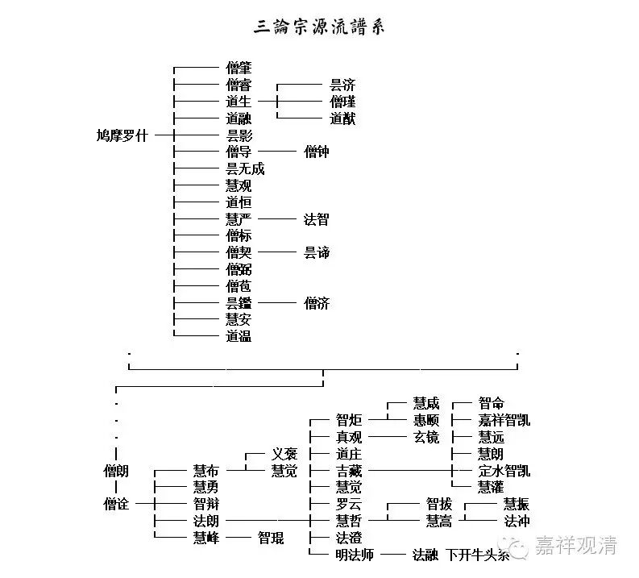
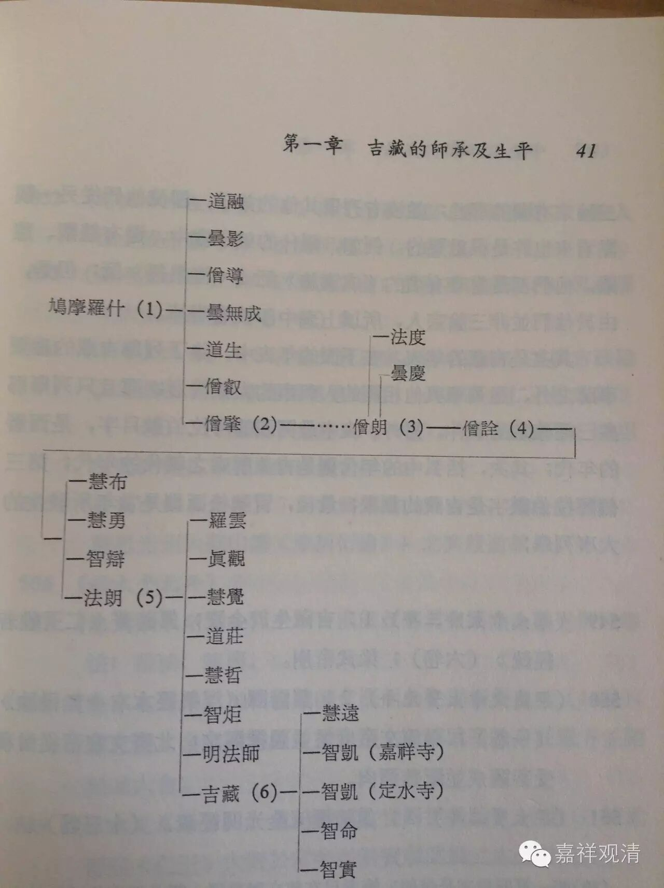
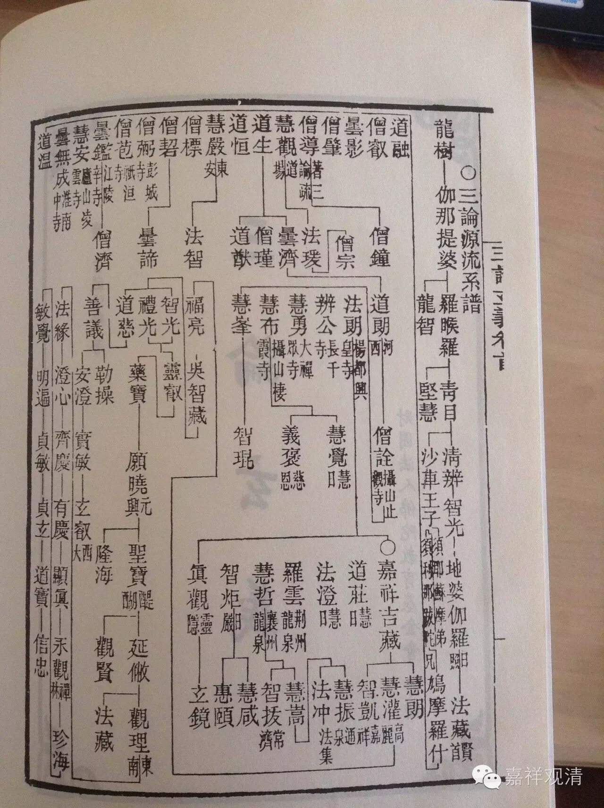

**新制三论宗源流谱系表**

**           ┌─── 僧肇**

**           ├─── 僧睿   ┌─── 昙济**

**           ├─── 道生 ─┼─── 僧瑾**

**           ├─── 道融   └─── 道猷**

** 鸠摩罗什 ─┼─── 昙影**

**           ├─── 僧导 ─── 僧钟**

**           ├─── 昙无成**

**           ├─── 慧观**

**           ├─── 道恒**

**           ├─── 慧严 ─── 法智**

**           ├─── 僧标**

**           ├─── 僧契 ─── 昙谛**

**           ├─── 僧弼**

**           ├─── 僧苞**

**           ├─── 昙鑑 ─── 僧济**

**           ├─── 慧安**

**           └─── 道温**

**    ·                                                          ·**

**    └──────────────┬──────────────┘**

**  ┌───────────────┘**

**  ·                                       ┌─ 慧咸 ┌─ 智命**

**  ·                            ┌─ 智炬 ─┴─ 惠颐 ├─ 嘉祥智凯**

**  ·                            ├─ 真观 ─── 玄镜 ├─ 慧远**

**  │                  ┌─ 义褒 ├─ 道庄             ├─ 慧朗**

** 僧朗   ┌── 慧布  ─┴─ 慧觉 ├─ 吉藏  ──────┼─ 定水智凯**

**  │    ├── 慧勇             ├─ 慧觉             └─ 慧灌**

** 僧诠 ─┼── 智辩             ├─ 罗云  ┌── 智拔 ┌── 慧振**

**        ├── 法朗 ──────┼─ 慧哲 ─┴── 慧嵩 ┴── 法冲**

**        └── 慧峰 ── 智琨   ├─ 法澄**

**                               └─ 明法师 ── 法融 下开牛头系**

现在给大家看另两张表：

《世界哲学家丛书·吉藏》里，杨惠南先生也做了一张《三论源流表》，如下：

再参考上次的，金陵刻经处版《三论玄义》中依日本传说照录的“三论源流系谱”：

一并供大家参考。

