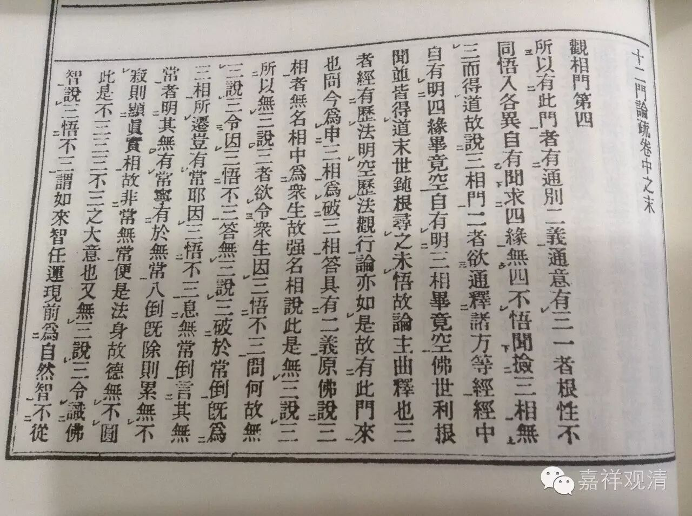

十二门论疏·观相门玄义

所以有此门者，有通、别二义。

通意有三：

一者，根性不同，悟入各异——自有闻求“四缘无四”不悟，闻捡“三相无三”而得道，故说“三相门”。

二者，欲通释诸方等经——经中自有明“四缘毕竟空”，自有明“三相毕竟空”。佛世利根闻，并皆得道，末世钝根，寻之未悟，故论主曲释也。

三者，经有历法明空，历法观行，《论》亦如是，故有此门来也。

问：今为申三相？为破三相？

答：具有二义。原佛说三相者，无名相中，为众生故，强名相说，此是“无三说三”。所以“无三说三”者，欲令众生因三，悟不三。

问：何故“无三说三”，令“因三悟不三”？

答：“无三说三”，破於常倒——既为三相所迁，岂有常耶？“因三悟不三”，息无常倒——言其“无常”者，明其无有“常”，宁有於“无常”！？八倒既除，则累无不寂，则显真实相，故非“常”“无常”，便是法身，故德无不圆。此是“不三三”、“三不三”之大意也。

又，“无三说三”，令识佛智说“三”悟“不三”——谓如来智，任运现前，为自然智；不从师得，为无师智。三世十方诸佛有所施作，常为一事。故知说三，为开四智同归一乘。说“三”既尔，“四缘”及一切诸法亦应如是知。

又，十方三世诸佛为一大事故出。如《大品》云：“般若为大事故起，示是道、非道。”“无三说三”，随颠倒故，说示非道；“因三，悟不三”，今示是道。

又，三世诸佛说法，不出权、实二门，“无三说三”，是方便随宜门；令因三，悟不三，此是真实门。现《中论》破缘缘偈，佛灭後，大小有所得人并不识此意，故论主申此意，破外人谓“三故三”病也。

问：经具有“三不三”、“不三三”，《论》何故但申“三不三”？

答：如上。“不三三”是权门，“三不三”为实门。今论实道，又是诸佛本意。

又，既识“三不三”，即申“不三三”，故下明二谛也。

问：经何处有“不三三”、“三不三”文耶？

答：诸方等经遍有文。略引《大品》、《净名》。《大品》“色无常，不可得故”——“色无常”，即“不三三”；“不可得”，谓“三不三”——具破八倒，备开实相中道也。《净名》“不生不灭是无常”义亦尔。

次，别叙来意，亦有三：

一者，若就“无生”义释者。自上三门，就“四缘”中求生不得。惑者复谓：“若诸法毕竟无生，何因缘故经说三相能生诸法耶？”今随外所引，故复破之。所以言“随外所引”者，三相犹属四缘中因缘门。上既求“四缘”无踪，即无“三相”。但纵外言有故，就觅无从，故有此门来也。

二者，上破“四缘”，破“别生法”，今破“三相”，破“通生法”。

所以“四缘”是“别生法”者，如心法备从四缘生，色法从二缘生。非色非心开为二分。无想、灭尽二定，从二缘生。自余不相应法，从二缘生——故名别生法。

“三相”“通生法”者，有为三聚，无不备从三相所生。今破三相，名破“通生法”。以“通”、“别”，求“生”不得，故知毕竟无生。

三者，三“空”分之。自上以来，明求果及缘不可得，名为“空门”，此下四品，捡相无从，名“无相门”。禀教之流，若於“空门”悟入，则不须“无相门”。为於“空门”不悟，是故次说“无相门”也。

又，根性不同，自有乐从“空门”入，自有从“无相门”入。

又，见多者，从“空门”入；爱、见等者，从“无相门”入……《百论疏》已具明之。

问：何以知此下四品明“无相门”？

答：文云“有为及无为，二法俱无相”，则知通破一切诸相，故知是“无相门”也。

上三门破所相，开为总、别。初门为总，二门为别。今四门破相亦二：初门正破，後三门纵破。初门正破者，明为、无为，一切相空。次门纵之，更开二关往责——为有？为无？若本有相，则不须相；若本无相，则无法可相。次门更复纵之——必言有相可相者，一异求之应得，一异求既无踪，不应言有。第三门更复踪有能相，就有、无求之，又不可得。故三门名为纵破。

又，四门即为四意：初门，破为、无为，正破“标相”；次门，破为、无为“体相”；第三门，就一异相，双破“标”、“体”二相；第四门，重责“标相”。

又，第一门破通相，第二门破别相，第三门合破通、别二相，第四门重破通相。

此门称“通相”者，以三相通为诸法作相，故名“通相”。今此品，求三相无踪，故云“观相门”。

释“三相”义，具如《中论》。今更引《婆沙》诚文以解释之。所以须取《婆沙》释者，龙树出世时，正对其人。又，余义多是人自造，不足可破也。

《婆沙·色品》问：生、住、老、无常，为是色耶？为是非色耶？

答：佛经中告诸比丘“有三有为相”，人不解此义趣，故种种解说。

譬喻人云：三有为相，无有实体。所以者何？三有为相，是不相应行，行阴所摄。不相应行，行阴，无有实体。为正此义，明三有为相是实有法，则是“实体、无实体”一双也。

又，毗婆闍婆提云：此法是无为。若法是有为者，其性羸劣，羸劣故，不能生法、住法、灭法。无为力故，能令法生、住、灭也！

又，昙摩崛人云：二是有为，一是无为：生、住是有为，不能灭法；灭相是无为，故能灭法。为正此二，人明三相是有为。此“为、无为”第二对也。

又，有异部云：三相是相应法。又为正如此说彼即法沙门义。其人云：色法生住灭，则是色体，乃至识亦如是。故今明，非是色法，亦非心法，而通三性，通学、无学、非学非无学，通见断、修断、不断，但不通无为。此三对，明即“法、异法”也。

问：三相为一时？前後？

答：佛但说三相有为。

譬喻者云：一刹那中无有三相。若一刹那中有三相者，则一法一时则生、则老、则无常。此有二过：一者，三相便乱；二者，共相违，生生，灭不得灭，灭灭，生不得生，便有失用之过。是故三相，前後而生。彼云：法初生时，名生；後时，名无常；此二中间，名老。

《婆沙》破此义云：此不如实分别。若“初者名生，最後名无常”，若作是说，则一法无三相，是故今明一法具三相！

问：若一法有三相者，云何不一法一时而生、则老、即无常耶？

答：大意明体同时，用前後。以体一时故，无有自起之过。明有为法不能自起，相扶共起，免自起过。生用之时，未有住用，住用时，生用已废，故无上过也。

问：四相相貌云何？

答：世中，生为生相。生已而体满足为性（住）。如初生之外为生，乃至果满足称住，住已渐衰，如外物萎黄等为异；衰必谢灭，如外物死，称之为灭。

问：三相，为是总相？为别相？

答：一解云，是别相。如色，自有生、住、灭，乃至识亦如是。故三相是客相，法体是旧相。

又解：三相是总相，以有为法皆有此三，故是总相；故诸法体是别相。

又解：非总相，亦非别相。以非自体，故非别相；各有生、住，故非总相。

问：既非总、别相，是何物法？

答：此是印、诚。若有此印，诚是有为；若无此印，诚非是有为。如涅槃相，非是涅槃体。

评云：是总相也。

问：为三相？为四相？

答：迦旃延旧云“生、老、住、无常”，後人言“生、住、异、灭”，故有四相也。或说“三相”，不明“住”相。言“三相”者，谓“生、老、无常”也，“无常”即是“灭”相。

问：何故明此三相，不明“住”相？

答：应说“住”相，而不说“住”者，是有余之义耳。

又，今欲示有为法，“住”相，似无为法，故不说。

又，“相”，若能令法历世者，则说是有为。如生相，移未来来现在；老与无常，移现在行过去。“住”与彼法相著，无舍离时。

又，分别法“相”时，三相堕有为部中，“住”相堕无为部中，故不说“住”。

问：“老”相“无常”，可得示有为相，“生”相云何示有为相？

答：“生”令诸行散怀，甚於老与无常。若“生”不生诸行来现在者，则老、无常不能散怀。以“生”生诸行来现在故，老令衰微，无常能坏。如人在牢固之处有三怨家：一人於牢固之处挽出之，二人共断其命。若一人不挽出，则二人无由得断其命。彼亦尔。

问：“相”与“所相”何异？

答：“能相”是“所相”过患，如病是人身过患。

经论多但明生、住、灭三相。

问：“生”次於“住”，“住”次於“灭”，“住”、“灭”中间，立其“异”相者。“生”、“住”中间，何不立“长”相耶？

答：数师云。非无此相！何以知然？“生”渐向“住”，必由“长”相。然说四相，为明过患，令物生厌。“长”是人之所欣，情既欣“长”，翻复增惑，於物无益，故没而不说。

问：“住”亦是人之所贵，既贵於“住”，便增物惑，不应说“住”相也！

答：“住”邻於“异”，有引“异”之能，亦为物所厌也。

问：“生”亦是人所贵不？

答：“生”是八苦名故，物不贵。

问：“无常”与“死”何异？

答：《婆沙》云，命根断一刹那，此亦是“死”，亦是“无常”；余五阴散坏，此是“无常”，非“死”。

又解：众生数散坏，名“死”，非众生数散坏，名“无常”。

问：为前法变故为“异”？为前法灭言“异”？若灭故言“异”，“异”与“灭”相何别？若变异故名“异”，与外道变乳作酪何异？

答：诸行，势盛故云“生”，势衰故言“异”。外道计乳变作酪，薪变作灰，不说势衰故名“异”。

问：一切时常有“老”时，何不一切时常有头白？

答：头白是色法，此是果报滓，後时方显，如酒滓，酒尽方显，故不一切时现。

问：头白是色，“老”是何相？

答：非色非心也。

问：有为法体，是“生”故生？为与“生”合故生？

答：体是生，但要由“生”相显发，如暗中虽有瓶，要须灯显发，不说灯生。彼亦如是。

又解：与生相合故生。

问：此品何故云“观相门”，不云“观三相门”？

答：此品非但破三相，通破为、无为一切法“相”，是故但标“观相门”。

问：《观相门》与《中论·观三相》何异？

答：二义不同。一者，就品名，有通、别。《中论》称“破三相”其名则“别”，今直称“观相”，其名则“通”。所以直称“观相”者，明今品为明“无相门”，明无一切“相”，故名“无相”。

又，一切取相心不生故，名“无一切相”也。

二者，《中论》广破三相有为，略破无为；此品略破有为，广破无为，互显也。

问：广破何等无为？

答：破二种无为。一、破三相是无为，有二门，如下列之。二、破无为法体有四门，亦如後说。凡论无为者，不出“相”与“体”，破此二种，一切无为义穷。

