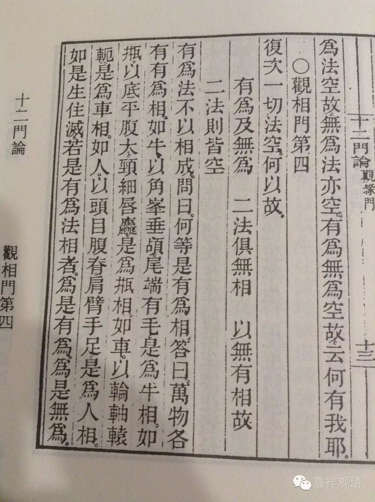

观相门第四

复次，一切法空，何以故？

**有为及无为，二法俱无相，

** 以无有相故，二法则皆空。

有为法不以相成？

问曰：何等是有为相？

答曰：万物各有有为相。如牛以角峯、垂颅、尾端有毛。是为牛相。如瓶以底平、腹大、颈细、唇麁，是为瓶相。如车以轮、轴、辕、轭，是为车相。如人以头、目、腹、脊、肩、臂、手、足，是为人相。如是生、住、灭。若是有为法相者，为是有为？为是无为？

问曰：若是有为，有何过？

答曰

**若生是有为，复应有三相，**

** 若生是无为，何名有为相？

若“生”是有为者，即应有三相，是三相，复应有三相。如是展转，则为无穷。住、灭亦尔。、若“生”是无为者，云何无为与有为作相？离生、住、灭，谁能知是生？

复次，分别生、住、灭故有生，无为不可分别，是故无生。住、灭亦尔。

生、住、灭空故，有为法空；有为法空故，无为法亦空。因有为故，有无为，有为、无为法空故，一切法皆空。

问曰：汝说三相复有三相，是故无穷。生不应是有为者，今当说：

**生生之所生，生于彼本生，

** 本生之所生，还生于生生。

法生时，通自体，七法共生：一、法；二、生；三、住；四、灭；五、生生；六、住住；七、灭灭。是七法中，本生，除自体，能生六法。“生生”，能生本生。本生，还生“生生”。是故三相虽是有为，而非无穷。住、灭亦如是。

答曰：

**若谓是生生，还能生本生，

** 生生从本生，何能生本生？

若谓“生生”能生“本生”，“本生”不生“生生”，“生生”何能生“本生”？

**若谓是本生，能生彼生生，

** 本生从彼生，何能生生生。

若谓“本生”能生“生生”，“生生”生已，还生本生，是事不然。何以故？“生生”，法应生“本生”，是故名“生生”。而“本生”实自未生，云何能生“生生”？若谓“生生”生时能生“本生”者，是事亦不然。何以故？

**是生生生时，或能生本生，

** 生生尚未生，何能生本生。

是“生生”生时，或能生“本生”，而是“生生”自体未生，不能生“本生”。

若谓是“生生”生时，能自生，亦生彼；如灯然时，能自照，亦照彼。是事不然，何以故？

**灯中自无闇，住处亦无闇，

** 破闇乃名照，灯为何所照。

“灯体自无闇”，明所“住处亦无闇”。若灯中无闇，住处亦无闇，云何言“灯自照，亦能照彼”？破闇故名为“照”，灯不自破闇，亦不破彼闇！是故灯不自照，亦不照彼！是故汝先说“灯自照亦照彼，生亦如是，自生亦生彼”者，是事不然。

问曰：若灯然时能破闇，是故灯中无闇，住处亦无闇。

答曰：

**云何灯然时，而能破于闇？

** 此灯初然时，不能及于闇。

若灯然时不能到闇，若不到闇，不应言破闇。

复次：

**灯若不及闇，而能破闇者，

** 灯在于此间，则破一切闇。

若谓“灯虽不到闇，而力能破闇”者，此处然灯，应破一切世间闇，俱不及故。而实此间然灯，不能破一切世间闇，是故汝说“灯虽不及闇，而力能破闇”者，是事不然！

复次：

**若灯能自照，亦能照于彼，

** 闇亦应如是，自蔽亦蔽彼。

若谓“灯能自照，亦照彼”，闇与灯相违，亦应“自蔽，亦蔽彼”。若“闇与灯相违，不能自蔽，亦不蔽彼”，而言“灯能自照，亦照彼”者，是事不然！是故汝喻非也。

如“生能自生，亦生彼”者，今当更说：

**此生若未生，云何能自生，

** 若生已自生，已生何用生。

此“生”未生时，应若生已“生”？若未生“生”？

若未生而“生”，未生名未有，云何能自生？

若谓生已而“生”，生已即是“生”，何须更生？生已更无生，作已更无作。是故生不自“生”。若生不自“生”，云何生彼？

汝说“自生亦生彼”，是事不然。住、灭亦如是。是故“生、住、灭是有为相”，是事不然。

“生、住、灭有为相”不成故，有为法空。有为法空故；无为法亦空。何以故？灭有为，名无为涅槃，是故涅槃亦空。

复次，无生、无住、无灭，名无为相。无生、住、灭，则无法，无法不应作相。

若谓“无相是涅槃相”，是事不然。若“无相是涅槃相”，以何相故，知是无相？若以有相知是无相，云何名无相？若以“无相知是无相”，无相是无，无则不可知！

若谓“如众衣皆有相，唯一衣无相，正以无相为相故，人言取无相衣。如是可知，无相衣可取。如是，生、住、灭是有为相，无生、住、灭处当知是无为相，是故无相是涅槃”者，是事不然。何以故？生、住、灭种种因缘皆空，不得有有为相，云何因此知无为？汝得何有为决定“相”，知无“相”处是无为？是故汝说“众相衣中无相衣”，喻“涅槃无相”者，是事不然。

又，衣喻，后第五门中广说。

是故，有为法皆空；有为法空故，无为法亦空；有为无为法空故，我亦空；三事空故，一切法皆空。

 