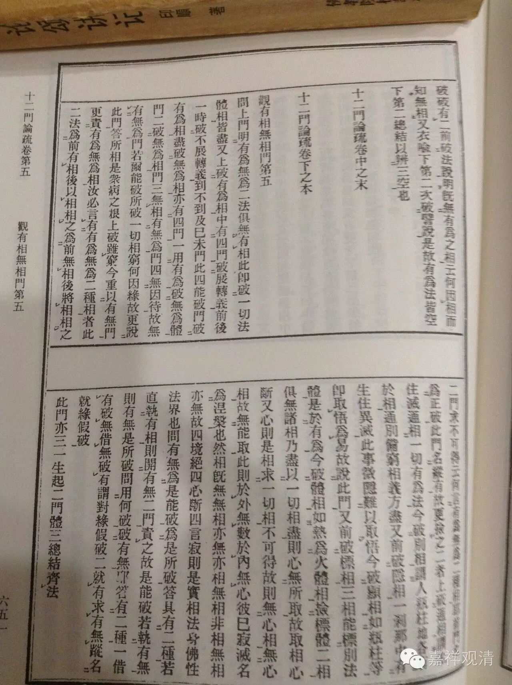

十二门论疏·观有相无相门第五

玄义

问：上门明有为、无为二法俱无有相，此即破一切法体相皆尽。

又，上破有为相中有四门：破展转义前後、一时；破不展转义到不到；及已未门。此四能破门；破有为相尽。破无为相亦有四门：一、用有为破无为体门；二、破无为相门；三、无相有无为门；四、无因待故，无有无为门。

若尔，能破、所破一切相穷，何因缘故更说此门？

答：所相是众病之根。上破虽穷，今重以有无门，更责有为、无为相。

汝必言有有为、无为二种相者，此二法为前有相，後以相相之？为前无相，後将相相之？二门求不可得，云何言有为、无为二种相耶？前门名为正破，此门名纵有，故更捡之。

二者，上破通相，谓生、住、灭，通“相”一切有为法；今破别相，谓人、瓶、柱、地，各有於相。通、别备穷，“相”义方尽。

又，前破“隐相”，一刹那中，有生、住、异、灭，此事微隐，难以取悟。今破“显相”，如瓶、柱等。即取悟为易，故说此门。

又，前破“标相”，三相能标别法体，是於有为。今破“体相”，如热，为火体相。捡标、体二相俱无，诸相乃尽，以一切相尽，则心无所取，故取相心断。

又，心则是相，求一切相不可得故，则无心相。无心相故，无能取。此则於外无数，於内无心。彼已寂灭，名为涅槃也。

然“相”既无，“无相”亦无，“亦相无相”、“非相无相”亦无，故四境绝，四心断，四言寂，则是实相、法身、佛性、法界也。

问：有、无，为是能破？为是所破？

答：具有二种。若直执有相，则开有、无二门责之，故是能破。若执有无，则有、无是所破。

问：用何破破有无耶？

答：有二种。一，借有破无，借无破有，谓“对缘假”破。二，就有求有无踪，名“就缘假”破。

