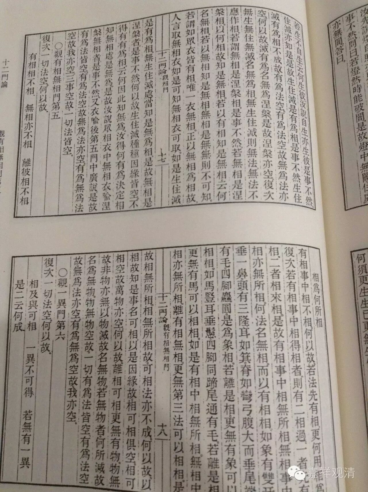

观有相无相门第五

复次，一切法空。何以故？

有相相不相，无相亦不相，

离彼相不相，相为何所相。

有相事中相不相。何以故？若法先有相，更何用相为？

复次，若有相事中相得相者，则有二相过：一者先有相，二者相来相。是故有相事中，相无所相。

无相事中，相亦无所相。何法名无相？而以有相相。如象有双牙，垂一鼻，头有三隆，耳如箕，脊如弯弓，腹大而垂，尾端有毛，四脚麁圆，是为象相。若离是相，更无有象可以相相。如马，竖耳，垂鬃，四脚同蹄，尾通有毛——若离是相，更无有马可以相相。

如是，有相中，相无所相，无相中，相亦无所相。离有相无相，更无第三法可以相相，是故相无所相。

相无所相故，可相法亦不成。何以故？以相故，知是事名可相，以是因缘故，相、可相俱空。相、可相空故，万物亦空。何以故？离相、可相，更无有物。物无故，非物亦无。以物灭故名无物，若无物者，何所灭故名为无物？物、无物空故，一切有为法皆空，

有为法空故，无为法亦空。有为、无为空故，我亦空。

 