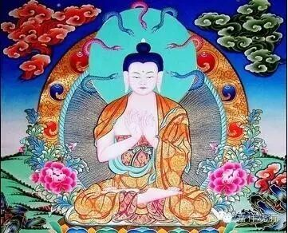

观性门第八

复次，一切法空。何以故？诸法无性故。如说：

**见有变异相，诸法无有性，

** 无性法亦无，诸法皆空故。

诸法若有性，则不应变异。而见一切法皆变异。是故当知，诸法无性。

复次，若诸法有定性，则不应从众缘生。若性从众缘生者，性即是作法，不作法，不因待他，名为性。是故一切法空。

问曰：若一切法空，则无生、无灭；若无生灭，则无苦谛；若无苦谛，则无集谛；若无苦集谛，则无灭谛；若无苦灭，则无至苦灭道；若诸法空无性，则无四圣谛；无四圣谛故，亦无四沙门果；无四沙门果故，则无贤圣；是事无故，佛、法、僧亦无；世间法皆亦无——是事不然！是故诸法不应尽空！

答曰：有二谛：一、世谛；二、第一义谛。因世谛，得说第一义谛。若不因世谛，则不得说第一义谛；若不得第一义谛，则不得涅槃。若人不知二谛，则不知自利、他利、共利。如是，若知世谛，则知第一义谛；知第一义谛，则知世谛。

汝今闻说世谛，谓是第一义谛，是故堕在失处。诸佛因缘法，名为甚深第一义。是因缘法无自性故，我说是空。

若诸法不从众缘生，则应各有定性五阴，不应有生灭相五阴；不生、不灭，即无无常；若无无常，则无苦圣谛；若无苦圣谛，则无因缘生法集圣谛；诸法若有定性，则无苦灭圣谛——何以故？性无变异故——若无苦灭圣谛，则无至苦灭道——是故，若人不受空，则无四圣谛；若无四圣谛，则无得四圣谛；若无得四圣谛，则无知苦、断集、证灭、修道；是事无故，则无四沙门果；无四沙门果故，则无得向者；若无得向者，则无佛；破因缘法故，则无法；以无果故，则无僧；若无佛、法、僧，则无三宝；若无三宝，则坏世俗法！

——此则不然！是故一切法空！

复次，若诸法有定性，则无生、无灭、无罪、无福。无罪、福、果、报，世间常是一相。是故当知，诸法无性。

若谓“诸法无自性，从他性有”者，是亦不然！何以故？若无自性，云何从他性有？因“自性”有“他性”故。

又，他性即亦是自性。何以故？他性即是他自性故。

若自性不成，他性亦不成。若自性他性不成，离自性、他性，何处更有法？若有不成，无亦不成。是故今推求无自性、无他性，无有、无无故，一切有为法空。有为法空故，无为法亦空。有为无为尚空，何况我耶？

 