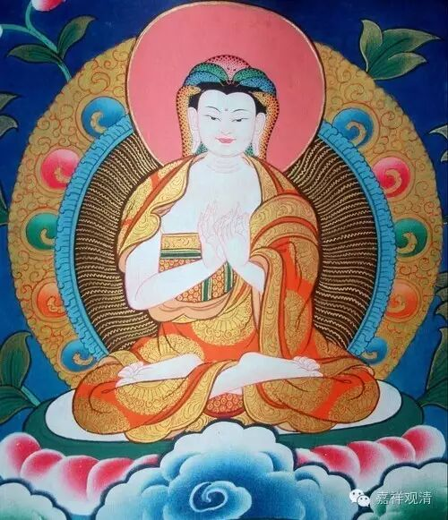

观生门第十二

复次，一切法空。何以故？生、不生、生时不可得故。今“生已”不生，“不生”亦不生，“生时”亦不生。如说：

**生果则不生，不生亦不生，

** 离是生不生，生时亦不生。

生，名果起、出；未生，名未起、未出、未有；生时，名始起未成。

是中，生果不生者，是生，生已不生。何以故？有无穷过故；作已更作故。

若生，生已，生第二生；第二生，生已，生第三生，第三生，生已，生第四生……如初生，生已，有第二生……如是“生”则无穷！是事不然！是故生，不生。

复次，若谓【生，生已，生，所用生“生”，是“生”，不生而生】。是事不然！何以故？初生，不生而生，是则二种生——生已而生、不生而生故。汝先定说，而今不定。

如作已不应作，烧已不应烧，证已不应证。如是，生已不应更生。是故生法不生！

不生法亦不生。何以故？不与生合故。

又，“一切不生有生”过故。

若不生法生，则离生有生，是则不生。若离生有生，则离作有作，离去有去，离食有食……如是则坏世俗法。是事不然！是故不生法不生。

复次，若不生法生，一切不生法皆应生。一切凡夫，未生阿耨多罗三藐三菩提皆应生；不坏法阿罗汉烦恼不生而生；兔马等角不生而生……是事不然！是故不应说“不生而生”！

问曰：“不生而生”者，如有因缘和合，时、方、作者、方便具足，是则不生而生，非“一切不生而生”——是故不应以“一切不生而生”为难。

答曰：若法生时、方、作者、方便，众缘和合生，是中先定有不生；先无亦不生；又，有无亦不生。是三种求生不可得，如先说，是故不生法不生。

生时亦不生。何以故？有“生生”过、“不生而生”过故。生时法，“生分不生”，如先说；“未生分亦不生”，如前说。

复次，若离“生”，有“生时”，则应“生时生”。而实离“生”无“生时”，是故生时亦不生。

复次，若人说“生时生”，则有二生：一、以“生时”为“生”；二、以“生时”“生”。无有二法，云何言有二“生”？是故“生时亦不生”。

复次，未有生，无生时，生于何处行？生若无行处，则无生时生。是故“生时亦不生”。如是，生、不生、生时皆不成。

生法不成故，无生，住、灭亦如是。

生、住、灭不成故，则有为法亦不成；有为法不成故，无为法亦不成；有为无为法不成故，众生亦不成。是故当知，一切法无生，毕竟空寂故。

 