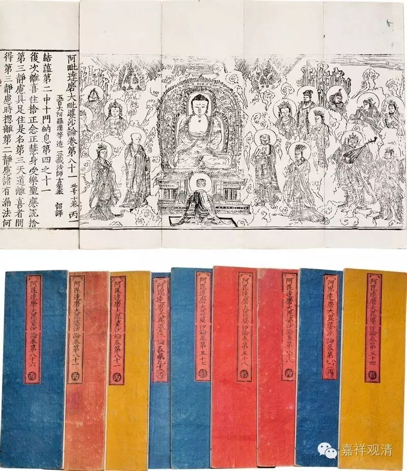
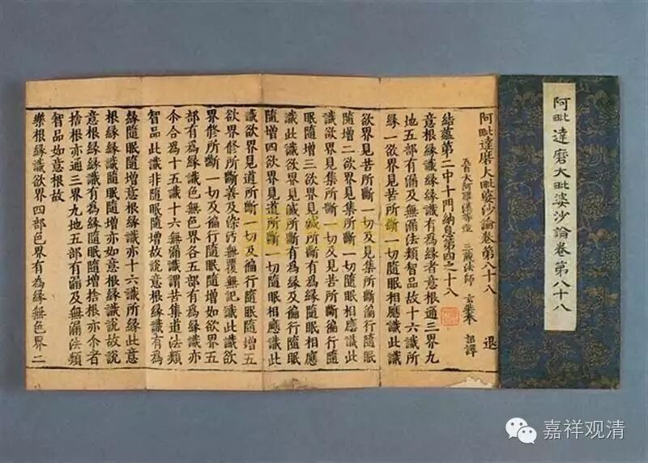

缘起、缘生

**《大毗婆沙论》卷二十三：**

** 如契经说：佛告 苾刍，吾当为汝说缘起法，及缘已生法。**

** 问：缘起法，与缘已生法，差别云何？**

** 有作是言：无有差别。所以者何？《品类足论》作如是言：“云何缘起法？谓一切有为法。云何缘已生法？谓一切有为法。”故知此二，无有差别。**

** 有余师说：亦有差别。谓名即差别。此名缘起法，彼名缘已生法故。**

** 复次，因名缘起法，果名缘已生法。如因、果，如是能作、所作；能成、所成；能生、所生；能转、所转；能起、所起；能引、所引；能续、所续；能相、所相；能取、所取；应知亦尔。**

** 复次前生者，名缘起法。后生者，名缘已生法。**

** 复次过去者，名缘起法，未来、现在者，名缘已生法。**

** 复次过去、现在者，名缘起法。未来者，名缘已生法。**

** 复次无明，名缘起法，行、名缘已生法；乃至生、名缘起法，老死、名缘已生法。**

** 胁尊者言：无明唯名缘起法，老死唯名缘已生法，中间十支，亦名缘起法，亦名缘已生法。**

** 尊者妙音，作如是说：过去二支，唯名缘起法；未来二支，唯名缘已生法；现在八支，亦名缘起法，亦名缘已生法。**

** 尊者望满，说有四句。有缘起法，非缘已生法——谓未来法。有缘已生法，非缘起法——谓过去、现在阿罗汉最后五蕴。有缘起法，亦缘已生法——谓除过去、现在阿罗汉最后五蕴诸余过去、现在法。有非缘起法，亦非缘已生法：谓无为法。**

** 《集异门论》，及《法蕴论》，俱作是说：若无明生行，决定安住不离乱者，名缘起法。亦名缘已生法。若无明生行，不决定，不安住，而杂乱者，名缘已生法，非缘起法。乃至生生老死，应知亦尔。**

** 尊者世友，作如是说：若法、是因，名缘起法。若法、有因，名缘已生法。**

** 复次，若法、是和合，名缘起法。若法、有和合，名缘已生法。**

** 复次，若法、是生，名缘起法。若法、有生，名缘已生法。**

** 复次，若法、是起，名缘起法。若法、有起，名缘已生法。**

** 复次，若法、是能作，名缘起法。若法、有能作，名缘已生法。**

** 大德说曰：转、名缘起法。随转，名缘已生法。**

** 尊者觉天，作如是说：诸法生时，名缘起法。诸法生已，名缘已生法。**

** 契经所说缘起法，缘已生法，如是差别。**

** 
**