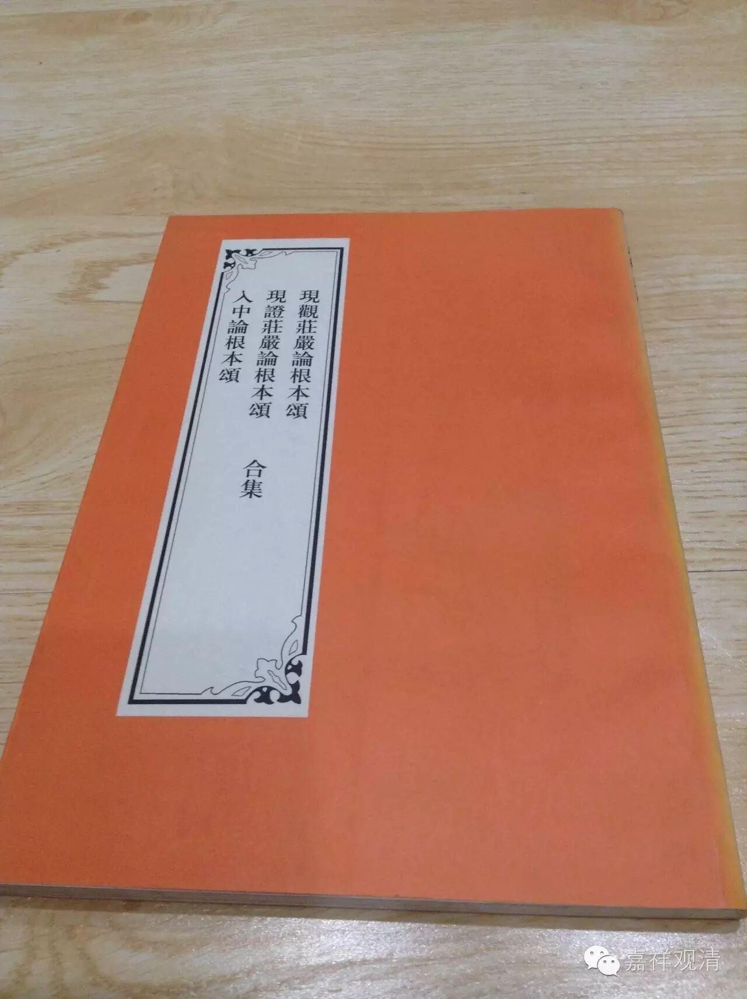
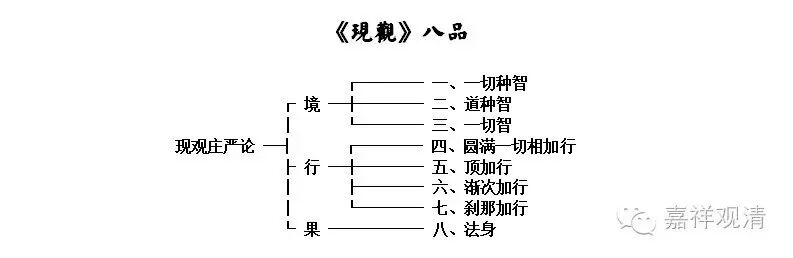
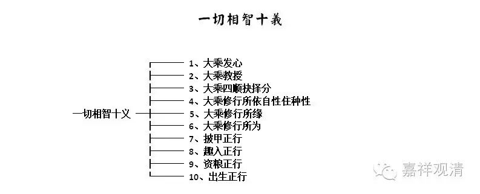
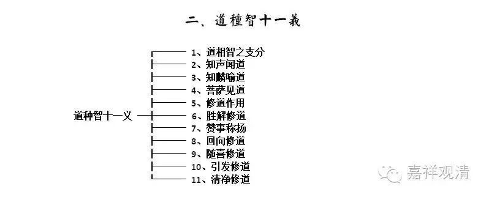
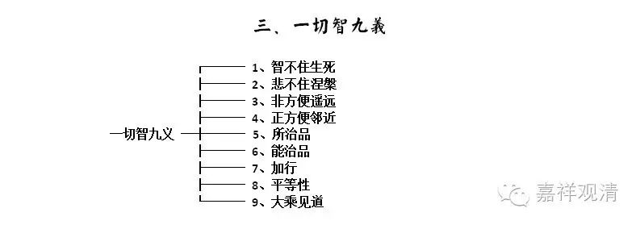
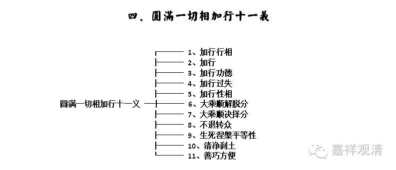
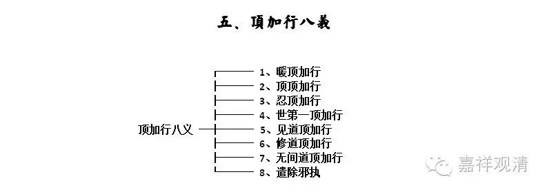
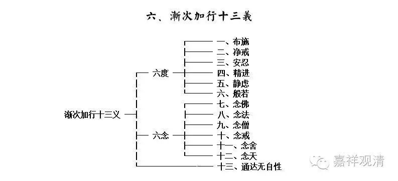
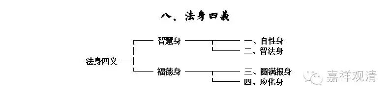

**
**

** 《现观庄严论》“八品七十义”简表**

**
**

《现观庄严论》为大品般若的本母，大科为“八品七十义”，“八品”又可束为“境”、“行”、“果”三，即三智、四加行、果法身。

《现观》之初，即列此出“八品七十义”，即：

** 般若波罗密，以八事正说：**

** 遍相智道智，次一切智性，一切相现观，至顶及渐次。**

** 刹那证菩提，及法身为八。**

** 发心与教授，四种决择分，正行之所依，谓法界自性。**

** 诸所缘所为，甲铠趣入事，资粮及出生，是佛遍相智。**

** 令其隐暗等，弟子麟喻道，此及他功德，大胜利见道。**

** 作用及胜解，赞事并称扬，回向与随喜，无上作意等。**

** 引发最清净，是名为修道，诸聪智菩萨，如是说道智。**

** 智不住诸有，悲不滞涅槃，非方便则远，方便即非遥。**

** 所治能治品，加行平等性，声闻等见道，一切智如是。**

** 行相诸加行，德失及性相，顺解脱决择，有学不退众，**

** 有寂静平等，无上清净刹，满证一切相，此具善方便。**

** 此相及增长，坚稳心遍住，见道修道中，各有四分别。**

** 四种能对治，无间三摩地，并诸邪执着，是为顶现观。**

** 渐次现观中，有十三种法。**

** 刹那证菩提，由相分四种。**

** 自性圆满报，如是馀化身。法身并事业，四相正宣说。**

**
**

** 今束作如下之九张表格，方便学习检索。**

**
**

我不是第一次画这个表格，而且一定也有人做过这个工作。这几张图属于仓促而成，或未尽善，可尽情指摘。