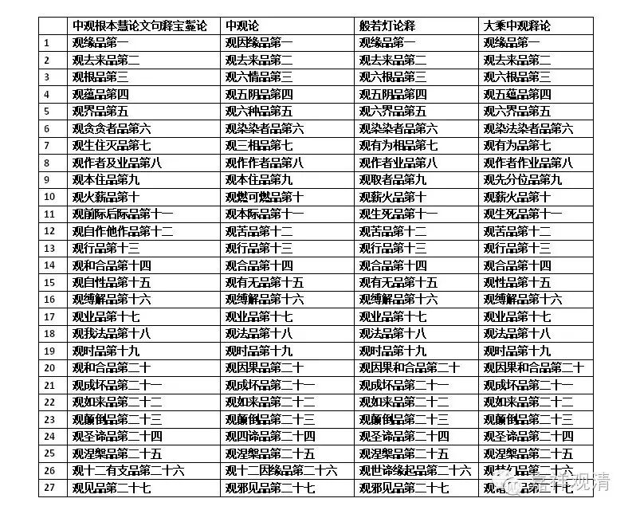

**四种《中观论》品目对照

**

** 一、关于所用之版本：**

** 《中观根本慧论文句释·宝鬘论》：僧海（根敦嘉措）著，任杰译。民族出版社《龙树六论》本。**

** 《中观论》：龙树著，姚秦·鸠摩罗什译。本论汉译品名，有作“破因缘品”、“破去来品”乃至“破邪见品”等，《藏要》本依吉藏《中观论疏》，作“观因缘品”、“观去来品”乃至“观邪见品”等，今从《藏要》本。**

** 《般若灯论》：清辨注，唐·波罗颇迦罗蜜多罗译，大正藏本。**

** 《大乘中观释论》：安慧注，宋·法护与惟净共译，大正藏本。**

** **

** 二、“和合品”**

** 《文句释》第十四品和第二十品都作“和合品”。彼中，十四品之“和合”，藏文为碰、触之意，与第二十品之“和合”并不相同。**

**
**

** 四种《中观论》品目对照表**

按：此表仅为初稿，容后更加增益损减。

