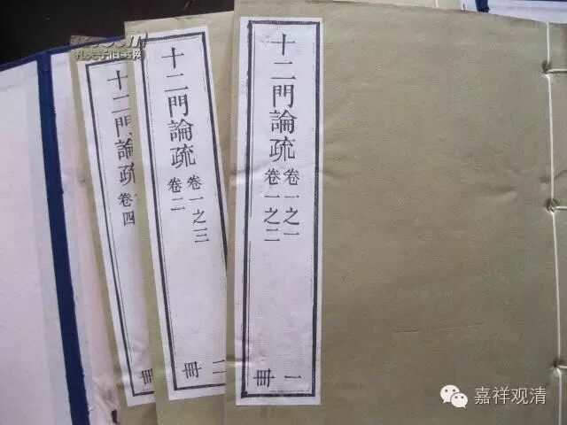

十二门论疏·观因果门第九

玄义

所以有此门来者，上四门求“相”不可得，次一门明“性”无踪。故《无量义经》云：“一切诸法，自本来今，性相空寂。”以外相、内性空故，一切法空。

外人云：若一切法“性”、“相”空者，可言“无因果”耶？然世、出世，“因”、“果”不可言无，云何言“无性相”？

是故今次明“非但无有性相，求此因果亦不可得”。故有此门来也。

又，近从性门来者，前偈上半明无万物实体，下半明无万物假体。

外云：若假、实二体空故，一切法空，然因果之理不可无，若尔，终有因果。有因果故，不实即假也。《毗昙》实有因果体。《成实》具二义：一者因成。相续、相待论因果。则因实而果假。如四微实，柱是假。若“法”、“受”、“名”三假，则因果皆假。如细色成粗色，是“法假”；四微成四大，是“受假”；四大成五根已去，为“名假”。又，五阴为“法假”；人为“受假”；人法皆有名，为“名假”。

问：若无因果，与邪见何异？

答：有五人立无因果。

一、立有见人，谓实有果体，则不从因生，故成无因果。

二、外道邪见，言无因果。

三、复二乘言无因果。

四、大乘人言无因果。

外道是邪见，拨无因果，故言无因果，此是邪见空。

二乘言无因果，望大乘亦是邪见空故，《涅槃》云：“若以二乘言无布施，是破戒邪见。”《智度论》云：“二乘空是但空。”四、大乘学方广人，谓无世谛因果。

五、诸佛菩萨言无因果者，因果宛然而毕竟空，故名无所得空。

所以有三空异：一、邪见空；二、但空；三、真空。今破前二空；令入真空；故明因果空也。

问：令悟因果空有何利？

答：悟因果宛然即毕竟空故，生“如来智”；虽毕竟空因果宛然，生於“佛智”；因果，非因果常尔，而观行任运纯熟，为“自然智”；不从师得，为“无师智”。既生四智，入佛知见，即是因果观行转明，遂得成佛，为佛果乘。论主今明“因果空”，为释成大乘义故也。

问：悟“因果空”但生智慧，云何有功德耶？大乘具以福慧为体，云何但明智慧？

答：既得如实悟，还为众生如实说，即是般若大悲，故福慧具足，名大乘也。

问：上来已明因果空竟，今何故复说？

答曰：自上八门，广破从因生果义，复有计无因自然有果。此三一病犹未除之，是故今品次破之也。

问：若尔，应言“破无因有果门”，云何言“破因果”耶？

答：论主欲对破“破无因有果”故——此品双破“从因生果”及“无因有果”，故言“观因果”。夫论因果不出斯二，斯二既无，则因果便空。

又，因果难明，上已广论。今次略辨，故有此门来。

又，有种种观门。今作“因果观门”以悟入实相，故有此门来也。

又，上门破因果便备，而更有此门者，是泥洹法宝，入有多门故也。

问：与《中论·因果品》何异。

答：彼品横阔、竖狭：广破十家因果，并是破“从因生果”义，故言“横阔”；不破“无因有果”，故言“竖狭”。此品略破“从因生果”，复破“无因有果”，故横狭、竖阔，故异也。

正文

门亦三。初，长行发起，为二：一者总唱“一切法空”。“何以故”下，释二义。别释一切法空，所以举二义者，上来已破因果，今复论之。似如烦重，故逆取偈意而生起之。言二义者，一、明诸法无自性，此辨“果不从因生”；二、明亦不从余处来，此正起此门，明“非因不生果”。

偈为二，三句正破，一句总结。

正破又二，上半明“因内无果”，次句明“因外无果”。文易知也。

长行释，二章即二。前释三句，次释第四句。

三句又二，前释上半，“又是果”下释第三句。

“若果众缘中无”下，释第四句也。

    “果空故”下，门中第三，结“一切法空”。

