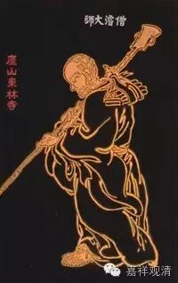

《摩诃般若波罗蜜经释论》序

长安释僧叡述

夫万有本于生生，而生生者无生；变化兆于物始，而始始者无始。然则无生、无始，物之性也。生、始不动于性，而万有陈于外、悔吝生于内者，其唯邪思乎！正觉有以见邪思之自起，故《阿含》为之作；知滞有之由惑，故《般若》为之照。然而照本希夷，津涯浩汗，理超文表，趣绝思境。以言求之，则乖其深；以智测之，则失其旨。二乘所以颠沛于三藏，杂学所以曝鳞于龙门者，不其然乎！

是以马鸣起于正法之余，龙树生于像法之末。正余易弘，故直振其遗风，莹拂而已。像末多端，故乃寄迹凡夫，示悟物以渐，又假照龙宫，以朗搜玄之慧，托闻幽祕，以穷微言之妙，尔乃宪章智典，作兹释论。其开夷路也，则令大乘之驾方轨而直入；其辩实相也，则使妄见之惑不远而自复。

其为论也，初辞拟之，必标众异以尽美；卒成之终，则举无执以尽善。《释》所不尽，则立论以明之；《论》其未辩，则寄折《中》以定之。使灵篇无难喻之章，千载悟作者之旨，信若人之功矣！

有鸠摩罗耆婆法师者，少播聪慧之闻，长集奇拔之誉，才举则亢标万里，言发则英辩荣枯，常杖兹论为渊镜、凭高致以明宗。以秦弘始三年，岁次星纪，十二月二十日，自姑臧至长安。秦王虚襟既已蕴在，昔见之心岂徒则悦而已！晤言相对，则淹留终日；研微造尽，则穷年忘倦。又以晤言之功虽深，而恨独符之心不旷；造尽之要虽玄，而惜津梁之势未普。遂以莫逆之怀，相与弘兼忘之慧，乃集京师义业沙门，命公卿赏契之士五百余人，集于渭滨逍遥园堂。銮舆伫驾于洪涘，禁御息警于林间。躬览玄章，考正名于梵本；谘通津要，坦夷路于来践。

《经》本既定，乃出此《释论》。《论》之略本有十万偈，偈有三十二字，并三百二十万言。梵夏既乖，又有烦简之异，三分除二，得此百卷。于大智三十万言，玄章婉旨，朗然可见，归途直达，无复惑趣之疑，以文求之无间然矣。

故天竺传云：“像、正之末，微马鸣、龙树，道学之门其沦胥溺丧矣！”其故何耶？寔由二未契微，邪法用盛，虚言与实教并兴，崄径与夷路争辙，始进者化之而流离，向道者惑之而播越，非二匠其孰与正之！是以天竺诸国，为之立庙，宗之若佛。又称而咏之曰：“智慧日已颓，斯人令再曜；世昏寝已久，斯人悟令觉。”若然者，真可谓功格十地，道侔补处者矣！传而称之，不亦宜乎！幸哉！此中鄙之外，忽得全有此论。

梵文委曲，皆如《初品》。法师以秦人好简，故裁而略之。若备译其文，将近千有余卷。法师于秦语大格，唯译一往；方言殊好，犹隔而未通。苟言不相喻，则情无由比。不比之情，则不可以托悟怀于文表；不喻之言，亦何得委殊涂于一致。理固然矣，进欲停笔争是，则交竞终日，卒无所成；退欲简而便之，则负伤于穿凿之讥以二三。唯案译而书，都不备饰。幸冀明悟之贤，略其文而挹其玄也！

