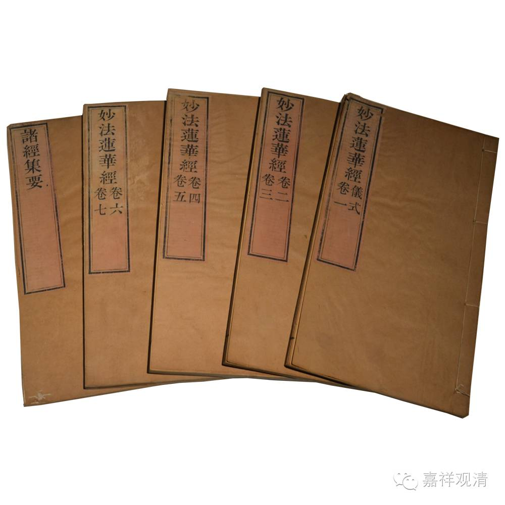

《法华经》后序

僧叡

法华经者，诸佛之秘藏，众经之实体也。以华为名者，照其本也；称芬陀利者，美其盛也。所兴既玄，其旨甚婉；自非达识传之，罕有得其门者。夫百卉药木之英，物实之本也；八万四千法藏者，道果之原也，故以喻焉。

诸华之中，莲华最胜。华尚未敷，名“屈摩罗”；敷而将落，名“迦摩罗”；处中盛时，名“芬陀利”。未敷喻二道，将落譬泥洹，荣曜独足以喻斯典。至如《般若》诸经，深无不极，故道者以之而归；大无不该，故乘者以之而济；然其大略，皆以适化为大；应务之门，不得不以善权为用。权之为化，悟物虽弘，于实体不足，皆属《法华》，固其宜矣。寻其幽旨，恢廓宏邃，所该甚远，岂徒说实归本，毕定殊涂而已耶？乃实大明觉理，囊括古今。云佛寿无量，永劫未足以明其久也；分身无数，万形不足以异其体也。然则寿量定其非数，分身明其无实，普贤显其无成，多宝照其不灭。夫迈玄古以斯今，则万世同一日；即万化以悟玄，则千途无异辙。夫如是者，则生生未足以期存，永寂亦未可言其灭矣。寻幽宗以绝往，则丧功于本无；控心辔于三昧，则忘期于二地。

经流兹土，虽复垂及百年，译者昧其虚津，灵关莫之或启；谈者乖其准格，幽踪罕得而履；徒复搜研皓首，并未有窥其门者。秦司隶校尉左将军安城侯姚嵩，拟韵玄门，宅心世表，注诚斯典，信诣弥至，每思寻其文，深识译者之失。既遇鸠摩罗法师，为之传写，指其大归，真若披重霄而高蹈，登昆仑而俯盻矣。

于时听受领悟之僧八百余人，皆是诸方英秀，一时之杰也。

是岁弘始八年，岁次鹑火。

