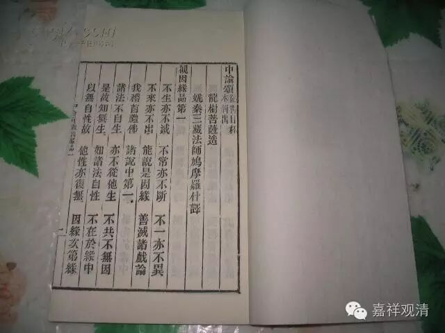

《大智度论》与《中论·23·13》

“常”与“无常”

（一）

《大智度论》卷一（北塔版P12）还有一处引《中论》文：

*复次，著常颠倒众生，不知诸法相似相续有；如是人观无常，是对治悉昙，非第一义。何以故？一切诸法自性空故。如说偈：*

*“无常见有常，是名为颠倒；*

*空中无无常，何处见有常？”*

此见罗什译《中论·观颠倒品第二十三》：

*“于无常着常，是名为颠倒；*

*空中无有常，何处有常倒？”*

这里第三句，《大智度论》做“空中无无常”， 什译《中论》做“空中无有常”，“无常”与“常”正相反！

那么哪个是正确的版本呢？

看汉文《大智度论》其他版本，这一段文字基本一致，仅有个别版本做“空中空无常”，意思没变。

《中论》的版本呢？

（二）

《中论》的版本，现在有很多可以参考。

对照《中论》的其他版本，发现“空中无无常”这一句，确实本来就有“常”和“无常”两个版本——1、《青目释》作“空中无有常”； 2、《无畏论》、《佛护释》、《般若灯论》、《明句论》作“空中无无常”。如果加上前后文，则有三种解读！

1、先说什译《中论》及《青目释》。

罗什本，《中论释》，青目：

*“于无常着常，是名为颠倒；*

*空中无有常，何处有常倒？”*

略释：把“无常”当作“常”，这就叫“颠倒”；而（自性）空中没有“常”，哪里有什么“常倒”（可以安立）？

2、波罗颇蜜多罗译，《般若灯论》，清辩：

*“无常谓常者，名为颠倒执，*

*无常亦是执，空何故非执。“*

略释：把“无常”当作是“常”，这就叫“颠倒执”；执无常也是颠倒，是分别故，如常执。

3、叶少勇，《明句论》，月称：

*“若于无常说为常，如是执取即颠倒；*

*而于空中无无常，从何而有颠倒执？“*

略释：把“无常”当作“常”，这样执取就叫“颠倒”；但（自性）空中没有“无常”，从哪里有观待“无常”而说的“常倒”呢？

此三说皆可通。

（三）

再看回《大智度论》。

《大智度论》上下文解释“四悉昙”，这里用“常无常”为例解释“对治悉昙”——对“常”而说“无常”。这样看来，《大智度论》引《中论》文义，略近月称《明句论》，即：

《大智度论》卷一：

*“无常见有常，是名为颠倒；*

*空中无无常，何处见有常？”*

略释：把“无常”当作“常”，此即名为“颠倒”；而（自性）空中没有“无常”，哪里能起“常”（倒）呢？

清按：本文“急救章”，略不出注。

