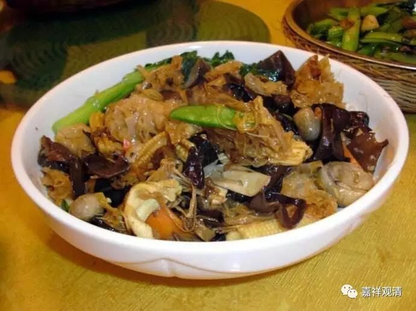
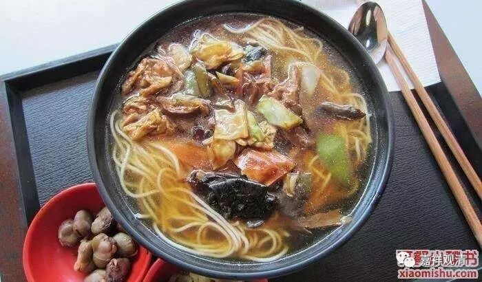
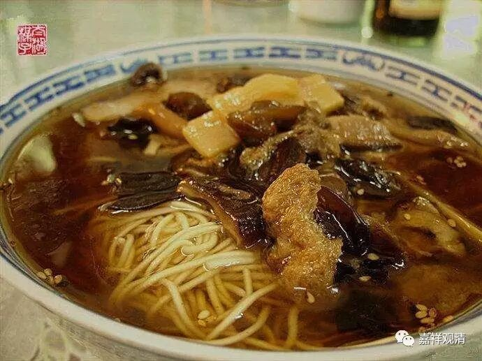

**金刚经 007（上）**

** **

我们继续《金刚经》的讨论学习。现在是讲到这一段：** “尔时世尊，食时，著衣持钵，入舍卫大城乞食。于其城中，次第乞已，还至本处。饭食讫，收衣钵，洗足已，敷座而坐。”**

** **

前面讲了几个故事，关于乞食和次第乞食，也谈到了出家人按照印度的习惯或者佛陀制定的戒律，应该是奉行乞食制度的。而现在汉传和藏传的出家人都是自己做饭，和以前不一样了，是因为经济环境、佛教的地位或者宗教信仰的环境都不一样了。我是很向往这种乞食制度的，这对我们出家人来说，心里应该蛮痒痒的，希望以后有机会到泰国或者缅甸，能够参加这样的一些活动。

** “于其城中，次第乞已，还至本处。”**就是回到祇园精舍——这叫** “还至本处”**，然后就吃饭。我们强调过好几次，按照南传，这个吃饭有点像我们现在的罗汉斋。我很喜欢吃罗汉斋和罗汉面的。这个罗汉面大家知道是什么样的，对吧？这个名字起得还真的有点道理。印度的托钵制度是这样的：托钵乞食的时候，每一家给的东西都是不一样的，最后就把饭菜在饭碗里面拌起来吃。这样做的本意是什么呢？是要消除对饭食的贪爱，先要想：“我仅仅是为了活命才吃这个的。”再要想：“这个是最不好吃的东西。”然后再吃下去。我觉得这跟减肥的人有相似之处啊，减肥的人看到食物也是想：“这都是热量，不得已才吃他。美食？那都是诱惑！是减肥的大敌！”

我们再来看罗汉面、罗汉斋，很多菜的名字就是“罗汉啥啥斋”、“罗汉啥啥煲”，看到的就是好多不一样的菜混在一起，有点像佛跳墙（当然，佛跳墙是另外一种意思）。罗汉斋、罗汉面都有这种性质，就是把很多菜拌在一起。

大家现在知道“罗汉面”的意思了吧？意思就是和尚吃的饭，就是这样一堆混在一起的。这个“罗汉”的称谓是说得好听，实际上是指因位的和尚、果位的罗汉。所以，是罗汉吃的也好，或者是和尚吃的也好，都是这个样子——把饭菜拌在一起，应该跟我们的炒饭也差不多吧。我倒是真挺爱吃炒饭的。菜饭也有点像。

