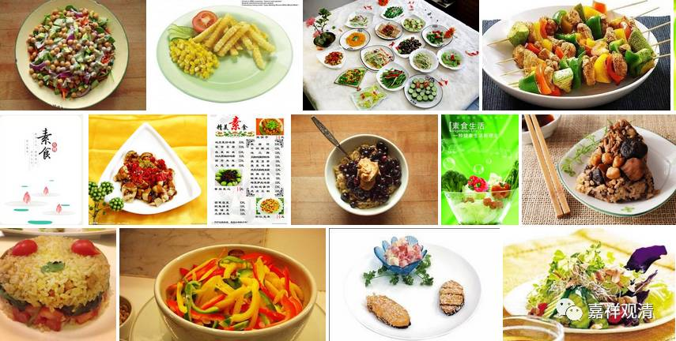

**《金刚经》007（中）**

吃的时候，按照小乘的说法是：这食物不是很好吃的，甚至是不好吃的，仅仅为了果腹、为了活命而吃下去的。但是大乘和密乘的说法还不一样呢，是什么呢？我们每天都唱《天厨妙供赞》，“天厨妙供”就是天神的厨师所做的最好吃的东西。为什么呢？因为这是用来供佛的，供完佛以后我们再吃的，所以这个就是最好吃的东西。在密宗里面是把它（食物）想像成甘露——甘露是长生不老药，据说天神吃的就是甘露，自然是上妙美味，最好吃的东西。对佛来说也是一样的，佛吃什么东西呢？佛都是吃最好吃的东西，所以我们要向佛学习。

曾经有个故事，说佛有三个月吃马麦。故事里说有一个地方，好像是国王请佛去那里安居三个月，佛陀的僧团到了那里之后，国王他好像忘记了这件事情（贵人多忘事啊，施主不靠谱，出家人倒霉），就没有了供养。没有供养的结果，就是僧团什么都没得吃，只能吃马麦——就是喂马的麦。

但是，这个马麦在佛吃起来却是非常非常好吃的东西。为什么呢？如果我们能够背得下来佛的“三十二相”、“八十种好”，其中就有一种功德叫“于非妙味转现上妙味”。比如说，这个马麦不是好吃的，就叫“非妙味”，而佛吃起来却是好吃的，就是“转现上妙味”。为什么呢？因为佛的功德是圆满的，由于这圆满的功德，他是不会碰到差的东西的。即便给了他再差的东西，对于他来说，这个仍然是最好最好的东西（这并不是说他自己想像为最好的东西）。因为佛陀的功德很圆满，马麦在他吃起来也是非常好的，好像后来留了一粒给阿难吃，阿难也觉得非常非常好吃。“于非妙味转现上妙味”，“于”就是对于的于，“非妙味”就是不很好的东西，“转现上妙味”，在佛吃起来就是最好最好的东西了。

我们现在也可以看到，福报差一点的人，再好的东西他都吃得不消化，甚至最好的药对他来说都变成毒药。你们看看，这是不是福报的问题啊？再好的东西对他来说都吃不下，再好的药对他来说都会变成毒药。这些都是自己的问题，是福报的问题啊！比如有些人，对芒果、牛奶、花生、鸡蛋、玉米都过敏，唉，太惨了！这是“于上妙味转为非妙味”啊！

现在都有这些情况在发生：再好的药都变成了伤害自己的药，还去找医院、找餐厅打官司。在佛教的理解当中，你不是该去找他们打官司，你应该好好忏悔，这是你自己的事情啊！这就是佛教和世间完全不同的视角。佛教认为应该更多地从自己这里出发，其实我们修行也是一样，更多地是从自己这里出发，而不是更多地从对方出发，你是改变不了对方的。

