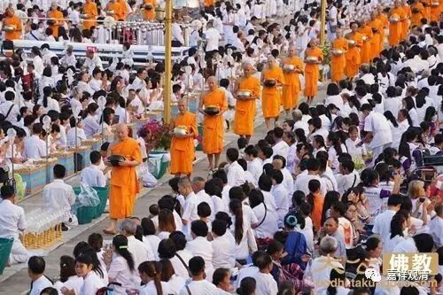
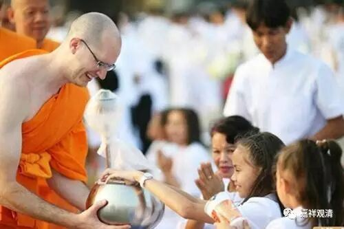
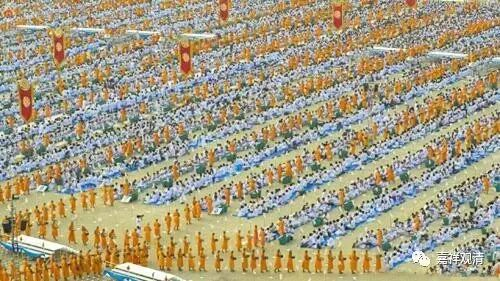

**
**

** 《金刚经》007（下）**

如果按照我们自小到的唯物主义的理想来讲，目标是最后是要实现共产主义的。我们也认为共产主义——极乐世界、圆满的净土是最后一定会实现的，但是我们的路径不同，我们认为，一定是先从心里面、心的方向上去实现的——先把我们的贪嗔痴都解决了，然后才会有共产主义、才会有净土。如果我们内心的贪嗔痴不能解决的话，那是绝对不会实现的，因为所有的人都想少付出、多获取，单单改造外部世界是不够的。按劳分配也好，按需分配也好，如果大家都增长了贪心，就把东西全搬自己家里去了。

那么，这个乞食制度是为什么产生的呢？乞食制度，是要在大家的周围创造这样一个环境，让大家能够看到有佛、有众生。大家还记得小路尊者和大路尊者的故事吧？孩子生下来以后，让人抱到路边，请出家人赐予祝福……都是因为有这样的出家人，能够随时给大家带来祝福。释迦牟尼佛也是一样，他为什么去乞食呢？也是为了众生，为了众生能够有一个培福的机会，并不是自己要贪吃或者怎么样，僧团里面自己要做饭也并不难。是因为要给当时周围的人看到有这样一批为了解脱而修行的人，所以佛陀制定了乞食制度，现在南传仍然是奉行乞食制度的。

不过，在印度能够奉行，是因为大家都能够接受这点。而现在的汉地如果奉行乞食制度，行不行呢？我们一直讲要去化缘，要去托钵一个月，但是到现在还没有做过。还是非常想做这个事情啊！有机会我们再想想，再把它付诸实践。我们和尚还是应该好好地讨讨饭，讨个几天的饭，讨个一个月的饭试试看——这才是我们应该做的。（我的一个出了家的好朋友JR师已经试着做了，不过徒步+要饭的不是他，是他的弟子们，他是在边上开越野车的那个，哈哈哈哈。我一直想约他我们俩单干。我考虑是不是骑自行车比较好，腰不好，背不了太多东西……）

另外，释迦牟尼佛也好，他的弟子也好，这样去乞食呢，不仅给众生培福的机会，也提供了众生能够听法的机会。因为一直去乞食，就会碰到一些人来提问题，这些人知道明天会有人过来，也会知道可以找到什么地方去提问，佛陀就会基于这些问题进行作答。比如有人请佛陀到家里去应供，然后就会问一些问题，也会碰到一些事情。我们如果看《阿含》的话，很多经典都是从这里出来的，说到了谁谁家里，然后出现什么问题，然后讲了什么内容，最后结集为什么什么经典……包括“八关斋戒”都是从这里出来的。佛陀安排僧众乞食，是有这样一些背景的。

好，今天讲得也不少了，就讲到这里吧，谢谢大家！

（照片是法身寺万人供僧法会。）

