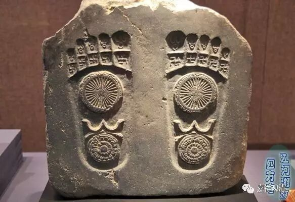

**金刚经 008（上）**

** **

好，我们继续《金刚经》。

《金刚经》以这样的方式来讲，会比较短，因为这不是一个很正式的讲经，而近似于帮助大家增加一点知识。这种讲法没有那么正式，都是这样一段一段的，一分钟一分钟的。这样的一天十分钟或者二十分钟，能够让大家稍微了解一点知识。大家来听的话，最好是对《金刚经》熟悉一点，如果都没念过，那肯定不够熟悉的。我一直比较奇怪，群里有好多人好像连《金刚经》都还没念过啊！

我们这次主要用的版本是鸠摩罗什法师的版本。** “如是我闻，一时佛在舍卫国，祗树给孤独园，”**在这样一个地方，** “与大比丘众千二百五十人俱。尔时世尊，”**这个时候，世尊，** “食时，”**一般估计在上午十点钟左右出去，** “著衣持钵，入舍卫大城乞食。”**就是去乞食，而且是次第乞食。** “于其城中，次第乞已，还至本处。”**回到自己住的地方，那就是祗树给孤独园了。** “收衣钵，”**把衣钵收好，** “洗足已，”** 还把脚洗了洗，** “敷座而坐。”**这个时候开始打坐。

我忘了上次讲过没有，反正现在就讲这一段吧。** “收衣钵，洗足已，敷座而坐。”**对我们出家人来说，比较重要的就是衣钵，相当于戒律的一种表征。“衣”，现在来讲就是指三衣。“钵”，就是一钵，它是有形制的。上次已经讲过了，这个钵应该是有三个人的饭量的一个形制。它唯独有按照我们现在来讲的瓦钵和铁钵两种，一种是陶瓷的或者是土烧的，还有一种就是铁钵。藏地的钵，我们远远看去很像瓦钵，仔细看的话就知道是铁钵，挺大的。戒律要求比较严格的，都是随身要带的。密宗当中戒律要求更严格，按照以前的规定出门都是必须要背在身上的，我们在下续部宗学院可以看到他们的钵都集体挂在那里。

** “收衣钵，洗足已，”**把衣服整理一下，把钵也整理一下，然后还洗个脚，挺讲卫生的。印度人都是光脚出门比较多。所以在声闻乘或者《阿含》的系统当中大家可以看到，有一次释迦牟尼佛的脚是被竹签穿破的，这个也算是比较重要的一件事情。怎么会出现这样的事情呢？那么，在声闻乘中是这样解释的：佛以前的这个业还没有报，到了这个时候也要报一下。而在大乘来说，这就是示现，是示现给大家看的。在《大藏经》当中对这个是有解释的，说是以前释迦菩萨前生是一个商主，为了保住自己和自己的团队，和另一位商主在海上就干起来了，结果拿枪卓中对方的脚……后来佛在走路的时候有一个木签把脚给戳穿了。如果从大乘的角度来说，这是佛的一种示现，告诉大家如果业和烦恼没有对治完的话，它还是要报的。声闻乘的说法就是真实的报应，佛也逃不掉。

从大乘本身来说，佛是不可能发生这种情况的，这是一种比方、示现。

