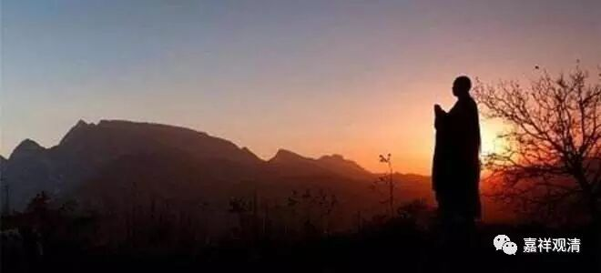

**《金刚经》008（中）**

** “洗足已，”**从外面回来以后，把脚洗一洗。

** “敷座而坐。”**把座垫铺好入坐。

完整地讲，就是在** “食时”——**上午，** “著衣持钵”——**把衣服整理好，拿着碗，到城中次第乞食，前后一家一家的，并不跳跃。乞食完毕回来以后，按应该进食的方法去进食。进完饮食以后，** “收衣钵，洗足已，敷座而坐。”**这整个都是在强调戒律，** “敷座**”的部分也可以是强调戒律，“** 而坐**”的部分可以强调禅定，那么，再后面就是强调慧学的部分。这个就是“戒定慧”三学。

汉传有这样的说法，这些内容分别属于“戒定慧”。藏传对此还有解释，比如说收衣钵、敷座等等，应该是侍者的事情，因为侍者就是干这些事情的嘛，但是为什么在讲《金刚经》的时候佛陀自己要这么做呢？藏传的《菩提道次第广论》当中也提到了这个问题，说这是表示对法的尊重。这是对《般若经》的尊重，乃至佛要讲《般若经》的时候，自己都要尊重这个法，所以佛自己来** “敷座而坐。”**

** “收衣钵，洗足已，敷座而坐。”**在其它的版本当中，还会再加进一段，就是释迦牟尼佛回来以后，其他的比丘们也回来了。大家都吃完饭后，绕佛三匝，合掌，然后坐下来准备听佛讲经。鸠摩罗什法师这个版本中是没有这段的。（其实也可以加，想想应该是可以有的。）

接下来，** “时长老须菩提，在大众中，”**那么，这个时候大众就已经来到佛的面前了。** “长老须菩提”**，早期是翻译成“长老”的，后来是翻译成“具寿”的。“具寿”也有“长老”的意思。“具”，是具备的具；“寿”，是寿命的寿。

这个“长老”其实可以有几种意思：一种是在出家人当中，他出家的时间比较长，比如说出家十年以上，可以称为长老或具寿；还有一种叫法性长老，就是他的水平比较高，也可以称为长老。这是两种长老的意思，还有一种我记不得了，好像是关于职位方面的，在僧团当中职位比较高的也称为长老。我记得前面两种是很明确有的，第三个我不能确定，好像是有三种长老的。

我们在僧团当中也可以看得到，有时候敬礼的对象一个就是比我们出家年长的，有时候就是僧官，我们应该要服从规矩的。比如说，我的师父在碰到我的师兄的时候，如果这位师兄当时在大寺院里当大僧官的话，我的师父也要给他敬礼的。当然，回来以后，我的师兄也必然向我的师父敬礼。这个就是在僧团当中担任一定的职务，要管事的长老。再有一种就是“法性长老”，比如说他已经成罗汉了，成圣者了，那我们也会致敬的，这个大家都能够理解。

