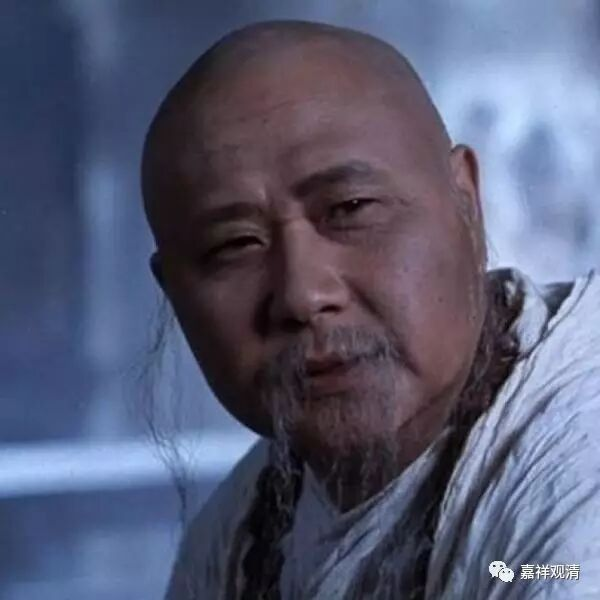
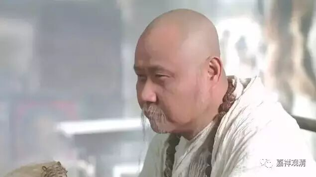
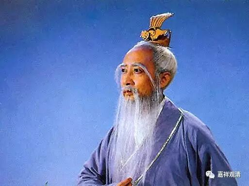
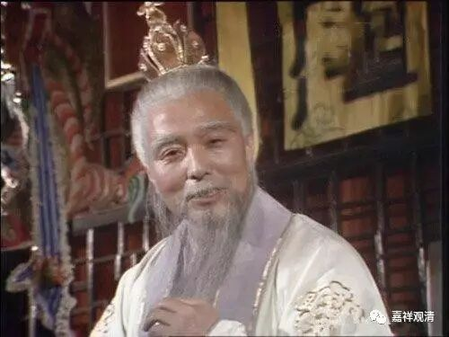

**《金刚经》008（下）**

这里的** “长老须菩提”**，已经证得阿罗汉果了，是那种“法性长老”了。“法”是佛法的法，“性”是性质的性。法性长老，也可以说他是真正的上座，应该成为大家致敬的对象。僧团当中的很多事情都由他们来抉择和处理等等，这些都属于长老。

那么，“长老”还有一种译法就是我们所说的玄奘法师翻译的“具寿”，意思也可以听得懂。我们现在好像对“长老”这个词更熟悉一点，感觉更好听一点。也有“上座”的称呼，“上座”就是指出家年龄比较长的这种，好像也可以有两种分法：一种是受具足戒二十年以上称为上座，十五年以上是中座，十年以上是下座；还有一种说法是十年以上称为上座，五年以下称为下座，中间的称为中座。虽然上座有十年以上或者二十年以上的不同说法，但都是指出家年龄时间比较长一点的。也可以有“法性上座”这样的称呼。

“善现”就是须菩提，“具寿善现”就是“长老须菩提”。据说他生下来的时候，家里突然之间就出现了一屋子的金子，所以取名叫“善现”。在佛教的传说当中，是说他出生的时候家里就冒出了很多钱，后来好像又隐没了等等，因此就给他取名叫“善现”。他的家里好像也是富贵长者之家，这种富贵长者之家出身的人，我们现在大概能够想得出来会有什么样子。

善现、须菩提这个人以前也是非常有趣的，他刚刚出家的时候，大家看到他挺讨厌的。《金刚经》后面会提到有一个“无诤三昧”，说他以后证得“无诤三昧”，其实和他一个习惯有关。他这个人很喜欢争论，很喜欢辩论，而且好像有点骄傲，别人到他都躲（藏人也有这样的情况，看到学辩论的都躲，觉得这是一帮看到个瓶子都能吵起来的怪咖……）。等到他证得罗汉以后，他就不怎么跟人家争论了。“无诤三昧”还有两个意思，一个是指断除烦恼，另一个是指借用神通的一种作用，后文会说，暂且不表。

须菩提这个人物在《西游记》这部小说当中也出过镜。谁呢，就是孙悟空的师父，菩提老祖——就是这里《金刚经》的最佳男配角长老善现。须菩提在佛教当中是被称为“解空第一”的。声闻乘的十大弟子在《阿含经》当中都有提到，在《维摩诘经》当中也是称他为“解空第一”的，就是对空的理解他是最殊胜的。那么，他和舍利弗怎么比呢？舍利弗、目犍连肯定是更厉害一点的，舍利弗和目犍连已经说过是“智慧第一”和“神通第一”，排在后面的就是须菩提“解空第一”，这是佛陀说过的……悟“空”的师父，是解“空”第一的（须）菩提老祖（所以《大话西游》刘镇伟版的菩提老祖是个和尚，这个是对的。不过，道教版的菩提老祖似乎更帅些）。

现在这部《金刚经》呢，又是和空性有关的经典，当然就由“解空第一”的须菩提来发起经端——要由他来问这个问题。因为《金刚般若波罗蜜经》是般若系的经典，而须菩提又是“解空第一”，那么，最适合由他来发问了。其他的大弟子诸如舍利子、“讲法第一”的富楼那等等，在《般若经》当中都会提到他们。而须菩提，是“解空第一”。

那今天就先到这里，就讲到“** 时长老须菩提”。**谢谢大家，明天继续。

