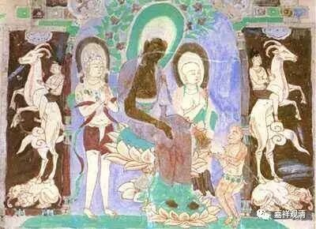

**金刚经 009**

我们继续《金刚经》。上次讲到了须菩提，是吧？** “时长老须菩提，在大众中，即从座起，偏袒右肩，右膝著地，合掌恭敬而白佛言：‘希有世尊，如来善护念诸菩萨，善付嘱诸菩萨。”**这一段，对吧？

我们现在讲到须菩提。长老称为“具寿”，须菩提称为“善现”，他在罗汉当中是被称为“解空第一”。孙悟空的老师不就是他吗？菩提老祖。孙悟空的名字也叫“悟空”是吧？他的师父就是“解空第一”的菩提老祖。就这个方面来看，《西游记》的作者多多少少还是了解一点佛教的，有一点点。对《西游记》的解读，有道教的（《西游原旨》），儒家的（我在新疆买过一套用《大学》思想全本注释《西游记》的），佛教也有，祈竹仁波切和贡唐仁波切都谈过《西游记》的佛教解读。不过，《西游记》本身还是本小说啦。

佛陀有时候是不请自说的，不请自说的情况在《阿含经》当中是有的。有人说《阿弥陀经》也是不请自说，其实你看看前后文就应该不是。《阿弥陀经》是《大宝积经》里的一会——《大宝积经·无量寿如来会》，单行出来就是我们常说的《阿弥陀经》。去找《大宝积经·无量寿如来会》前后看看的话，你会发现，其实这也不是不请自说，还是有讲经缘起的。其实，讲经如果是有针对性地来讲，会比较好。比如这部《金刚般若波罗蜜经》，由“解空第一”的须菩提发起提问来谈“空”的方面，正好很合适，是吧？

那天，长老须菩提也在大众当中，大家右绕三匝后都行礼合掌坐下了。这个时候长老须菩提就来发起问难，就在大众当中起来了。

“** 时长老须菩提，在大众中，即从座起，偏袒右肩，右膝著地，合掌恭敬而白佛言”。**他之前也和那些长老、罗汉、弟子们一起，也是绕佛三匝，然后坐下来。坐下来以后，就要请问佛法了。佛当然也有不请自说的，但是一般佛法都是要请法然后再讲的，那表示对法的尊重，至少也是一种规矩、礼貌吧。

