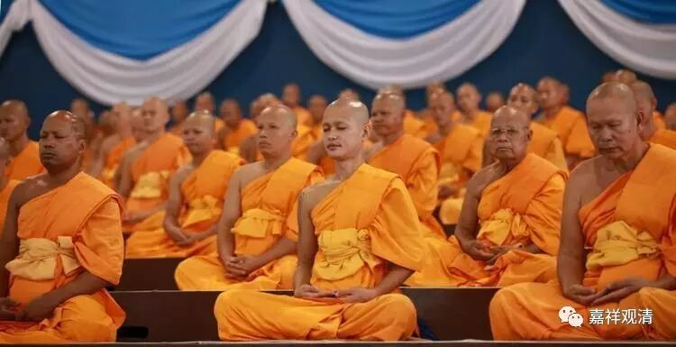
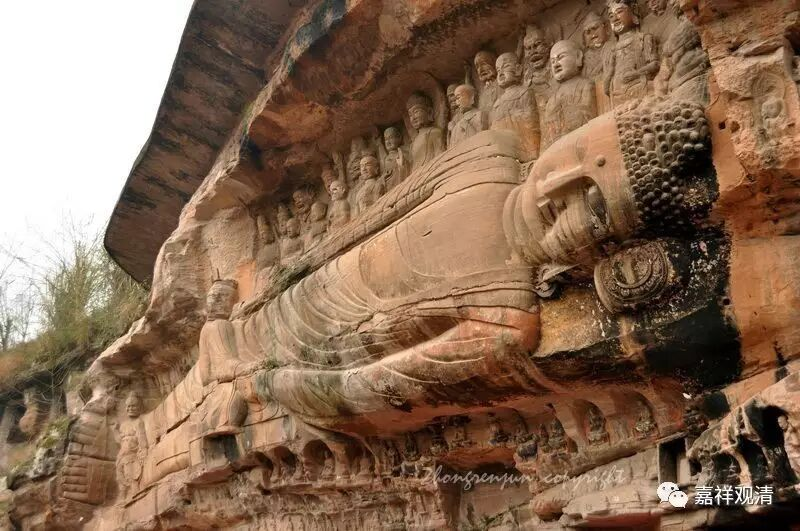
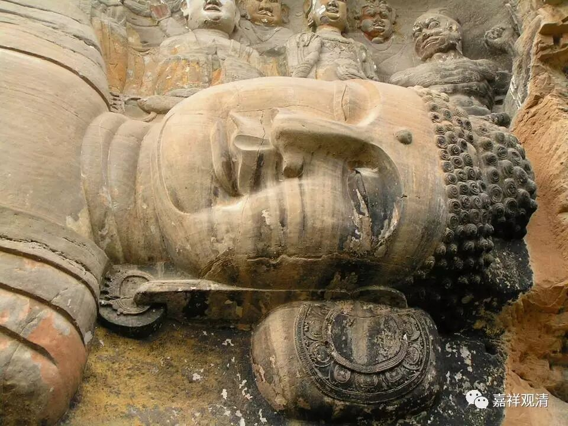
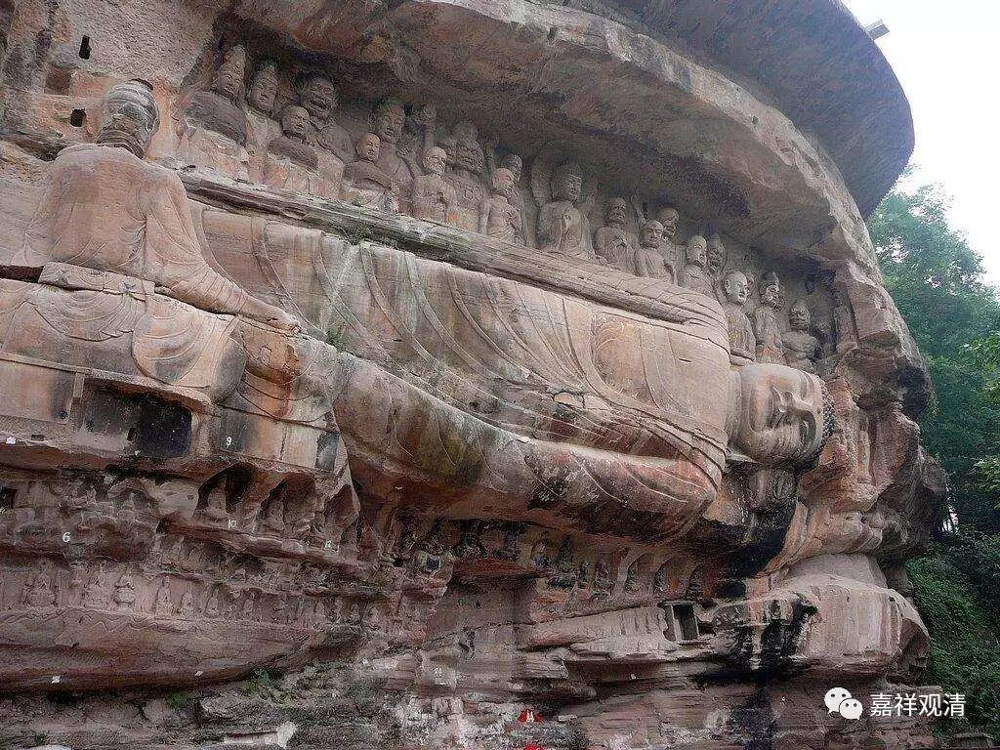
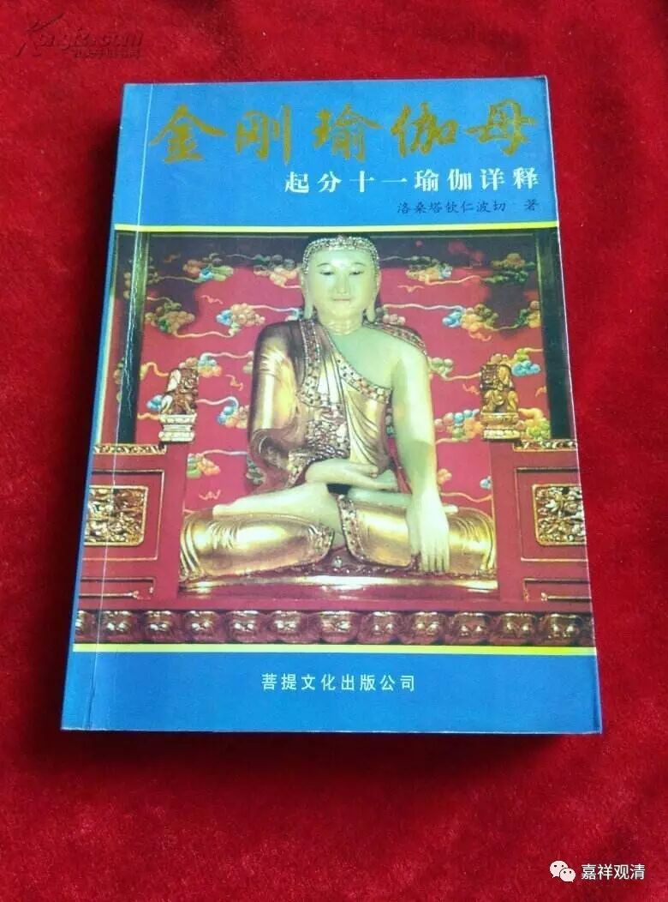
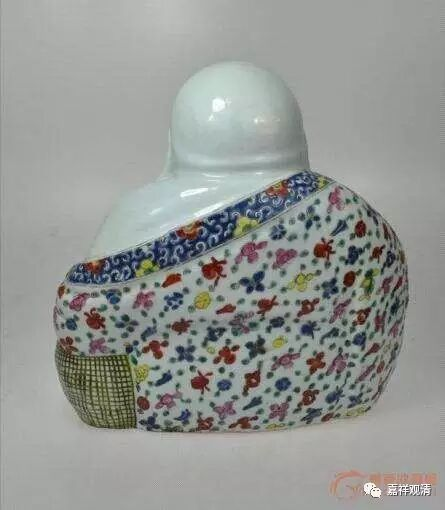
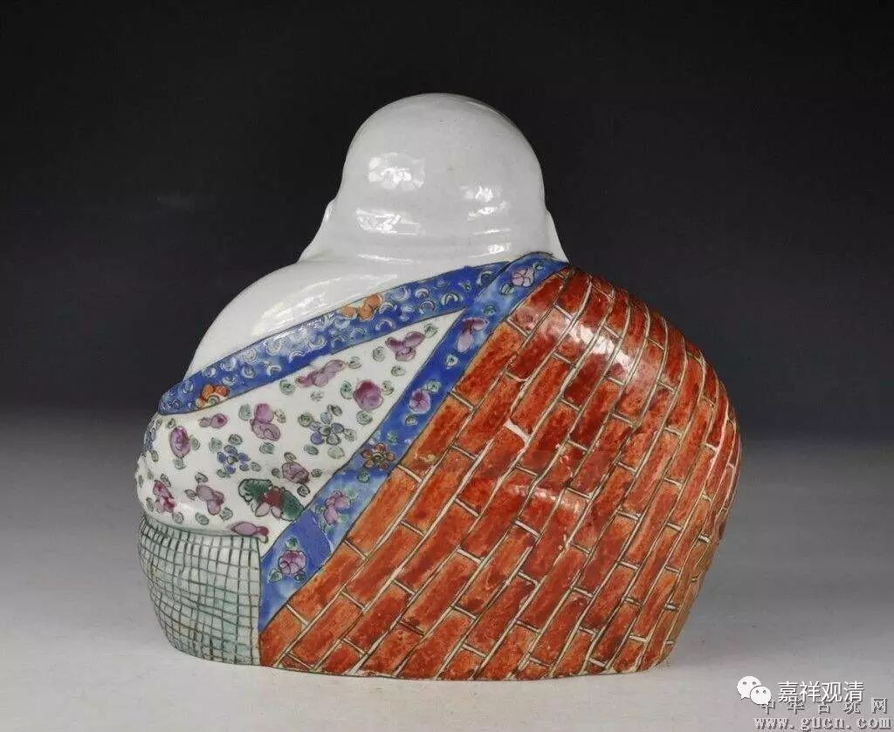

**《金刚经》009（中）**

** “偏袒右肩，右膝著地”，**这个是佛教的规矩，佛教是偏袒右肩的。我看到现在很多佛教的圈内人、圈外人，在这个上面都不懂，这个真的有点晕啊！我在普陀山的紫竹林看到的佛像壁画是左右对称的——一半是偏袒右肩、一半是偏袒左肩的，是做成这样左右对称的。我在其他很多寺院当中看到的壁画、浮雕等等，大量地出现偏袒左肩。很多的画当中也出现类似的错误。

** （某地涅槃相左胁而卧，错！）**

比如说释迦牟尼佛圆寂的画像，把右胁而卧直接画成左胁的，这种错误太多了。我们现在对这些内容完全不知道，甚至连和尚都有不知道的，就放手让这些画家随便画，然后这些画家就完全靠他们自己的思想乱想、乱来，这可不行啊！我们还是要对这个有所坚持的，就是“偏袒右肩”。

** 封面，左右颠倒！错！**

**
**

** 偏袒左肩！错！**

你们可能没注意，我待会儿发几个给大家看看。现在不是有微信表情嘛？微信表情包里面所有的袈裟全是穿反了。我也没太认真地去说，只是好玩儿嘛。有个表情包，所有的袈裟都是穿反的，我现在先发两个给大家看看。看见没有？这几张全部都是反的。这个就是我们经常提到的，真正的佛教和大家所理解的佛教相差太远了。这太成问题了！如果和佛教真正的内容差得有点远，就说明我们佛教传播上有很大的问题。

当然，前面我也讲过了，有些连和尚自己都不知道。刚才我讲的普陀山紫竹林就有这个情况，还有很多大寺院，我就不好意思一一点名了。这个可以说是我们这个时代的悲哀啊！那么，佛教的规矩是向右的，** “偏袒右肩”**。

** “右膝著地”，**单腿跪下的。在西藏受戒的时候也是这样，很正式的做法就是单腿跪下、右膝著地。因为大家蹲不住，所以才开许大家两个膝盖一起跪下来的，而传统的印度佛教的礼仪应该是：单腿跪下、右膝著地、合掌恭敬。

合掌，是印度的礼仪，到今天还是这样，还传到了像泰国等国家，也都是合掌——这是佛教的礼仪。单掌，是没有这个说法的。单掌的原因，是因为很难得的有时候一个手没空了，然后另一个手习惯性地就竖起来——那另外再说。单掌这个礼仪不是佛教的。双手合十，要两个手在一起才是十啊！单掌只有五，单掌只能叫立五，不能叫合十，对吧？

现在有一些人立单掌，可能受影视片里的影响太大。这个做法有没有呢？这个做法是有的，这属于武林当中的规矩，用来看是不是自己人。我在少林寺内部的武林秘籍当中看到过，当时觉远大师规定的：江湖上行走的时候，当不能确定对方是不是少林派的时候，就自己先立左掌，对方如果立右掌，那就是自己人，都是少林系统的，就不要误伤了自己人。这个属于武林当中的规矩，佛教当中没有这种单手的做法。佛教的礼仪都是双手合十，两个手并在一起叫合十，我们没有立五这个说法。

