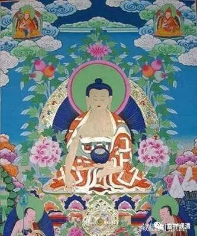

**《南传佛教史·着衣的论争》**

　　约在公元１７０８年，缅甸佛教发生了很大的论争，就是关于“着衣”有不同的意见，论争的时间竟达七十五年之久。
　　缅甸东部萨尔温江西岸，有一村名登那（Tunna），一位上座名瞿那毗楞伽罗（Gunabhilankara），他命令弥出寺外或入市邑时，着衣要偏袒右肩，不必持多罗叶（棕榈叶）遮阳光。瞿那毗楞伽罗领导的僧团，被人称为“登那派”（Tunnaguna），他对弟子们只讲阿毗达磨，经律及注释不多研究。
　　其他地方有四位上座：佛陀拘罗（Buddhan Kura）、质多（Citta）、须离多（Sunanta）、迦耶那（Kalyana）。他们都通达三藏及注疏，教诫持多罗扇，才可入市邑。这样，就形成对立的两派：一称“偏袒派”（Ekansika，着衣时覆盖在肩，袒露右肩），一称“被覆派”（Parupana，着衣时覆盖两肩）。偏袒派的根据不多，却证明是前辈妙法行（Saddhammacara）长老过去传自斯里兰卡的教导。至于被覆派，根据经律说，认为偏袒右肩时，仅是对佛陀和僧长礼敬时才适用，除此都必须被覆两肩，成其是到佛寺以外地方。（1.般若萨弥：称巴《教史》第６章。2.山本达郎编：《东南亚细亚的宗教与政治》，第１４８页。）
　　这样的情形，经过二十四年，公元１７３２年，多尼犍毗王邀集四位僧伽上座为判决委员，听取两派陈说意见。偏袒派比丘虽不甚了解三藏，根据很少，但与国王关系比较接近；被覆派力量薄弱，却据理力争，不与偏袒派妥协，辩论时静默不语。裁判委员无法执行判决。（1.《教史》第６章。2.Charles Eliot Hinduism and Buddhism, Vol.Ⅲ，第６２－６３页。3.泰文：《东南亚佛教史》，《佛轮》月刊第１６卷。）
　　１７３３年，东固末代国王狄波帝（Mahadam mayaza Dipati,１７３３～１７５２）在位期间，两派论争又起。为了息争，邀请被覆派智愿上座为代表，偏袒派波僧沙（Pasansa）为代表，举行辩论，另请一位大长老作裁决。但此位大长老也不甚了解三藏，无法判决两方的意见。到１７４０年缅境内连年混乱不安，荷兰及英国势力也侵入，因政治的纷扰，着衣论争暂时停息下来。（般若萨弥：利巴《教史》，第６章。）
……

东固王朝灭亡后，佛教着衣的论争，并没有解决，到贡榜王朝时期，着衣论争更趋激烈。
　　职权瑙帕雅于公元１７５２年，建立贡榜王朝后不久，被覆派善生上座等上书国王，说明沙弥进市邑时，依律制着衣应该被覆两肩。全是偏袒派阿都罗国师等了书国王，认为此事以前已经平息，现在不应该再起论争。所以，国王没有认真处理，推说国事很多，此事留待以后解决。可是后来，阿瑙帕雅王命令全国僧人都须服从国师的规定，这样一来，被覆派就必须遵守偏袒派的规定。但有两位上座，仍教诫他们的弟子，应遵守入市邑时着衣被覆两肩。
　　国王命其中一位牟尼陀瞿潲（Munindaghosa）至王都税布。召集僧众会议。当时牟尼陀瞿沙在会中受到警告，有一位比丘对他说：“现在全国的僧众，都依国王和僧王的的命令奉行，即遵守偏袒派的规定？”牟尼陀瞿沙回答说：“我以前听说，你是很有修学、持戒、知惭愧的比丘，像你这样人，不应该说出这样的话。我是缺少福德的人，没有力量为依靠。请你转身见见我的老师，假使你记得我是他的弟子，你就不应该说出这样非法的话。”
　　那比丘问：“谁是你的老师？”牟尼陀瞿沙对佛像作礼说：“这位就是我的老师！”说完，站立于僧众中，偏袒右户，行去佛像面前合掌恭敬地说：“佛陀！弟子愿意牺牲自己性命，尽形寿不舍弃佛陀的戒法！”后来，国王把他驱逐出缅甸境外，地名叫摩辛伽（Mahanga）。集尼陀瞿沙仍至各处教授跟随他的学僧，并译《摄阿毗达磨义论》为缅文。
　　之后，国王知道他在边境的作法，就派人叫他回来。牟尼陀沙心想：“这次国王想要杀我了。”于是舍戒还俗，跟着使者至王都。国王问他：“我听说你是比丘，聚合很多僧众，现在为什么变成俗人呢？”他答：“大王！我想大王命我回来，或将杀我，因为如果我舍戒还俗，免得大王会得重罪，现在大王如果要杀我，就请吧！”国王下令把他囚款起来，出兵征讨泰国大城。国王回军至直通的毗林（Bilin）时，得病去世。（般若萨弥：巴利《教史》第６章。）
　　阿瑙帕雅王去世后，被覆派的正智（Nana）受封为国师。这时被覆派认为，我派僧长已为国师，有所依靠了，于是上书国王，说明沙弥入市邑时，应该着衣被覆两肩。偏袒派阿都罗国师也上书，说明此事以前已止息，所以两派未再争论。
　　公元１７７６年以后，一位曼陀摩罗（Mandamala）上座，教授很多学僧，他常说沙弥入市邑时，着衣应被覆两肩才合法，而偏袒右肩，在三藏及注疏典籍中，都的不到根据。关于着衣的事，他引据多种经论，写了一本书抉择是非。又有一位难陀摩罗（Nandamala）比丘，依据三藏及注释等，向国王钦拘明（Singu Min，１７７６～１７８１）呈书解说，沙弥入市邑时，着衣应被覆两肩，至于偏袒右肩入市邑，在任何经论中都未有说明。于是国王邀请两派僧众在王宫中举行集会，各自陈述理由和意见。
　　被覆派依据经律，举明出处，如说：“比丘沙弥当学，着衣遮蔽（身体）。”因巴利语Parimandala一词，意思即是“遮蔽身体”或“遮蔽全身”之义。同时，偏袒举不出根据来，仅说是依前人流传下来的习例实行。结果，偏袒派辩论失败，国王命令全国比丘沙弥进市邑时，应该被覆两肩，即依被覆派实行。（般若萨弥：巴利《教史》第６章。）
　　后来到孟云王时，着衣的论争又起。那时阿都罗国师还在，上书国王，说明沙弥入市邑时，着衣偏袒右户是合法的，因为已经找到斯里兰卡过去一位已证阿罗汉的目犍连上座作的《小圣典》（Culagantipada）中说：“沙弥着衣，应如僧伽梨挂搭于左肩上，再转束腰部。”但经过辩论和审查，发现阿都罗根据的论典，是后来斯里兰卡一个同名目犍连所写的，而且不是很正确的论典。最后国王公布，命全国比丘沙弥，应依被覆派实行。偏袒派此后逐渐衰微，甚至无存了。这是公元１７８３年的事，长达七十五年的论争终于结束了。（1.般若萨弥：巴利《教史》第６集。2.山本达郎编：《东南亚细亚的宗教与政治》，第１４８页。3.Charles Eliot:Hinduism and Buddhism,Vol.Ⅲ，第６２－６３页。）

