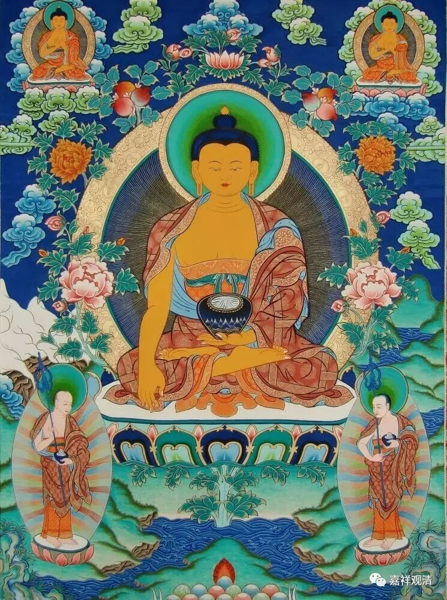
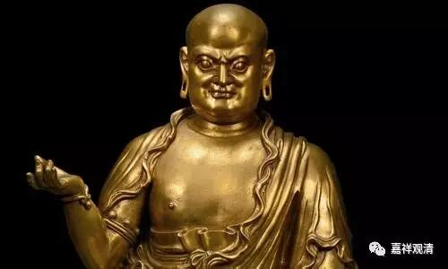
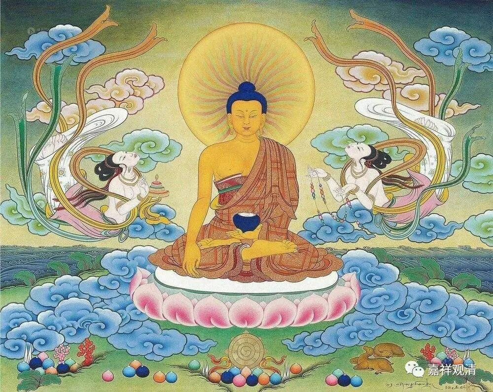
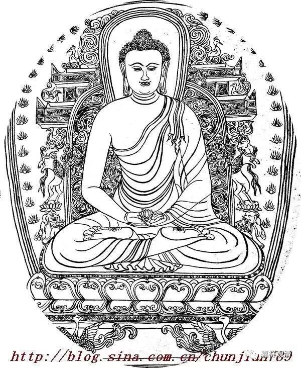
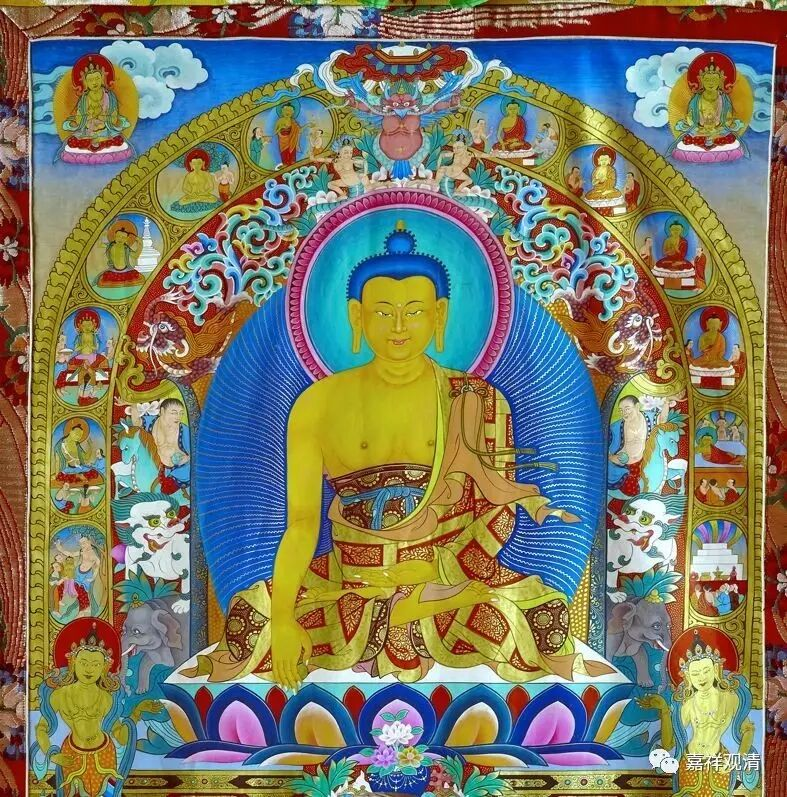
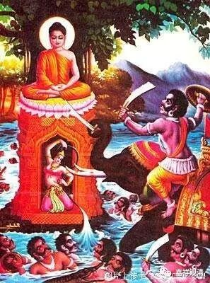
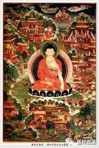
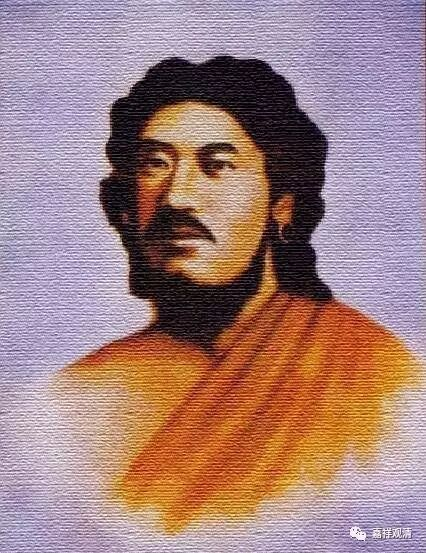

**《金刚经》009（下）**

那么，** “时长老须菩提，在大众中，”**和大家在一起的时候，** “即从座起，”**从大家当中就起来了，然后** “偏袒右肩”。**

** **

这里还有一个内容，如果出门去的话，是要披覆双肩的。你们如果看佛像的话，会有两种画法：一种是有一个角把右肩也盖住的，另一种是两肩当中露出右肩的。在寺院中是偏袒右肩，属于恭敬；出门的话，双肩要披覆的，另外一个角也要披一点点。

** 以上正确披覆双肩像**

** 以上正确偏袒右肩像**

** 偏袒左肩相，错！**

** 披覆双肩的左右颠倒相！错！**

** 伪佛像！查无此作！**

** 又，这不是耶稣吗？！
**

这里面其实也有故事的，南传曾经有过一场延续七十五年的论争，就是关于出门到底要不要批双肩的问题。我们稍微讲讲也可以。

当时对这个问题是有争论的，然后有一位法师就非常强硬地说一定要披双肩，而另外一批就说不需要披双肩，说是目犍连尊者说的。最后考证下来，其实那个说不需要披双肩的人只是名字叫目犍连，并不是以前的目犍连尊者。当时，国王正好打了败仗，很不高兴，就把那个很坚持的和尚抓过来，准备杀他。把他抓回来以后发现：“哎？什么意思？他还俗了！”那个和尚说：“国王，我知道您把我抓回来是要杀我的，所以我就先还俗，那你杀的只是一个平民。如果我不还俗，你杀死的是一个和尚，你的罪过会很大。”。

过了若干年以后，大家再辩论这件事情的时候，最后认定实际上他是对的，出门的时候应该要批双肩的。而另一方所引用的那本书，并不是目犍连尊者所写的，而是另外有一位法师名字也叫目犍连，他说出门不要披双肩的。

因为讲《金刚经》那个时候须菩提长老在祗树给孤独园，是在寺院当中，所以他在请讲的时候，没有披覆双肩，而是偏袒右肩的。你看，我们进寺院的时候也是一样，本来是披双肩的，进了寺院就会把右肩叠起来。比如我穿藏装的时候，会把右肩的批单叠起来，挪到左肩上，右肩是偏袒的，然后再顶礼等等。大家有机会的话可以稍微观察下。密宗学院的话，基本上右肩都是空着的，每个学院的披法还不完全一样。显宗和密宗的披法表现出来是不一样的，大家一眼就能看出来，衣服的叠法、裙子的束法都有点不一样。

** “偏袒右肩，右膝著地，合掌恭敬而白佛言”。**这个时候须菩提就开口跟佛说了。他说什么呢？** “希有世尊，如来善护念诸菩萨，善付嘱诸菩萨。”**在其他的版本当中，这后面是有三句问话的：** “……发阿耨多罗三藐三菩提心，应云何住？云何修？云何降伏其心？”**我们现在鸠摩罗什法师的版本当中是没有** “应云何修”**这一句的。在其他的版本当中都是这样：** “应云何住？云何修？云何降伏其心？”**

** **

对了，先说一下，接下去我们可能会印玄奘法师或者义净法师翻译的《金刚经》版本。

那今天就讲到这里，谢谢大家！

