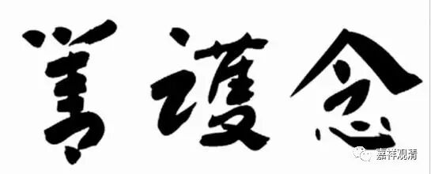

**金刚经 010**

** **

好，我继续给大家白话白话《金刚经》。《金刚经》在中国流传比较广，通用的版本就是鸠摩罗什法师翻译的版本。最近我们可能要印刷我以前句读过的义净法师的版本，一般来说，越晚翻译的就越好一点，是吧？我们可能会考虑印。现在我们主要是按照鸠摩罗什法师的版本来讲，因为大家都比较熟悉这个版本。（以前的句读版本，找不到了，要重新做了……）

在中国人习惯的科判当中，前面的这一段可以叫“序分”，最后的部分叫“流通分”，中间是“正宗分”。那么，我们讲《金刚经》的时候没有用汉地比较常见的“法会因由分第一”等等这些科判。这个据说是昭明太子分的，当然也算是一种分段，但是因为他对佛法的理解不够，所以这个分段不一定正确，所以我们就不用了。我自己在念《金刚经》的时候是不念这些“法会因由分”之类的，我那些师兄弟们都是念的，他们一起念的时候我就闭着嘴不念。这个事情你们可以自己考虑，我觉得其实是没有必要念的，昭明太子的水平不够，科判做得不是很好，该合在一起的没在一起，该分开的没分开。

现在我们讲到这里：** “时长老须菩提，在大众中，即从座起，偏袒右肩，右膝着地，合掌恭敬而白佛言”**，是吧？

这个时候须菩提就合掌恭敬** “而白佛言”**。他请问的时候先夸奖老师一段：** “合掌恭敬而白佛言：‘希有世尊，”**世尊是难得稀有的，世人不容易见到这样的智者。世间，没有佛法的时候居多，而有佛法的时候是很稀少的。有了佛法出现以后，还能够在佛的面前“亲自”聆听，真是太幸运了！这都是累世的因缘。发起提问的时候，就先赞叹世尊：“世尊啊！您是稀有难得的。”

** “如来善护念诸菩萨，善付嘱诸菩萨。”**这个** “如来善护念”**，在玄奘法师的版本当中，是以“最胜摄受”“摄受”诸菩萨。从这个方面来说的话，大家就可以理解了，这个所谓的“护念”就是佛能够以“最上的摄受”来摄受菩萨，“念”就是要一直摄受他们的，是吧？“护”就是摄受他们。现在各大法师都在努力发挥“善护念”的意思，也算是一种善良愿望的演绎吧……

**
**

** “善付嘱诸菩萨”**，就是“最胜付嘱付嘱诸菩萨”，教育他们，是吧？这就是** “如来善护念诸菩萨，善付嘱诸菩萨”**。

