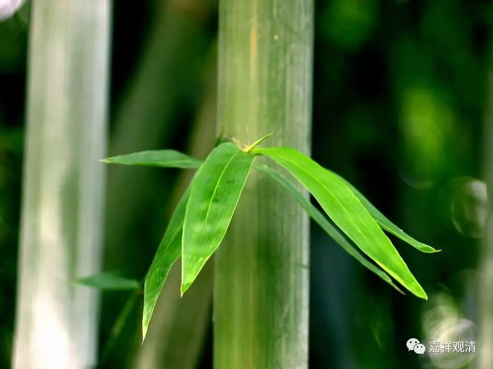

**《每日一偈》第六辑**

无常速迁流，无物可恃怙。

正知无常者，速能趋解脱。

诸无常者，是生灭法；

此身必朽，速趋解脱！

修短随业，缚脱在己。

见生灭法，能见涅槃。

密护根门，远离五欲；

如大山王，巍然不动。

不欺不害，将护身心；

渐至涅槃，无忧无虑。

鹦鹉持名，善根不增；

诵礼竟日，不如知义。

大乘修学之基础，

即此道之三主要！

剃发着染衣，善护净尸罗，

远离于贪欲，见真得解脱。

醍醐非速构，广厦非幻成；

巍巍正觉山，次第而得升。

无病大利，知足胜福，

正信至亲，涅槃最乐！

若人寿百年，肆祀不知义，

不如须臾间，静坐观非常。

有漏皆苦，慧以观之；

断除无明，无忧无苦。

无信不立，

无戒不护，

无慧不明！

通达四圣谛，持戒勤断障，

令身心寂静，是求解脱者！

世间惑所生，何喜何贪染；

断除无明者，无忧亦无染。

当断欲稠林，勿伐诸森林；

断欲得解脱，伐树得雾霾。

修善应速，断恶亦然。

——此即精进，能满善品。

大智大承担，大心大坚固，

大力大精进，能至无能胜！

归雁不计道远，回乡何辞路遥；

此去涅槃已远，何不早启归程！

外绝诸缘，静心勿染，

通达非我，能至无生。

断除诸不善，解脱于系缚，

所执境本无，苦不能相随。

视金钱如粪土，

视红木如废柴。

菩萨畏因，凡夫畏果；

恶业熟时，必受其害。

诤友能利，谄友令溺；

针药能治，膏粱令嗜。

梵行律仪净，多闻能了义，

正念及止观，能趋沙门果。

集福智资粮，愿成福智身！

人身难得寿考难，佛法难闻遇师难；

只此形骸莫虚弃，速证无住大涅槃。

人常自澡洁，而不去心垢；

澡后身爽利，障尽心安泰。

寿康世荣耀，皆被无常坏；

故当具精勤，恒与烦恼敌。

观待故非自成立，自性无故待缘起；

善说释迦正等觉，无比世尊前敬礼！

信启正道，

慧启正智，

悲启正觉！

