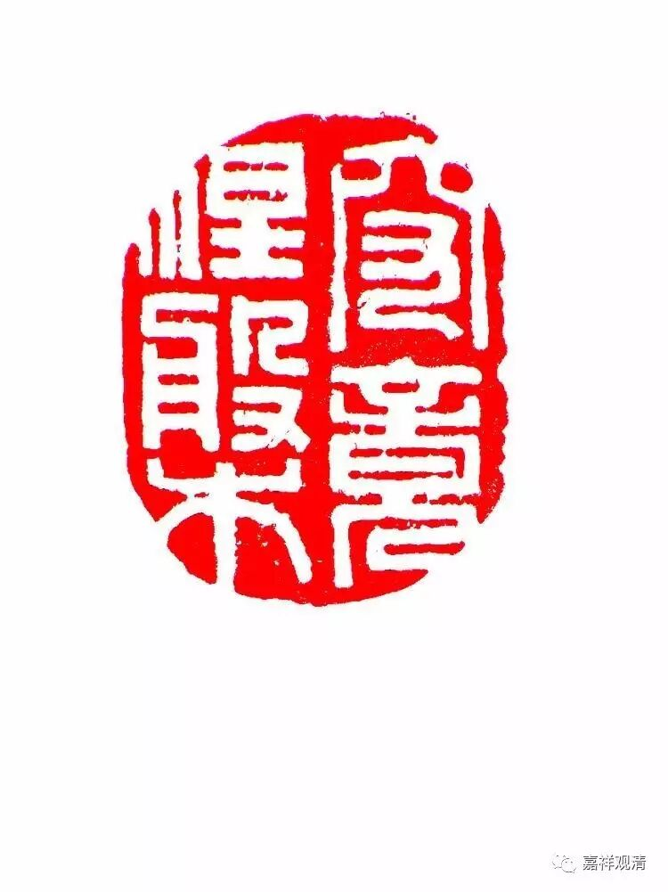

**《金刚经》011（二）**

** “善男子、善女人发阿耨多罗三藐三菩提心，应如是住，如是降伏其心。”**我们前面解释过了，善男子、善女人——发起菩提心的人，应该这样依止善知识，应该这样修法，应该这样摄受众生。

这个时候须菩提就说了：** “唯然，世尊，愿乐欲闻。”**“对的，世尊，您讲吧！我愿意听。”** “愿乐欲闻”**，我想听，而且我会是以善心专注（属意）地听，按道次第里面的说法就是：不是一个倒扣的杯子，不是一个脏的杯子，也不是一个漏的杯子——这样地听。

须菩提——长老须菩提，或者具寿善现，就是这部《金刚经》的发起者，他又被称为“解空第一”。那么，首先他是来问“要发菩提心的人应该怎么做？”

接下去，** “佛告须菩提：‘诸菩萨摩诃萨，应如是降伏其心。”**菩萨摩诃萨，就是菩萨，前面讲了“善男子、善女人发阿耨多罗三藐三菩提心”，这里就讲菩萨。那么，菩萨应该发起什么心呢？** “应如是降伏其心”**，这个版本是这样翻译的，但是玄奘法师翻译的就是“应当发起如是之心”，就不是“降伏”，而是应当发起这个心。

应当发起什么心呢？** “所有一切众生之类，若卵生、若胎生、若湿生、若化生，若有色、若无色，若有想、若无想、若非有想非无想，我皆令入无余涅槃而灭度之。如是灭度无量、无数、无边众生，实无众生得灭度者。”**

** **

如果以现代的缩句来分析的话，中间的这一段都是修饰的，可以缩写成这样：“诸菩萨摩诃萨，应如是降伏其心。所有一切众生之类，我皆令入无余涅槃而灭度之。如是灭度无量、无数、无边众生，实无众生得灭度者。”这是后面对前面再加以解释，这段的意思就是说：菩萨应该这样发心，应该誓度一切众生，誓度一切众生到究竟的彼岸。

这里，虽然文字上说的是“无余涅槃”，实际上它指向的是究竟涅槃，也就是佛的究竟圆满的涅槃。涅槃，分为“有余涅槃”和“无余涅槃”，是吧？“无余涅槃”，一般来说声闻乘的或者大乘的唯识派会这么讲，有时也会讲“灰身泯智”。这里面虽然文字上是讲“无余涅槃”，它最终指向的是无住处涅槃，或者叫“无住涅槃”——就是佛的究竟圆满的涅槃，可以这样理解。

