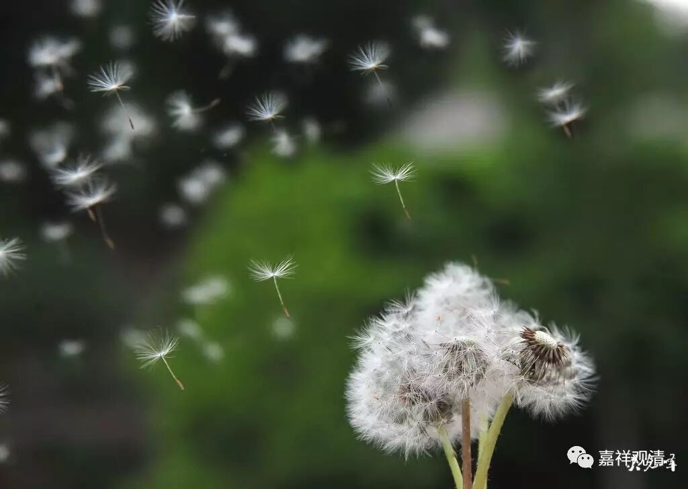

**《金刚经》011（四）**

** “一切众生之类”**，其实从这个角度来看，汉地是不把“有情”和“补特伽罗”区分开来的，从这里也可以看得出来。

“有情”有哪些呢？首先“有情”可以分为“四生”，“生”是生老病死的生。“四生”，就是有情出生的因缘，我一直这么讲。我是用出生的因缘来讲“四生”的，胎卵湿化——胎生、卵生、湿生、化生。人大部分是胎生的，是吧？在佛教当中说人有四生的哦，胎卵湿化都有的哦。那么，卵生就是像鸡这样，是吧？湿生，就是在潮湿的环境下，那些蚊蝇、蟑螂什么的，应该都属于湿生。化生，是一下子就出生了。

我解读四种生，它是指生下来的周围环境。佛教里面讲这四种生，就是我们通常世间人所能够理解的这四种背景吧。首先胎生，人的胎生，这是大家比较容易理解的。化生呢，按照佛教里面讲，最早期的人是化生的，是天上下来的。（我们是不是外星人啊？天上下来的。）湿生，据说顶生王应该属于湿生。佛教历史上有一个比较有名的传说，这里面有一个转轮圣王——金轮胜王，叫顶生王，他就是湿生的，这个湿是潮湿的湿。卵生，好像在佛经里面也提到过，说是某一个人到什么地方去看到卵生的，是不是《僧护因缘经》？经典当中说人是有四生的，胎卵湿化都有的。

其他的众生，也有四生的，会有卵生的，有些是湿生的，地狱道和有些天道就是化生的，是吧？“四生”——胎生、卵生、湿生、化生，胎卵湿化，这就已经包含了一切众生。如果从这个角度来讲呢，佛也要算在里面的，“有情”这里面也要算的嘛。不过在西藏不算，那就没办法。西藏这么说，或者格鲁派这么说，那就这么说吧。

有情的第二种分类，** “若有色、若无色”**。色就是物质，无色呢，没有物质依靠，那就是无色界天了。** “若有色、若无色”**，这也包含了一切众生的意思。有色呢，是包含了色界和欲界；无色呢，就是无色界。这样，一切众生当中可以分四生，也可以按照有色和无色来分，欲界和色界叫有色，无色界叫无色，所以称为** “若有色、若无色”**。

后面应该是** “若有想、若无想、若非有想非无想”**，应该说这是一类。昨天我们正好讲过定，“无想”呢，也可以称为“无想天”，或者叫“无想报”、“无想异熟”。那么，“若非有想非无想”是指什么呢？是指“非想非非想天”。除了这两个以外的，就都称为叫“有想”。这个“若无想”里面，有时候也可以包含“灭受想定”的，就是“无想定”和“灭受想定”都叫“无想”，但在这里按有情说，就不计入了。“非想非非想”是一个，就是“若非有想非无想”。前面的“若有想”呢，就是除了这两个以外的，其他的地也好，其他的有情也好，都称为叫“有想”。“灭受想定”有时候可以放在无想里面，不过，“灭受想定”它是一个定，不是三界九地独立的哪一个，所以这里的“若无想”还是单单讲“无想天”。除了“无想天”的众生和“非想非非想天”的众生以外其他，都叫“有想”众生。有想、无想、非有想非无想，这三个也是包含了一切众生。

这里就等于是以三类来讲一切众生：一切众生当中有胎卵湿化的；一切众生当中有有物质的和没物质的；一切众生当中有有想的、无想的和非有想非无想的。就是这三种分类。

